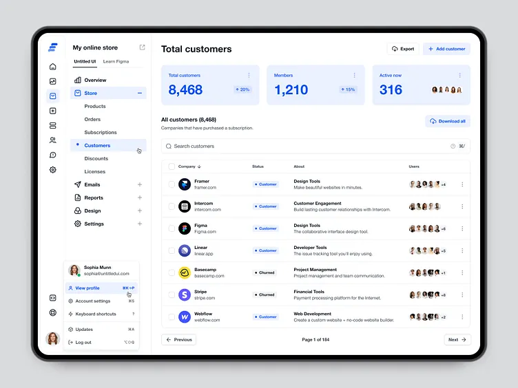

# Online Store API Design Specification

## General Information
- **Base URL**: `http://localhost:8000/online-store`
- **Swagger UI**: `http://localhost:8000/online-store/swagger-ui.html`
- **OpenAPI JSON**: `http://localhost:8000/online-store/v3/api-docs`
- **Data Format**: JSON (`application/json`)
- **Timezone & Date Format**: `Asia/Ho_Chi_Minh` (`dd/MM/yyyy HH:mm:ss`)

---

## 1. Authentication Module (`/api/v1/auth`)

| Method | API URL | Parameters (Optional) | Status Codes | Description |
| :--- | :--- | :--- | :--- | :--- |
| `POST` | `/api/v1/auth/login` | **Body (JSON)**: `email` (String, Required) `password` (String, Required) | `200 OK` `401 Unauthorized` | Authenticate user using raw email and password credentials to receive JWT Access Token and Refresh Token. |
| `POST` | `/api/v1/auth/refresh-token` | **Body (JSON)**: `refreshToken` (String, Required) | `200 OK` `401 Unauthorized` | Issue a new Access Token and Refresh Token pair using a valid Refresh Token without re-entering password. |
| `POST` | `/api/v1/auth/logout` | *None* | `200 OK` | Log out the user and clear current authentication session from SecurityContext. |
| `GET` | `/api/v1/auth/profile` | *None* | `200 OK` | View profile details of the currently authenticated user. |
| `PUT` | `/api/v1/auth/profile` | **Body (JSON)**: Account settings / profile object (Required) | `200 OK` | Update account settings or profile details for the authenticated user. |

---

## 2. User Management Module (`/api/v1/users`)

| Method | API URL | Parameters (Optional) | Status Codes | Description |
| :--- | :--- | :--- | :--- | :--- |
| `GET` | `/api/v1/users` | *None* | `200 OK` | Retrieve the complete list of all users in the system. |
| `GET` | `/api/v1/users/{id}` | **Path Variable**: `id` (Long, Required) | `200 OK` `404 Not Found` | Retrieve detailed profile of a single user by User ID. |
| `GET` | `/api/v1/users/email/{email}` | **Path Variable**: `id` (String, Required) | `200 OK` `404 Not Found` | Search and retrieve detailed user profile by email address. |
| `POST` | `/api/v1/users` | **Body (JSON)**: `User` object (Required) | `201 Created` | Create a new user account in mock storage. |
| `PUT` | `/api/v1/users/{id}` | **Path Variable**: `id` (Long, Required) **Body (JSON)**: `User` object (Required) | `200 OK` `404 Not Found` | Update details of an existing user account by User ID. |
| `DELETE` | `/api/v1/users/{id}` | **Path Variable**: `id` (Long, Required) | `204 No Content` `404 Not Found` | Remove a single user account by User ID. |
| `DELETE` | `/api/v1/users` | *None* | `204 No Content` | Remove all user accounts from mock storage. |

---

## 3. Customer Management Module (`/api/v1/customers`)

| Method | API URL | Parameters (Optional) | Status Codes | Description |
| :--- | :--- | :--- | :--- | :--- |
| `GET` | `/api/v1/customers` | **Query Params**: `companyName` (String, Optional) `product` (String, Optional) `page` (Integer, Default: 1) `size` (Integer, Default: 5) | `200 OK` | Retrieve paginated list of customers (default 5 items per page), with optional filtering by company name and product category. |
| `GET` | `/api/v1/customers/{id}` | **Path Variable**: `id` (Long, Required) | `200 OK` `404 Not Found` | Retrieve detailed information of a single customer company by Customer ID. |
| `POST` | `/api/v1/customers` | **Body (JSON)**: `Customer` object (Required) | `201 Created` | Add a new customer company (tenant) record to the system. |
| `PUT` | `/api/v1/customers/{id}` | **Path Variable**: `id` (Long, Required) **Body (JSON)**: `Customer` object (Required) | `200 OK` `404 Not Found` | Update information of an existing customer company by Customer ID. |
| `DELETE` | `/api/v1/customers/{id}` | **Path Variable**: `id` (Long, Required) | `204 No Content` `404 Not Found` | Remove a customer company from the system by Customer ID. |
| `POST` | `/api/v1/customers/downloadListCustomer` | *None* | `200 OK` | Export and download complete customer list in CSV format. |

---

## 4. Dashboard Statistics Module (`/api/v1/dashboard/statistics`)

| Method | API URL | Parameters (Optional) | Status Codes | Description |
| :--- | :--- | :--- | :--- | :--- |
| `GET` | `/api/v1/dashboard/statistics` | *None* | `200 OK` | Retrieve overall system statistics, including total customer count, total user count, and total active user count. |
| `POST` | `/api/v1/dashboard/statistics/export` | *None* | `200 OK` | Export dashboard statistics data report in CSV format. |

---

## 5. Menu Management Module (`/api/v1/menus`)

| Method | API URL | Parameters (Optional) | Status Codes | Description |
| :--- | :--- | :--- | :--- | :--- |
| `GET` | `/api/v1/menus` | *None* | `200 OK` | Retrieve full hierarchical navigation menu tree with dynamically nested child sub-menus (`children`). |
