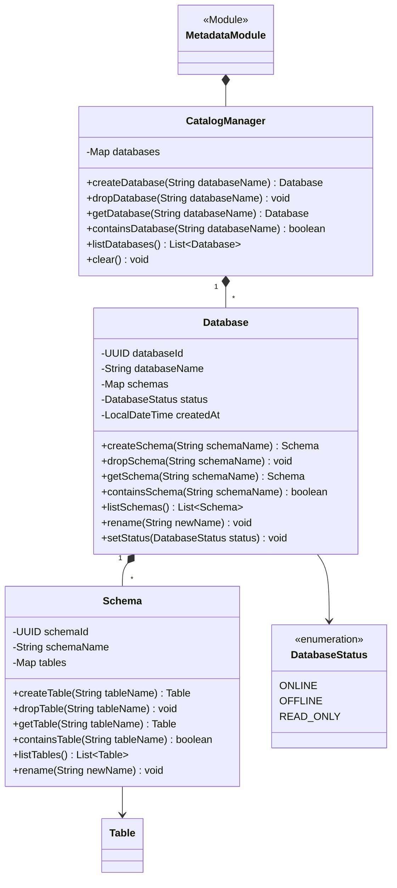

```mermaid
classDiagram
    direction TD

    %% =====================================================
    %% METADATA MODULE
    %% =====================================================

    class MetadataModule{
        <<Module>>
    }

    %% =====================================================
    %% CATALOG MANAGER
    %% =====================================================

    class CatalogManager{
        -Map<String, Database> databases

        +createDatabase(String databaseName) Database
        +dropDatabase(String databaseName) void
        +getDatabase(String databaseName) Database
        +containsDatabase(String databaseName) boolean
        +listDatabases() List~Database~
        +clear() void
    }

    %% =====================================================
    %% DATABASE
    %% =====================================================

    class Database{
        -UUID databaseId
        -String databaseName
        -Map<String, Schema> schemas
        -DatabaseStatus status
        -LocalDateTime createdAt

        +createSchema(String schemaName) Schema
        +dropSchema(String schemaName) void
        +getSchema(String schemaName) Schema
        +containsSchema(String schemaName) boolean
        +listSchemas() List~Schema~

        +rename(String newName) void
        +setStatus(DatabaseStatus status) void
    }

    %% =====================================================
    %% SCHEMA
    %% =====================================================

    class Schema{
        -UUID schemaId
        -String schemaName
        -Map<String, Table> tables

        +createTable(String tableName) Table
        +dropTable(String tableName) void
        +getTable(String tableName) Table
        +containsTable(String tableName) boolean
        +listTables() List~Table~

        +rename(String newName) void
    }

    %% =====================================================
    %% ENUM
    %% =====================================================

    class DatabaseStatus{
        <<enumeration>>
        ONLINE
        OFFLINE
        READ_ONLY
    }

    %% =====================================================
    %% DEPENDENCIES
    %% =====================================================

    MetadataModule *-- CatalogManager

    CatalogManager "1" *-- "*" Database

    Database "1" *-- "*" Schema

    Schema --> Table

    Database --> DatabaseStatus
```