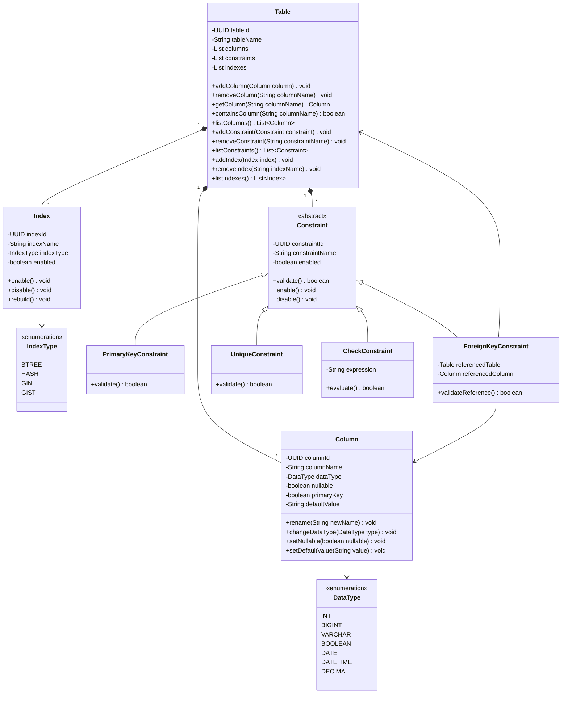

```mermaid
classDiagram
    direction TD

    %% =====================================================
    %% TABLE
    %% =====================================================

    class Table{

        -UUID tableId
        -String tableName

        -List<Column> columns

        -List<Constraint> constraints

        -List<Index> indexes

        +addColumn(Column column) void
        +removeColumn(String columnName) void
        +getColumn(String columnName) Column
        +containsColumn(String columnName) boolean
        +listColumns() List~Column~

        +addConstraint(Constraint constraint) void
        +removeConstraint(String constraintName) void
        +listConstraints() List~Constraint~

        +addIndex(Index index) void
        +removeIndex(String indexName) void
        +listIndexes() List~Index~
    }

    %% =====================================================
    %% COLUMN
    %% =====================================================

    class Column{

        -UUID columnId

        -String columnName

        -DataType dataType

        -boolean nullable

        -boolean primaryKey

        -String defaultValue

        +rename(String newName) void

        +changeDataType(DataType type) void

        +setNullable(boolean nullable) void

        +setDefaultValue(String value) void
    }

    %% =====================================================
    %% DATATYPE
    %% =====================================================

    class DataType{

        <<enumeration>>

        INT

        BIGINT

        VARCHAR

        BOOLEAN

        DATE

        DATETIME

        DECIMAL
    }

    %% =====================================================
    %% INDEX
    %% =====================================================

    class Index{

        -UUID indexId

        -String indexName

        -IndexType indexType

        -boolean enabled

        +enable() void

        +disable() void

        +rebuild() void
    }

    %% =====================================================
    %% INDEX TYPE
    %% =====================================================

    class IndexType{

        <<enumeration>>

        BTREE

        HASH

        GIN

        GIST
    }

    %% =====================================================
    %% CONSTRAINT
    %% =====================================================

    class Constraint{

        <<abstract>>

        -UUID constraintId

        -String constraintName

        -boolean enabled

        +validate() boolean

        +enable() void

        +disable() void
    }

    class PrimaryKeyConstraint{

        +validate() boolean
    }

    class ForeignKeyConstraint{

        -Table referencedTable

        -Column referencedColumn

        +validateReference() boolean
    }

    class UniqueConstraint{

        +validate() boolean
    }

    class CheckConstraint{

        -String expression

        +evaluate() boolean
    }

    %% =====================================================
    %% RELATIONSHIPS
    %% =====================================================

    Table "1" *-- "*" Column

    Table "1" *-- "*" Constraint

    Table "1" *-- "*" Index

    Column --> DataType

    Index --> IndexType

    Constraint <|-- PrimaryKeyConstraint

    Constraint <|-- ForeignKeyConstraint

    Constraint <|-- UniqueConstraint

    Constraint <|-- CheckConstraint

    ForeignKeyConstraint --> Table

    ForeignKeyConstraint --> Column
```