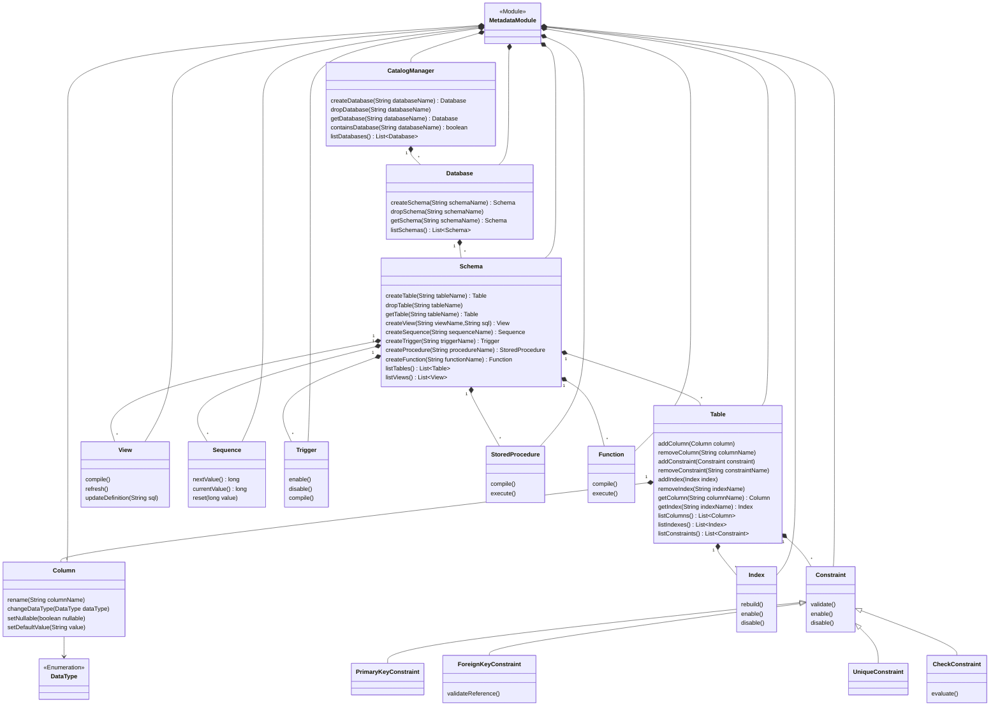

```mermaid
classDiagram
    direction TD

    %% =====================================================
    %% METADATA MODULE
    %% =====================================================

    class MetadataModule{
        <<Module>>
    }

    %% =====================================================
    %% CATALOG
    %% =====================================================

    class CatalogManager{
        createDatabase(String databaseName) Database
        dropDatabase(String databaseName)
        getDatabase(String databaseName) Database
        containsDatabase(String databaseName) boolean
        listDatabases() List~Database~
    }

    class Database{
        createSchema(String schemaName) Schema
        dropSchema(String schemaName)
        getSchema(String schemaName) Schema
        listSchemas() List~Schema~
    }

    class Schema{
        createTable(String tableName) Table
        dropTable(String tableName)
        getTable(String tableName) Table

        createView(String viewName,String sql) View
        createSequence(String sequenceName) Sequence
        createTrigger(String triggerName) Trigger
        createProcedure(String procedureName) StoredProcedure
        createFunction(String functionName) Function

        listTables() List~Table~
        listViews() List~View~
    }

    %% =====================================================
    %% TABLE
    %% =====================================================

    class Table{
        addColumn(Column column)
        removeColumn(String columnName)

        addConstraint(Constraint constraint)
        removeConstraint(String constraintName)

        addIndex(Index index)
        removeIndex(String indexName)

        getColumn(String columnName) Column
        getIndex(String indexName) Index

        listColumns() List~Column~
        listIndexes() List~Index~
        listConstraints() List~Constraint~
    }

    class Column{
        rename(String columnName)
        changeDataType(DataType dataType)
        setNullable(boolean nullable)
        setDefaultValue(String value)
    }

    class DataType{
        <<Enumeration>>
    }

    %% =====================================================
    %% INDEX
    %% =====================================================

    class Index{
        rebuild()
        enable()
        disable()
    }

    %% =====================================================
    %% VIEW
    %% =====================================================

    class View{
        compile()
        refresh()
        updateDefinition(String sql)
    }

    %% =====================================================
    %% CONSTRAINT
    %% =====================================================

    class Constraint{
        validate()
        enable()
        disable()
    }

    class PrimaryKeyConstraint{
    }

    class ForeignKeyConstraint{
        validateReference()
    }

    class UniqueConstraint{
    }

    class CheckConstraint{
        evaluate()
    }

    %% =====================================================
    %% SEQUENCE
    %% =====================================================

    class Sequence{
        nextValue() long
        currentValue() long
        reset(long value)
    }

    %% =====================================================
    %% TRIGGER
    %% =====================================================

    class Trigger{
        enable()
        disable()
        compile()
    }

    %% =====================================================
    %% STORED PROCEDURE
    %% =====================================================

    class StoredProcedure{
        compile()
        execute()
    }

    %% =====================================================
    %% FUNCTION
    %% =====================================================

    class Function{
        compile()
        execute()
    }

    %% =====================================================
    %% MODULE COMPOSITION
    %% =====================================================

    MetadataModule *-- CatalogManager
    MetadataModule *-- Database
    MetadataModule *-- Schema
    MetadataModule *-- Table
    MetadataModule *-- Column
    MetadataModule *-- Index
    MetadataModule *-- View
    MetadataModule *-- Constraint
    MetadataModule *-- Sequence
    MetadataModule *-- Trigger
    MetadataModule *-- StoredProcedure
    MetadataModule *-- Function

    %% =====================================================
    %% CATALOG TREE
    %% =====================================================

    CatalogManager "1" *-- "*" Database

    Database "1" *-- "*" Schema

    Schema "1" *-- "*" Table
    Schema "1" *-- "*" View
    Schema "1" *-- "*" Sequence
    Schema "1" *-- "*" Trigger
    Schema "1" *-- "*" StoredProcedure
    Schema "1" *-- "*" Function

    Table "1" *-- "*" Column
    Table "1" *-- "*" Index
    Table "1" *-- "*" Constraint

    Column --> DataType

    %% =====================================================
    %% INHERITANCE
    %% =====================================================

    Constraint <|-- PrimaryKeyConstraint
    Constraint <|-- ForeignKeyConstraint
    Constraint <|-- UniqueConstraint
    Constraint <|-- CheckConstraint
```