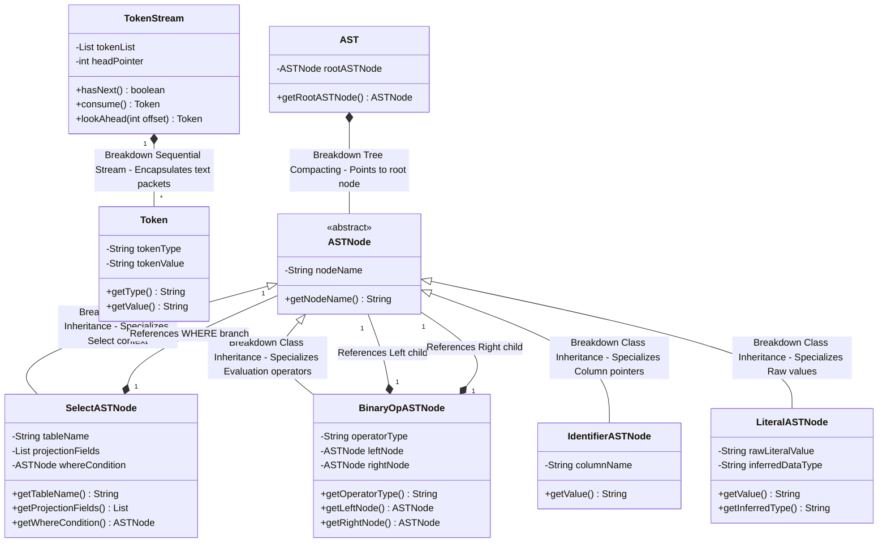

```mermaid
classDiagram
    direction TD

    %% =====================================================
    %% GIAI ĐOẠN 1: BREAKDOWN LEXICAL STREAM
    %% Pattern: "Sequential Stream Breakdown"
    %% (Tách dòng văn bản thô thành dòng quản lý Token có con trỏ)
    %% =====================================================
    
    class TokenStream {
        -List<Token> tokenList
        -int headPointer
        +hasNext() boolean
        +consume() Token
        +lookAhead(int offset) Token
    }

    class Token {
        -String tokenType
        -String tokenValue
        +getType() String
        +getValue() String
    }

    %% =====================================================
    %% GIAI ĐOẠN 2: BREAKDOWN PARSE & AST TREE HIERARCHY
    %% Pattern: "Composite Node Hierarchy Breakdown"
    %% (Tách hộp đen AST thành tập hợp đa hình các Node dữ liệu)
    %% =====================================================

    class AST {
        -ASTNode rootASTNode
        +getRootASTNode() ASTNode
    }

    class ASTNode {
        <<abstract>>
        -String nodeName
        +getNodeName() String
    }

    class SelectASTNode {
        -String tableName
        -List<String> projectionFields
        -ASTNode whereCondition
        +getTableName() String
        +getProjectionFields() List<String>
        +getWhereCondition() ASTNode
    }

    class BinaryOpASTNode {
        -String operatorType
        -ASTNode leftNode
        -ASTNode rightNode
        +getOperatorType() String
        +getLeftNode() ASTNode
        +getRightNode() ASTNode
    }

    class IdentifierASTNode {
        -String columnName
        +getValue() String
    }

    class LiteralASTNode {
        -String rawLiteralValue
        -String inferredDataType
        +getValue() String
        +getInferredType() String
    }

    %% =====================================================
    %% LEVEL 3 STRUCTURAL BREAKDOWN RELATIONSHIPS
    %% =====================================================

    %% Breakdown 1: Lexical Stream
    TokenStream "1" *-- "*" Token : Breakdown Sequential Stream - Encapsulates text packets

    %% Breakdown 2: AST Node Hierarchy
    AST *-- ASTNode : Breakdown Tree Compacting - Points to root node
    ASTNode <|-- SelectASTNode : Breakdown Class Inheritance - Specializes Select context
    ASTNode <|-- BinaryOpASTNode : Breakdown Class Inheritance - Specializes Evaluation operators
    ASTNode <|-- IdentifierASTNode : Breakdown Class Inheritance - Specializes Column pointers
    ASTNode <|-- LiteralASTNode : Breakdown Class Inheritance - Specializes Raw values

    %% Tree Node Compositions
    SelectASTNode "1" *-- "1" ASTNode : References WHERE branch
    BinaryOpASTNode "1" *-- "1" ASTNode : References Left child
    BinaryOpASTNode "1" *-- "1" ASTNode : References Right child
```