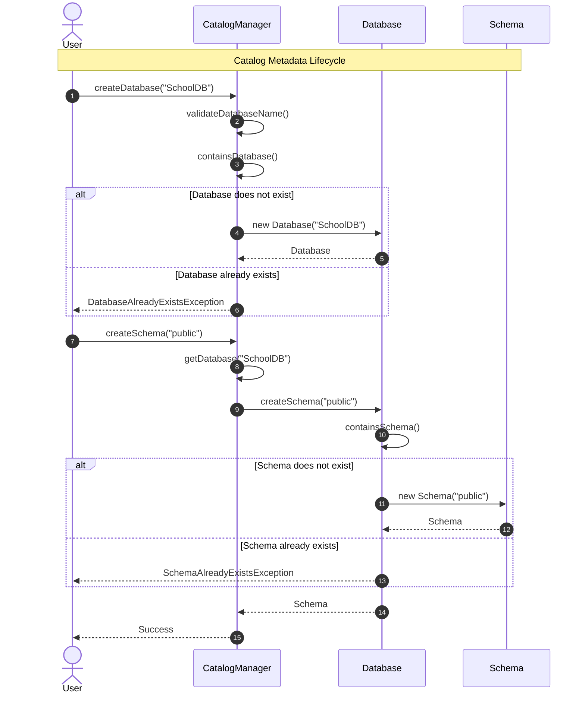

```mermaid
sequenceDiagram
    autonumber

    actor User
    participant CatalogManager
    participant Database
    participant Schema

    Note over User,Schema: Catalog Metadata Lifecycle

    User->>CatalogManager: createDatabase("SchoolDB")

    CatalogManager->>CatalogManager: validateDatabaseName()
    CatalogManager->>CatalogManager: containsDatabase()

    alt Database does not exist
        CatalogManager->>Database: new Database("SchoolDB")
        Database-->>CatalogManager: Database
    else Database already exists
        CatalogManager-->>User: DatabaseAlreadyExistsException
    end

    User->>CatalogManager: createSchema("public")

    CatalogManager->>CatalogManager: getDatabase("SchoolDB")
    CatalogManager->>Database: createSchema("public")

    Database->>Database: containsSchema()

    alt Schema does not exist
        Database->>Schema: new Schema("public")
        Schema-->>Database: Schema
    else Schema already exists
        Database-->>User: SchemaAlreadyExistsException
    end

    Database-->>CatalogManager: Schema
    CatalogManager-->>User: Success
```