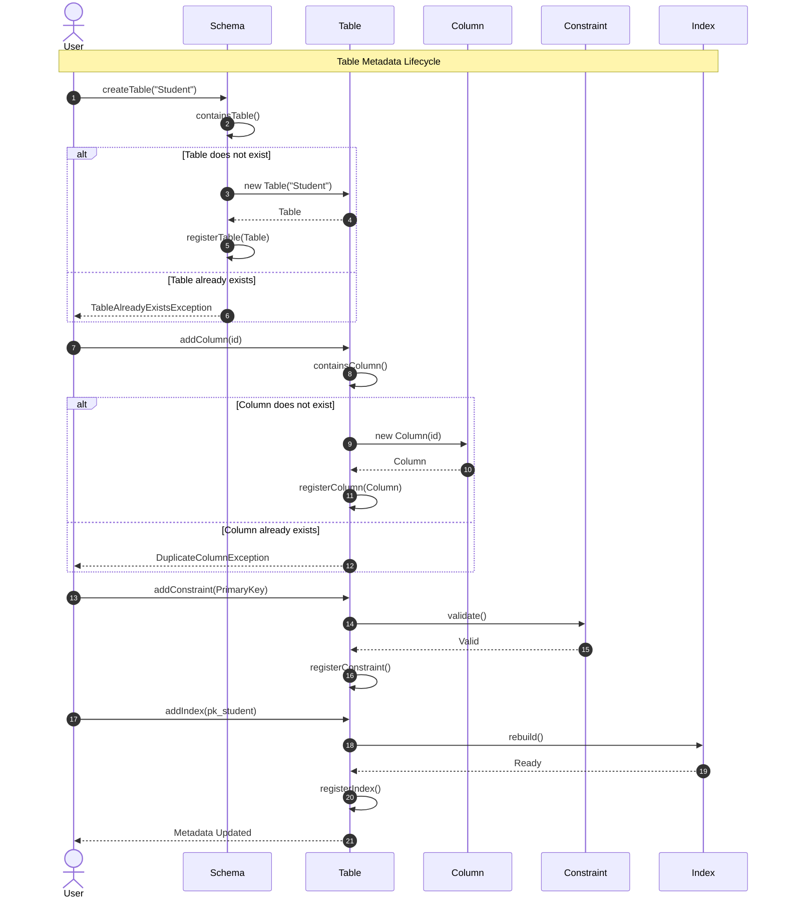

```mermaid
sequenceDiagram
    autonumber

    actor User
    participant Schema
    participant Table
    participant Column
    participant Constraint
    participant Index

    Note over User,Index: Table Metadata Lifecycle

    User->>Schema: createTable("Student")

    Schema->>Schema: containsTable()

    alt Table does not exist
        Schema->>Table: new Table("Student")
        Table-->>Schema: Table
        Schema->>Schema: registerTable(Table)
    else Table already exists
        Schema-->>User: TableAlreadyExistsException
    end

    User->>Table: addColumn(id)

    Table->>Table: containsColumn()

    alt Column does not exist
        Table->>Column: new Column(id)
        Column-->>Table: Column
        Table->>Table: registerColumn(Column)
    else Column already exists
        Table-->>User: DuplicateColumnException
    end

    User->>Table: addConstraint(PrimaryKey)

    Table->>Constraint: validate()
    Constraint-->>Table: Valid
    Table->>Table: registerConstraint()

    User->>Table: addIndex(pk_student)

    Table->>Index: rebuild()
    Index-->>Table: Ready
    Table->>Table: registerIndex()

    Table-->>User: Metadata Updated
```