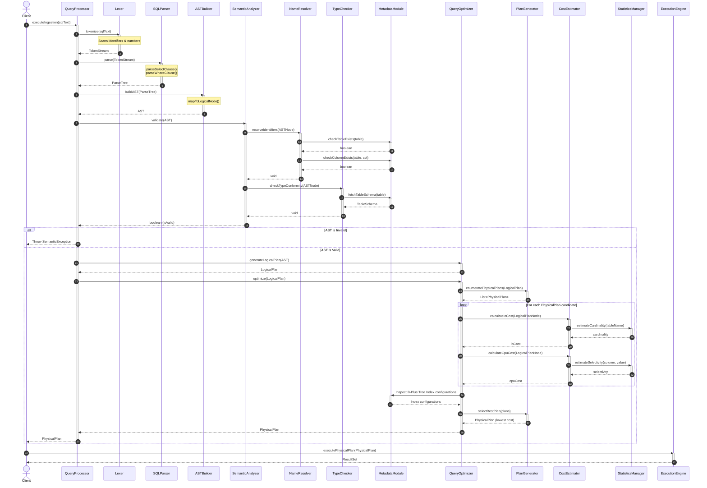

```mermaid
sequenceDiagram
    autonumber
    actor Client
    participant QP as QueryProcessor
    participant L as Lexer
    participant P as SQLParser
    participant AB as ASTBuilder
    participant SA as SemanticAnalyzer
    participant NR as NameResolver
    participant TC as TypeChecker
    participant MM as MetadataModule
    participant QO as QueryOptimizer
    participant PG as PlanGenerator
    participant CE as CostEstimator
    participant SM as StatisticsManager
    participant EE as ExecutionEngine

    Client->>QP: executeIngestion(sqlText)
    activate QP
    
    %% Lexical Analysis
    QP->>L: tokenize(sqlText)
    activate L
    Note over L: Scans identifiers & numbers
    L-->>QP: TokenStream
    deactivate L

    %% Syntax Analysis
    QP->>P: parse(TokenStream)
    activate P
    Note over P: parseSelectClause()<br/>parseWhereClause()
    P-->>QP: ParseTree
    deactivate P

    %% AST Construction
    QP->>AB: buildAST(ParseTree)
    activate AB
    Note over AB: mapToLogicalNode()
    AB-->>QP: AST
    deactivate AB

    %% Semantic Analysis
    QP->>SA: validate(AST)
    activate SA
    
    SA->>NR: resolveIdentifiers(ASTNode)
    activate NR
    NR->>MM: checkTableExists(table)
    activate MM
    MM-->>NR: boolean
    deactivate MM
    NR->>MM: checkColumnExists(table, col)
    activate MM
    MM-->>NR: boolean
    deactivate MM
    NR-->>SA: void
    deactivate NR

    SA->>TC: checkTypeConformity(ASTNode)
    activate TC
    TC->>MM: fetchTableSchema(table)
    activate MM
    MM-->>TC: TableSchema
    deactivate MM
    TC-->>SA: void
    deactivate TC

    SA-->>QP: boolean (isValid)
    deactivate SA

    alt AST is Invalid
        QP-->>Client: Throw SemanticException
    else AST is Valid
        %% Query Optimization
        QP->>QO: generateLogicalPlan(AST)
        activate QO
        QO-->>QP: LogicalPlan
        deactivate QO

        QP->>QO: optimize(LogicalPlan)
        activate QO
        
        QO->>PG: enumeratePhysicalPlans(LogicalPlan)
        activate PG
        PG-->>QO: List<PhysicalPlan>
        deactivate PG

        loop For each PhysicalPlan candidate
            QO->>CE: calculateIoCost(LogicalPlanNode)
            activate CE
            CE->>SM: estimateCardinality(tableName)
            activate SM
            SM-->>CE: cardinality
            deactivate SM
            CE-->>QO: ioCost
            deactivate CE

            QO->>CE: calculateCpuCost(LogicalPlanNode)
            activate CE
            CE->>SM: estimateSelectivity(column, value)
            activate SM
            SM-->>CE: selectivity
            deactivate SM
            CE-->>QO: cpuCost
            deactivate CE
        end

        QO->>MM: Inspect B-Plus Tree Index configurations
        activate MM
        MM-->>QO: Index configurations
        deactivate MM

        QO->>PG: selectBestPlan(plans)
        activate PG
        PG-->>QO: PhysicalPlan (lowest cost)
        deactivate PG

        QO-->>QP: PhysicalPlan
        deactivate QO
        
        QP-->>Client: PhysicalPlan
    end
    deactivate QP

    %% Execution Engine Dispatches
    Client->>EE: executePhysicalPlan(PhysicalPlan)
    activate EE
    EE-->>Client: ResultSet
    deactivate EE
```
