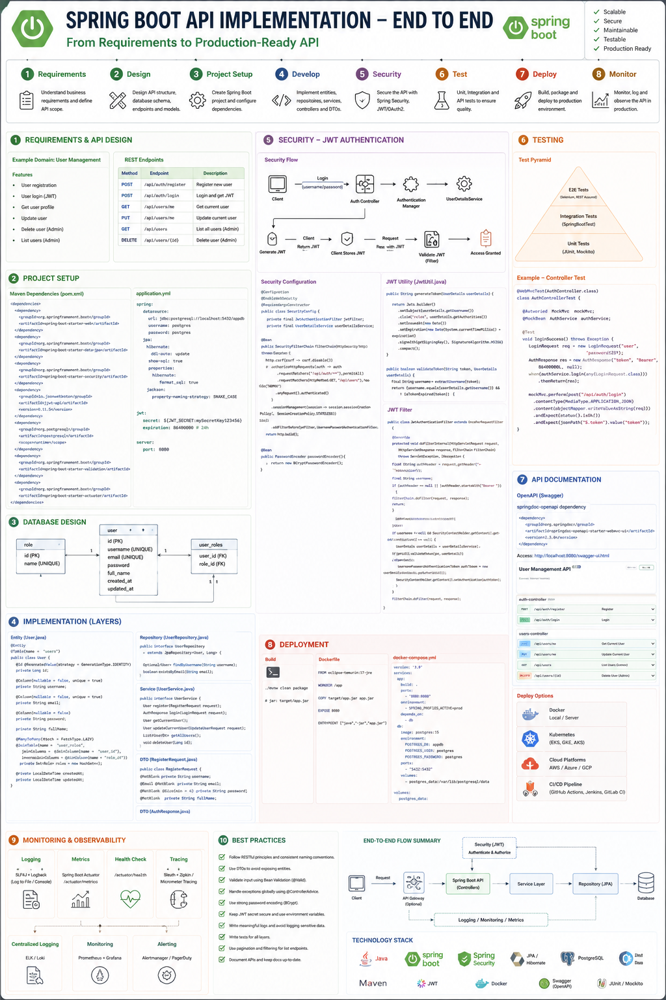
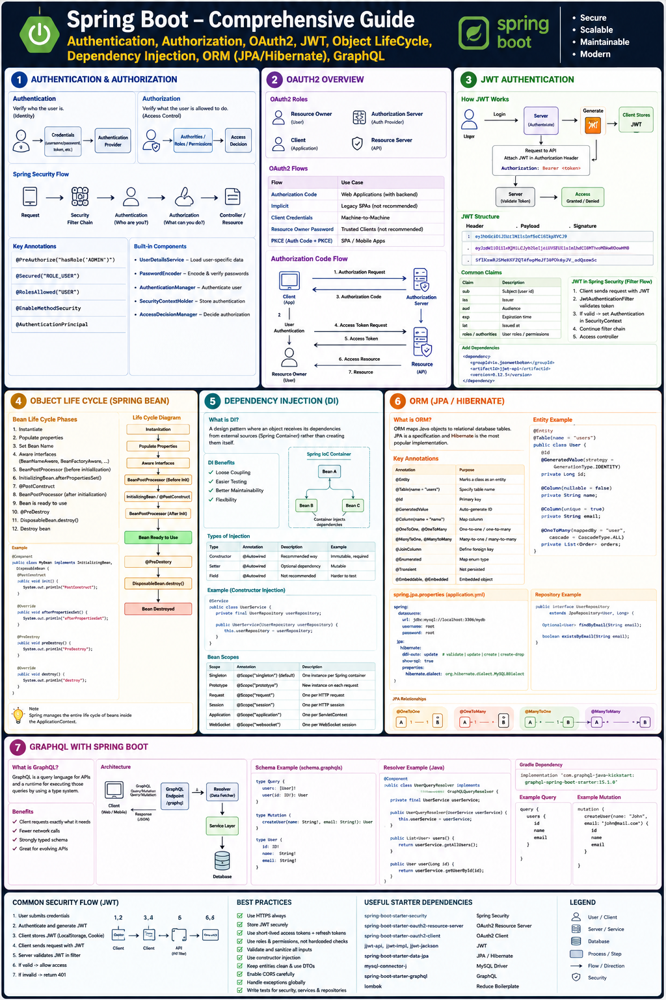
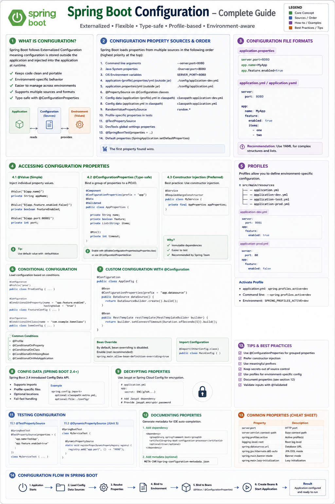
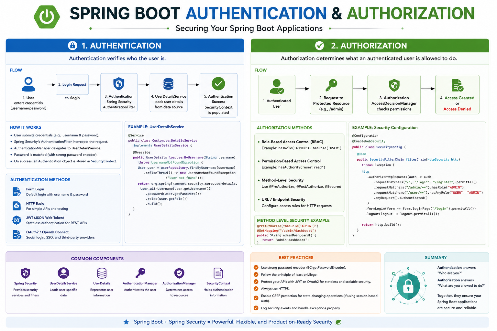
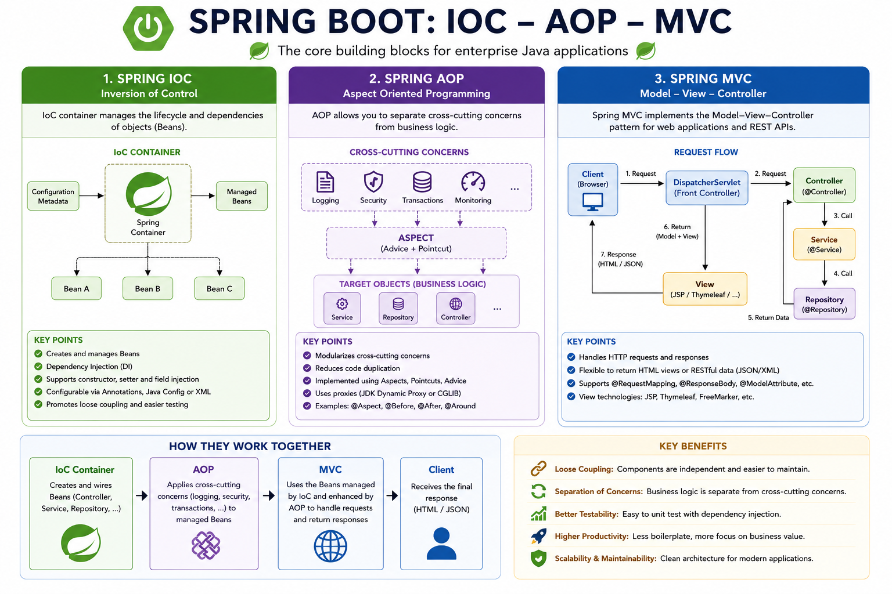
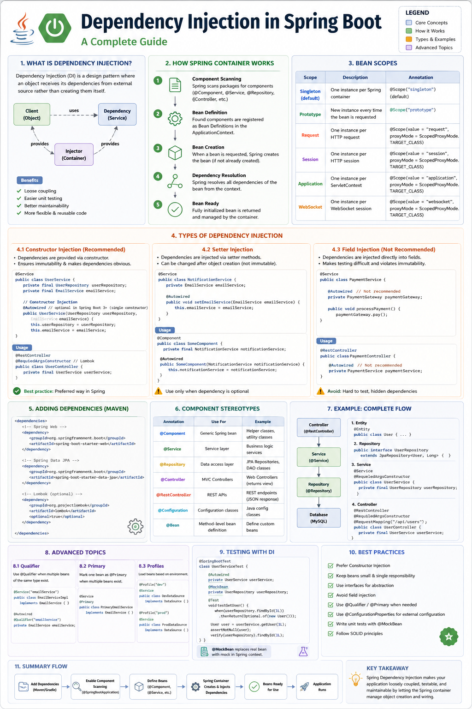
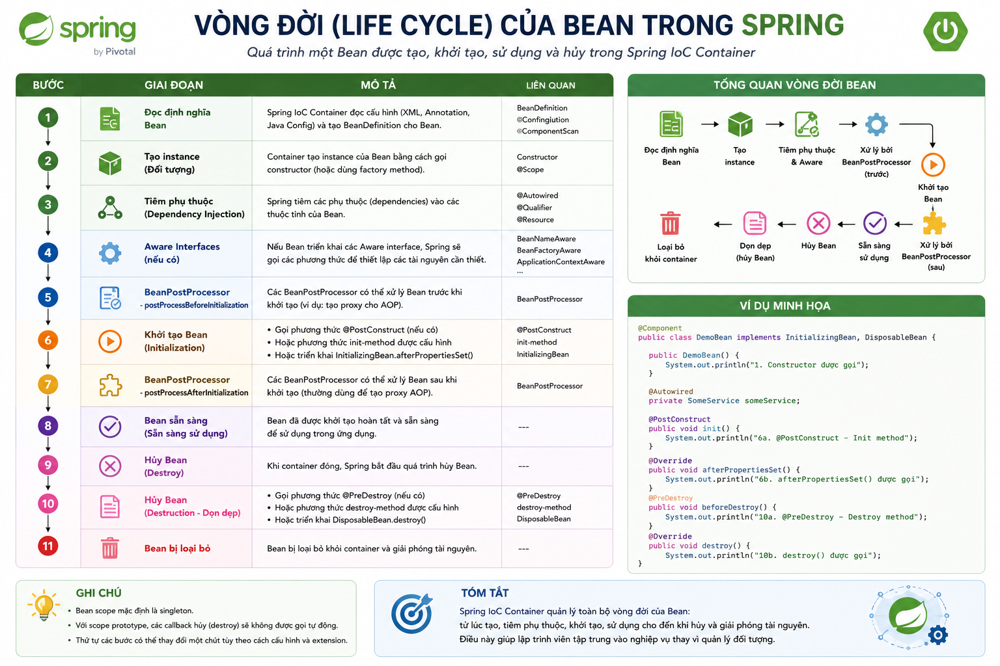
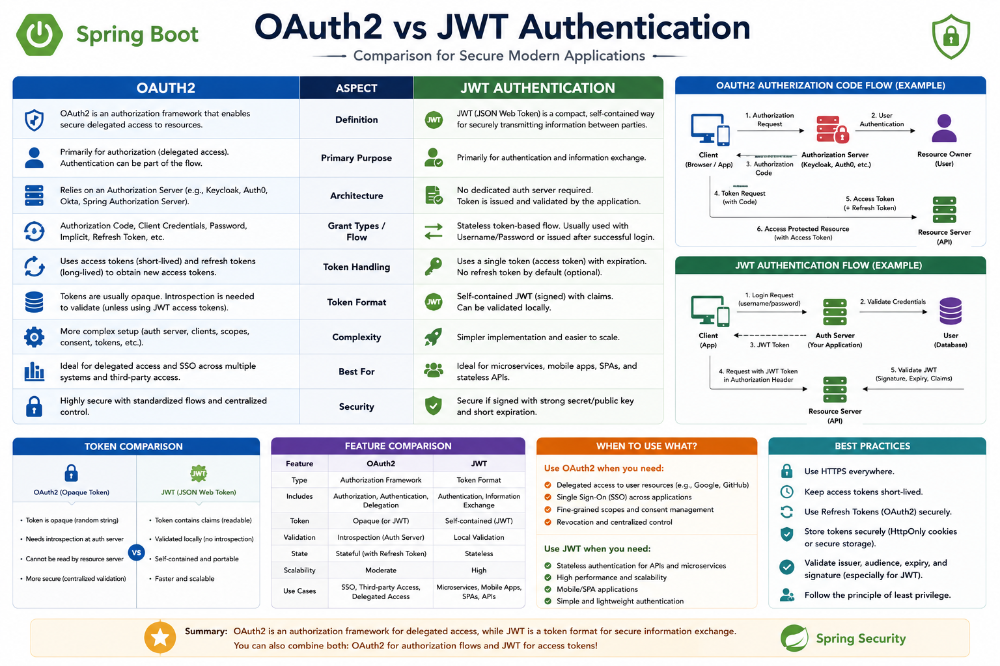
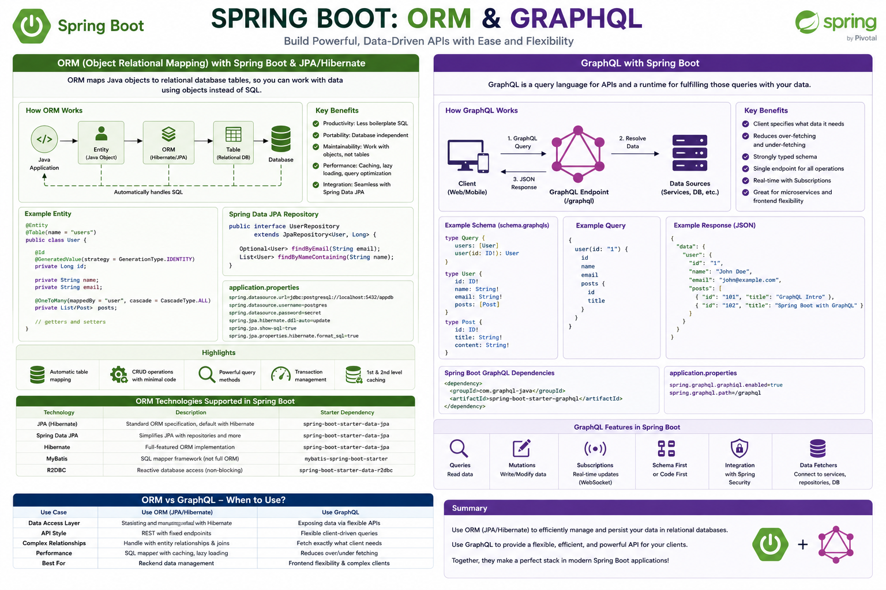

# Spring Roadmap Mindmaps

Dưới đây là các sơ đồ tư duy (Mindmap) học tập Spring Framework theo thứ tự:

## 1. API Implementation

## 2. Overview Flow

## 3. Configuration

## 4. Authentication & Authorization

## 5. IoC, AOP & Spring MVC

## 6. Dependency Injection (DI)

## 7. Bean Lifecycle

## 8. OAuth2 & JWT

## 9. ORM & GraphQL

