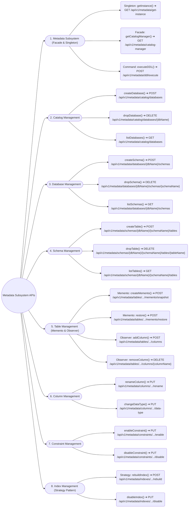

# Metadata Subsystem - API Design & Design Pattern Mapping Mindmap

```mermaid
flowchart LR
    Root(("Metadata Subsystem APIs"))

    %% =====================================================
    %% Subsystem Categories (8 Domains)
    %% =====================================================
    CatFacade(["1. Metadata Subsystem (Facade & Singleton)"])
    CatCatalog(["2. Catalog Management"])
    CatDatabase(["3. Database Management"])
    CatSchema(["4. Schema Management"])
    CatTable(["5. Table Management (Memento & Observer)"])
    CatColumn(["6. Column Management"])
    CatConstraint(["7. Constraint Management"])
    CatIndex(["8. Index Management (Strategy Pattern)"])

    Root --> CatFacade
    Root --> CatCatalog
    Root --> CatDatabase
    Root --> CatSchema
    Root --> CatTable
    Root --> CatColumn
    Root --> CatConstraint
    Root --> CatIndex

    %% =====================================================
    %% 1. Facade & Singleton APIs
    %% =====================================================
    CatFacade --> F1("Singleton: getInstance() ➔ GET /api/v1/metadata/get-instance")
    CatFacade --> F2("Facade: getCatalogManager() ➔ GET /api/v1/metadata/catalog-manager")
    CatFacade --> F3("Command: executeDDL() ➔ POST /api/v1/metadata/ddl/execute")

    %% =====================================================
    %% 2. Catalog Management APIs
    %% =====================================================
    CatCatalog --> C1("createDatabase() ➔ POST /api/v1/metadata/catalog/databases")
    CatCatalog --> C2("dropDatabase() ➔ DELETE /api/v1/metadata/catalog/databases/{dbName}")
    CatCatalog --> C3("listDatabases() ➔ GET /api/v1/metadata/catalog/databases")

    %% =====================================================
    %% 3. Database Management APIs
    %% =====================================================
    CatDatabase --> D1("createSchema() ➔ POST /api/v1/metadata/databases/{dbName}/schemas")
    CatDatabase --> D2("dropSchema() ➔ DELETE /api/v1/metadata/databases/{dbName}/schemas/{schemaName}")
    CatDatabase --> D3("listSchemas() ➔ GET /api/v1/metadata/databases/{dbName}/schemas")

    %% =====================================================
    %% 4. Schema Management APIs
    %% =====================================================
    CatSchema --> S1("createTable() ➔ POST /api/v1/metadata/schemas/{dbName}/{schemaName}/tables")
    CatSchema --> S2("dropTable() ➔ DELETE /api/v1/metadata/schemas/{dbName}/{schemaName}/tables/{tableName}")
    CatSchema --> S3("listTables() ➔ GET /api/v1/metadata/schemas/{dbName}/{schemaName}/tables")

    %% =====================================================
    %% 5. Table Management APIs (Memento & Observer)
    %% =====================================================
    CatTable --> T1("Memento: createMemento() ➔ POST /api/v1/metadata/tables/.../memento/snapshot")
    CatTable --> T2("Memento: restore() ➔ POST /api/v1/metadata/tables/.../memento/restore")
    CatTable --> T3("Observer: addColumn() ➔ POST /api/v1/metadata/tables/.../columns")
    CatTable --> T4("Observer: removeColumn() ➔ DELETE /api/v1/metadata/tables/.../columns/{columnName}")

    %% =====================================================
    %% 6. Column Management APIs
    %% =====================================================
    CatColumn --> CL1("renameColumn() ➔ PUT /api/v1/metadata/columns/.../rename")
    CatColumn --> CL2("changeDataType() ➔ PUT /api/v1/metadata/columns/.../data-type")

    %% =====================================================
    %% 7. Constraint Management APIs
    %% =====================================================
    CatConstraint --> CT1("enableConstraint() ➔ PUT /api/v1/metadata/constraints/.../enable")
    CatConstraint --> CT2("disableConstraint() ➔ PUT /api/v1/metadata/constraints/.../disable")

    %% =====================================================
    %% 8. Index Management APIs (Strategy Pattern)
    %% =====================================================
    CatIndex --> I1("Strategy: rebuildIndex() ➔ POST /api/v1/metadata/indexes/.../rebuild")
    CatIndex --> I2("disableIndex() ➔ PUT /api/v1/metadata/indexes/.../disable")
```
