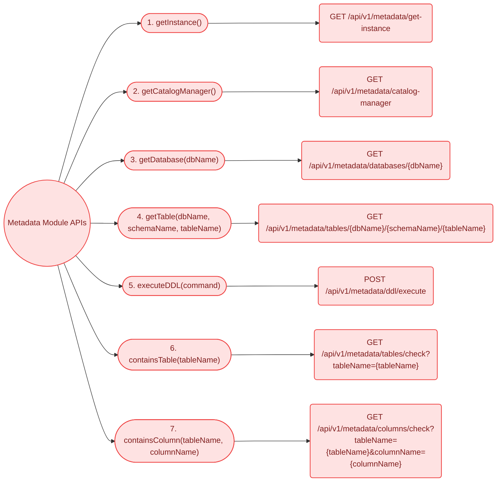

# Metadata Module - API Design & Endpoint Mapping Mindmap

```mermaid
flowchart LR
    Root(("Metadata Module APIs"))

    %% =====================================================
    %% Facade Methods
    %% =====================================================

    M1(["1. getInstance()"])
    M2(["2. getCatalogManager()"])
    M3(["3. getDatabase(dbName)"])
    M4(["4. getTable(dbName, schemaName, tableName)"])
    M5(["5. executeDDL(command)"])
    M6(["6. containsTable(tableName)"])
    M7(["7. containsColumn(tableName, columnName)"])

    Root --> M1
    Root --> M2
    Root --> M3
    Root --> M4
    Root --> M5
    Root --> M6
    Root --> M7

    %% =====================================================
    %% API Endpoints Mapping
    %% =====================================================

    M1 --> API1("GET /api/v1/metadata/get-instance")
    M2 --> API2("GET /api/v1/metadata/catalog-manager")
    M3 --> API3("GET /api/v1/metadata/databases/{dbName}")
    M4 --> API4("GET /api/v1/metadata/tables/{dbName}/{schemaName}/{tableName}")
    M5 --> API5("POST /api/v1/metadata/ddl/execute")
    M6 --> API6("GET /api/v1/metadata/tables/check?tableName={tableName}")
    M7 --> API7("GET /api/v1/metadata/columns/check?tableName={tableName}&columnName={columnName}")

    %% Custom Light Red Styling
    classDef lightRed fill:#fee2e2,stroke:#ef4444,color:#7f1d1d,stroke-width:1.5px;
    class Root,M1,M2,M3,M4,M5,M6,M7,API1,API2,API3,API4,API5,API6,API7 lightRed;
```
