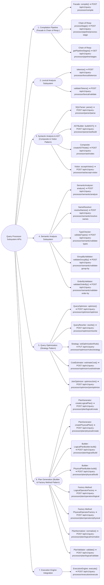

# Query Processor Subsystem - API Design & Design Pattern Mapping Mindmap

```mermaid
flowchart LR
    Root(("Query Processor Subsystem APIs"))

    %% =====================================================
    %% Subsystem Categories (7 Domains)
    %% =====================================================
    CatFacade(["1. Compilation Pipeline (Facade & Chain of Resp.)"])
    CatLexical(["2. Lexical Analysis Subsystem"])
    CatSyntactic(["3. Syntactic Analysis & AST (Composite & Visitor Pattern)"])
    CatSemantic(["4. Semantic Analysis Subsystem"])
    CatOptimizer(["5. Query Optimization (Strategy Pattern)"])
    CatPlan(["6. Plan Generation (Builder & Factory Method Pattern)"])
    CatExecution(["7. Execution Engine Integration"])

    Root --> CatFacade
    Root --> CatLexical
    Root --> CatSyntactic
    Root --> CatSemantic
    Root --> CatOptimizer
    Root --> CatPlan
    Root --> CatExecution

    %% =====================================================
    %% 1. Facade & Compilation Pipeline APIs
    %% =====================================================
    CatFacade --> F1("Facade: compile() ➔ POST /api/v1/query-processor/compile")
    CatFacade --> F2("Chain of Resp: processStage() ➔ POST /api/v1/query-processor/pipeline/process-stage")
    CatFacade --> F3("Chain of Resp: getPipelineStages() ➔ GET /api/v1/query-processor/pipeline/stages")

    %% =====================================================
    %% 2. Lexical Analysis APIs
    %% =====================================================
    CatLexical --> L1("tokenize() ➔ POST /api/v1/query-processor/lexical/tokenize")
    CatLexical --> L2("validateTokens() ➔ POST /api/v1/query-processor/lexical/validate")

    %% =====================================================
    %% 3. Syntactic Analysis & AST APIs (Composite & Visitor)
    %% =====================================================
    CatSyntactic --> P1("SQLParser: parse() ➔ POST /api/v1/query-processor/parser/parse")
    CatSyntactic --> P2("ASTBuilder: buildAST() ➔ POST /api/v1/query-processor/parser/ast/build")
    CatSyntactic --> P3("Composite: createASTNode() ➔ POST /api/v1/query-processor/ast/nodes")
    CatSyntactic --> P4("Visitor: acceptVisitor() ➔ POST /api/v1/query-processor/ast/accept-visitor")

    %% =====================================================
    %% 4. Semantic Analysis APIs
    %% =====================================================
    CatSemantic --> S1("SemanticAnalyzer: analyze() ➔ POST /api/v1/query-processor/semantic/analyze")
    CatSemantic --> S2("NameResolver: resolveNames() ➔ POST /api/v1/query-processor/semantic/resolve-names")
    CatSemantic --> S3("TypeChecker: validateTypes() ➔ POST /api/v1/query-processor/semantic/validate-types")
    CatSemantic --> S4("GroupByValidator: validateGroupBy() ➔ POST /api/v1/query-processor/semantic/validate-group-by")
    CatSemantic --> S5("OrderByValidator: validateOrderBy() ➔ POST /api/v1/query-processor/semantic/validate-order-by")

    %% =====================================================
    %% 5. Query Optimization APIs (Strategy Pattern)
    %% =====================================================
    CatOptimizer --> O1("QueryOptimizer: optimize() ➔ POST /api/v1/query-processor/optimizer/optimize")
    CatOptimizer --> O2("QueryRewriter: rewrite() ➔ POST /api/v1/query-processor/optimizer/rewrite")
    CatOptimizer --> O3("Strategy: setOptimizationRule() ➔ PUT /api/v1/query-processor/optimizer/rules/strategy")
    CatOptimizer --> O4("CostEstimator: estimateCost() ➔ POST /api/v1/query-processor/optimizer/cost/estimate")
    CatOptimizer --> O5("JoinOptimizer: optimizeJoin() ➔ POST /api/v1/query-processor/optimizer/join/optimize")

    %% =====================================================
    %% 6. Plan Generation APIs (Builder & Factory Method)
    %% =====================================================
    CatPlan --> PL1("PlanGenerator: createLogicalPlan() ➔ POST /api/v1/query-processor/plan/logical/create")
    CatPlan --> PL2("PlanGenerator: createPhysicalPlan() ➔ POST /api/v1/query-processor/plan/physical/create")
    CatPlan --> PL3("Builder: LogicalPlanBuilder.build() ➔ POST /api/v1/query-processor/plan/logical/build")
    CatPlan --> PL4("Builder: PhysicalPlanBuilder.build() ➔ POST /api/v1/query-processor/plan/physical/build")
    CatPlan --> PL5("Factory Method: LogicalOperatorFactory ➔ POST /api/v1/query-processor/plan/operators/logical")
    CatPlan --> PL6("Factory Method: PhysicalOperatorFactory ➔ POST /api/v1/query-processor/plan/operators/physical")
    CatPlan --> PL7("PlanNormalizer: normalize() ➔ POST /api/v1/query-processor/plan/logical/normalize")
    CatPlan --> PL8("PlanValidator: validate() ➔ POST /api/v1/query-processor/plan/logical/validate")

    %% =====================================================
    %% 7. Execution Engine Integration APIs
    %% =====================================================
    CatExecution --> E1("ExecutionEngine: execute() ➔ POST /api/v1/query-processor/execution/execute")
```
