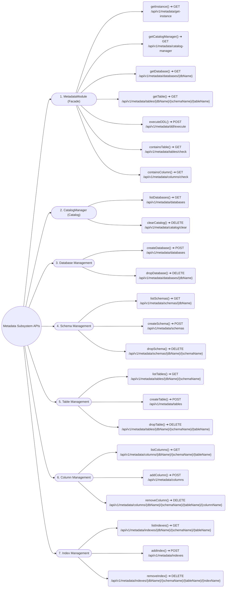

# API Implementation Mindmaps

Tài liệu tổng hợp sơ đồ tư duy (Mindmap) ánh xạ thiết kế API cho các Subsystem thuộc hệ thống DBMS.

---

## 1. Metadata Subsystem APIs

Chi tiết tài liệu: [Metadata.md](Metadata.md)

