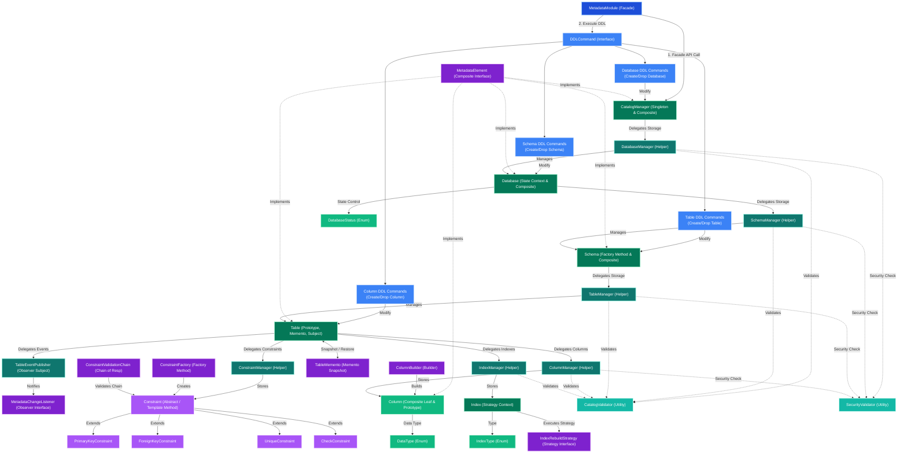

# Sơ Đồ Kiến Trúc Module Metadata

```mermaid
flowchart TD
    %% =====================================================
    %% STYLES DEFINITION
    %% =====================================================
    classDef facade fill:#1d4ed8,stroke:#93c5fd,stroke-width:2px,color:#ffffff;
    classDef command fill:#3b82f6,stroke:#dbeafe,stroke-width:2px,color:#ffffff;
    classDef core fill:#047857,stroke:#a7f3d0,stroke-width:2px,color:#ffffff;
    classDef leaf fill:#10b981,stroke:#d1fae5,stroke-width:2px,color:#ffffff;
    classDef manager fill:#0f766e,stroke:#99f6e4,stroke-width:2px,color:#ffffff;
    classDef helper fill:#14b8a6,stroke:#ccfbf1,stroke-width:2px,color:#ffffff;
    classDef pattern fill:#7e22ce,stroke:#f5d0fe,stroke-width:2px,color:#ffffff;
    classDef constraint fill:#a855f7,stroke:#fae8ff,stroke-width:2px,color:#ffffff;

    %% =====================================================
    %% NODES DEFINITION
    %% =====================================================
    MetadataModule["MetadataModule (Facade)"]:::facade

    DDLCommand["DDLCommand (Interface)"]:::command
    DatabaseCmds["Database DDL Commands<br>(Create/Drop Database)"]:::command
    SchemaCmds["Schema DDL Commands<br>(Create/Drop Schema)"]:::command
    TableCmds["Table DDL Commands<br>(Create/Drop Table)"]:::command
    ColumnCmds["Column DDL Commands<br>(Create/Drop Column)"]:::command

    MetadataElement["MetadataElement (Composite Interface)"]:::pattern

    CatalogManager["CatalogManager (Singleton & Composite)"]:::core
    DatabaseManager["DatabaseManager (Helper)"]:::manager

    Database["Database (State Context & Composite)"]:::core
    DatabaseStatus["DatabaseStatus (Enum)"]:::leaf
    SchemaManager["SchemaManager (Helper)"]:::manager

    Schema["Schema (Factory Method & Composite)"]:::core
    TableManager["TableManager (Helper)"]:::manager

    Table["Table (Prototype, Memento, Subject)"]:::core
    ColumnManager["ColumnManager (Helper)"]:::manager
    ConstraintManager["ConstraintManager (Helper)"]:::manager
    IndexManager["IndexManager (Helper)"]:::manager
    TableEventPublisher["TableEventPublisher (Observer Subject)"]:::manager

    TableMemento["TableMemento (Memento Snapshot)"]:::pattern
    MetadataChangeListener["MetadataChangeListener (Observer Interface)"]:::pattern

    ColumnBuilder["ColumnBuilder (Builder)"]:::pattern
    Column["Column (Composite Leaf & Prototype)"]:::leaf
    DataType["DataType (Enum)"]:::leaf

    Index["Index (Strategy Context)"]:::core
    IndexType["IndexType (Enum)"]:::leaf
    IndexRebuildStrategy["IndexRebuildStrategy (Strategy Interface)"]:::pattern

    ConstraintFactory["ConstraintFactory (Factory Method)"]:::pattern
    ConstraintValidationChain["ConstraintValidationChain (Chain of Resp)"]:::pattern
    Constraint["Constraint (Abstract / Template Method)"]:::constraint

    PrimaryKeyConstraint["PrimaryKeyConstraint"]:::constraint
    ForeignKeyConstraint["ForeignKeyConstraint"]:::constraint
    UniqueConstraint["UniqueConstraint"]:::constraint
    CheckConstraint["CheckConstraint"]:::constraint

    CatalogValidator["CatalogValidator (Utility)"]:::helper
    SecurityValidator["SecurityValidator (Utility)"]:::helper

    %% =====================================================
    %% ARCHITECTURE CONNECTIONS & FLOWS
    %% =====================================================

    %% Facade & Command Flows
    MetadataModule -->|1. Facade API Call| CatalogManager
    MetadataModule -->|2. Execute DDL| DDLCommand

    DDLCommand --> DatabaseCmds
    DDLCommand --> SchemaCmds
    DDLCommand --> TableCmds
    DDLCommand --> ColumnCmds

    DatabaseCmds -->|Modify| CatalogManager
    SchemaCmds -->|Modify| Database
    TableCmds -->|Modify| Schema
    ColumnCmds -->|Modify| Table

    %% Composite Interface Inheritance
    MetadataElement -.->|Implements| CatalogManager
    MetadataElement -.->|Implements| Database
    MetadataElement -.->|Implements| Schema
    MetadataElement -.->|Implements| Table
    MetadataElement -.->|Implements| Column

    %% Core Hierarchy & Managers Delegation
    CatalogManager -->|Delegates Storage| DatabaseManager
    DatabaseManager -->|Manages| Database

    Database -->|State Control| DatabaseStatus
    Database -->|Delegates Storage| SchemaManager
    SchemaManager -->|Manages| Schema

    Schema -->|Delegates Storage| TableManager
    TableManager -->|Manages| Table

    %% Table Internal Delegations
    Table -->|Delegates Columns| ColumnManager
    Table -->|Delegates Constraints| ConstraintManager
    Table -->|Delegates Indexes| IndexManager
    Table -->|Delegates Events| TableEventPublisher

    %% Column Subsystem
    ColumnBuilder -->|Builds| Column
    ColumnManager -->|Stores| Column
    Column -->|Data Type| DataType

    %% Index Subsystem
    IndexManager -->|Stores| Index
    Index -->|Type| IndexType
    Index -->|Executes Strategy| IndexRebuildStrategy

    %% Constraint Subsystem
    ConstraintManager -->|Stores| Constraint
    ConstraintFactory -->|Creates| Constraint
    ConstraintValidationChain -->|Validates Chain| Constraint

    Constraint -->|Extends| PrimaryKeyConstraint
    Constraint -->|Extends| ForeignKeyConstraint
    Constraint -->|Extends| UniqueConstraint
    Constraint -->|Extends| CheckConstraint

    %% Memento & Observer
    Table <-->|Snapshot / Restore| TableMemento
    TableEventPublisher -->|Notifies| MetadataChangeListener

    %% Validation Utilities
    DatabaseManager -.->|Validates| CatalogValidator
    DatabaseManager -.->|Security Check| SecurityValidator
    SchemaManager -.->|Validates| CatalogValidator
    SchemaManager -.->|Security Check| SecurityValidator
    TableManager -.->|Validates| CatalogValidator
    TableManager -.->|Security Check| SecurityValidator
    ColumnManager -.->|Validates| CatalogValidator
    ColumnManager -.->|Security Check| SecurityValidator
    IndexManager -.->|Validates| CatalogValidator
```
