# Sơ Đồ Kiến Trúc Module Metadata (Metadata Module Architecture)

Tài liệu thể hiện sơ đồ kiến trúc tổng thể (Architecture Flowchart) và luồng liên kết giữa tất cả các Class, Interface, Enum, và Helper Manager trong module `metadata` theo đúng thực tế thiết kế mã nguồn.

---

## 1. Sơ Đồ Kiến Trúc Tổng Thể (Mermaid Architecture Flowchart)

```mermaid
flowchart TD
    %% =====================================================
    %% STYLES DEFINITION (COHESIVE COLOR FAMILIES BY GROUP)
    %% =====================================================
    %% Nhóm 1: Entry Point & Commands (Họ màu Xanh Dương - Blue Family)
    classDef facade fill:#1d4ed8,stroke:#93c5fd,stroke-width:2px,color:#ffffff;
    classDef command fill:#3b82f6,stroke:#dbeafe,stroke-width:2px,color:#ffffff;

    %% Nhóm 2: Core Domain Entities & Leaves (Họ màu Xanh Lá - Green Family)
    classDef core fill:#047857,stroke:#a7f3d0,stroke-width:2px,color:#ffffff;
    classDef leaf fill:#10b981,stroke:#d1fae5,stroke-width:2px,color:#ffffff;

    %% Nhóm 3: Helper Managers & Utilities (Họ màu Xanh Ngọc - Teal Family)
    classDef manager fill:#0f766e,stroke:#99f6e4,stroke-width:2px,color:#ffffff;
    classDef helper fill:#14b8a6,stroke:#ccfbf1,stroke-width:2px,color:#ffffff;

    %% Nhóm 4: Patterns, Interfaces & Constraints (Họ màu Tím - Purple Family)
    classDef pattern fill:#7e22ce,stroke:#f5d0fe,stroke-width:2px,color:#ffffff;
    classDef constraint fill:#a855f7,stroke:#fae8ff,stroke-width:2px,color:#ffffff;

    %% =====================================================
    %% NODES DEFINITION
    %% =====================================================
    MetadataModule["MetadataModule (Facade)"]:::facade

    DDLCommand["DDLCommand (Interface)"]:::command
    DatabaseCmds["Database DDL Commands<br>(Create/Drop/Rename Database)"]:::command
    SchemaCmds["Schema DDL Commands<br>(Create/Drop/Rename Schema)"]:::command
    TableCmds["Table DDL Commands<br>(Create/Drop/Rename Table)"]:::command
    ColumnCmds["Column DDL Commands<br>(Create/Drop/Rename Column)"]:::command

    MetadataElement["MetadataElement (Composite Interface)"]:::pattern

    CatalogManager["CatalogManager (Singleton & Composite)"]:::core
    DatabaseManager["DatabaseManager (Helper)"]:::manager

    Database["Database (State Context & Composite)"]:::core
    DatabaseStatus["DatabaseStatus (Enum)"]:::leaf
    SchemaManager["SchemaManager (Helper)"]:::manager

    Schema["Schema (Factory Method & Composite)"]:::core
    TableManager["TableManager (Helper)"]:::manager

    Table["Table (Prototype, Memento, Subject)"]:::core
    ColumnManager["ColumnManager (Helper)"]:::manager
    ConstraintManager["ConstraintManager (Helper)"]:::manager
    IndexManager["IndexManager (Helper)"]:::manager
    TableEventPublisher["TableEventPublisher (Observer Subject)"]:::manager

    TableMemento["TableMemento (Memento Snapshot)"]:::pattern
    MetadataChangeListener["MetadataChangeListener (Observer Interface)"]:::pattern

    ColumnBuilder["ColumnBuilder (Builder)"]:::pattern
    Column["Column (Composite Leaf & Prototype)"]:::leaf
    DataType["DataType (Enum)"]:::leaf

    Index["Index (Strategy Context)"]:::core
    IndexType["IndexType (Enum)"]:::leaf
    IndexRebuildStrategy["IndexRebuildStrategy (Strategy Interface)"]:::pattern

    ConstraintFactory["ConstraintFactory (Factory Method)"]:::pattern
    ConstraintValidationChain["ConstraintValidationChain (Chain of Resp)"]:::pattern
    Constraint["Constraint (Abstract / Template Method)"]:::constraint

    PrimaryKeyConstraint["PrimaryKeyConstraint"]:::constraint
    ForeignKeyConstraint["ForeignKeyConstraint"]:::constraint
    UniqueConstraint["UniqueConstraint"]:::constraint
    CheckConstraint["CheckConstraint"]:::constraint

    CatalogValidator["CatalogValidator (Utility)"]:::helper
    SecurityValidator["SecurityValidator (Utility)"]:::helper

    %% =====================================================
    %% ARCHITECTURE CONNECTIONS & FLOWS
    %% =====================================================

    %% Facade & Command Flows
    MetadataModule -->|1. Facade API Call| CatalogManager
    MetadataModule -->|2. Execute DDL| DDLCommand

    DDLCommand --> DatabaseCmds
    DDLCommand --> SchemaCmds
    DDLCommand --> TableCmds
    DDLCommand --> ColumnCmds

    DatabaseCmds -->|Modify| CatalogManager
    SchemaCmds -->|Modify| Database
    TableCmds -->|Modify| Schema
    ColumnCmds -->|Modify| Table

    %% Composite Interface Inheritance
    MetadataElement -.-|Implements| CatalogManager
    MetadataElement -.-|Implements| Database
    MetadataElement -.-|Implements| Schema
    MetadataElement -.-|Implements| Table
    MetadataElement -.-|Implements| Column

    %% Core Hierarchy & Managers Delegation
    CatalogManager -->|Delegates Storage| DatabaseManager
    DatabaseManager -->|Manages| Database

    Database -->|State Control| DatabaseStatus
    Database -->|Delegates Storage| SchemaManager
    SchemaManager -->|Manages| Schema

    Schema -->|Delegates Storage| TableManager
    TableManager -->|Manages| Table

    %% Table Internal Delegations
    Table -->|Delegates Columns| ColumnManager
    Table -->|Delegates Constraints| ConstraintManager
    Table -->|Delegates Indexes| IndexManager
    Table -->|Delegates Events| TableEventPublisher

    %% Column Subsystem
    ColumnBuilder -->|Builds| Column
    ColumnManager -->|Stores| Column
    Column -->|Data Type| DataType

    %% Index Subsystem
    IndexManager -->|Stores| Index
    Index -->|Type| IndexType
    Index -->|Executes Strategy| IndexRebuildStrategy

    %% Constraint Subsystem
    ConstraintManager -->|Stores| Constraint
    ConstraintFactory -->|Creates| Constraint
    ConstraintValidationChain -->|Validates Chain| Constraint

    Constraint -->|Extends| PrimaryKeyConstraint
    Constraint -->|Extends| ForeignKeyConstraint
    Constraint -->|Extends| UniqueConstraint
    Constraint -->|Extends| CheckConstraint

    %% Memento & Observer
    Table <-->|Snapshot / Restore| TableMemento
    TableEventPublisher -->|Notifies| MetadataChangeListener

    %% Validation Utilities
    DatabaseManager .->|Validates| CatalogValidator
    DatabaseManager .->|Security Check| SecurityValidator
    SchemaManager .->|Validates| CatalogValidator
    SchemaManager .->|Security Check| SecurityValidator
    TableManager .->|Validates| CatalogValidator
    TableManager .->|Security Check| SecurityValidator
    ColumnManager .->|Validates| CatalogValidator
    ColumnManager .->|Security Check| SecurityValidator
    IndexManager .->|Validates| CatalogValidator
```

---

## 2. Mô Tả Chi Tiết Từng Tầng Kiến Trúc (Architectural Layers Breakdown)

### 2.1. Tầng Giao Diện Cấp Cao (Facade & Command Layer - Họ màu Xanh Dương)
* **`MetadataModule` (Facade Pattern)**: Cung cấp điểm truy cập tập trung duy nhất cho hệ thống DBMS tương tác với bộ nhớ Metadata.
* **`DDLCommand` (Command Pattern)**: Đóng gói các câu lệnh thay đổi DDL (`Create`, `Drop`, `Rename` trên `Database`, `Schema`, `Table`, `Column`) hỗ trợ `execute()` và hoàn tác `undo()`.

---

### 2.2. Tầng Cấu Trúc Cây Metadata (Core Hierarchy & Managers Layer)
Mô hình tổ chức dữ liệu dạng cây phân cấp theo chuẩn RDBMS (Composite Pattern qua interface `MetadataElement`):
1. **`CatalogManager` (Singleton & Composite Root - Họ màu Xanh Lá)**:
   * Ủy quyền lưu trữ và thao tác danh sách Database cho **`DatabaseManager`** (Họ màu Xanh Ngọc).
2. **`Database` (State Context & Composite Node - Họ màu Xanh Lá)**:
   * Quản lý trạng thái thông qua enum **`DatabaseStatus`** (`ONLINE`, `OFFLINE`, `READ_ONLY`).
   * Ủy quyền lưu trữ danh sách Schema cho **`SchemaManager`** (Họ màu Xanh Ngọc).
3. **`Schema` (Factory Method & Composite Node - Họ màu Xanh Lá)**:
   * Ủy quyền lưu trữ danh sách Table cho **`TableManager`** (Họ màu Xanh Ngọc).
4. **`Table` (Prototype, Memento, Subject & Composite Node - Họ màu Xanh Lá)**:
   * Ủy quyền quản lý Cột cho **`ColumnManager`** (Họ màu Xanh Ngọc).
   * Ủy quyền quản lý Ràng buộc cho **`ConstraintManager`** (Họ màu Xanh Ngọc).
   * Ủy quyền quản lý Chỉ mục cho **`IndexManager`** (Họ màu Xanh Ngọc).
   * Ủy quyền phát thông báo sự kiện cho **`TableEventPublisher`** (Họ màu Xanh Ngọc).

---

### 2.3. Tầng Thành Phần Chi Tiết (Subsystems)

#### A. Cột (Column Subsystem)
* **`Column`**: Đối tượng biểu diễn cột dữ liệu (Họ màu Xanh Lá).
* **`ColumnBuilder` (Builder Pattern)**: Hỗ trợ tạo `Column` qua giao diện Fluent API (Họ màu Tím).
* **`DataType`**: Enum định nghĩa các kiểu dữ liệu SQL (`INT`, `VARCHAR`, `BOOLEAN`, `DATE`, v.v.).

#### B. Ràng Buộc (Constraint Subsystem - Họ màu Tím)
* **`Constraint` (Abstract Class / Template Method Pattern)**: Định nghĩa khung thẩm định `validate()` chuẩn với các bước `preValidate()`, `doValidate()`, `postValidate()`.
  * Lớp con cụ thể: `PrimaryKeyConstraint`, `ForeignKeyConstraint`, `UniqueConstraint`, `CheckConstraint`.
* **`ConstraintFactory` (Factory Method Pattern)**: Khởi tạo linh hoạt các loại `Constraint` dựa theo tên tham số.
* **`ConstraintValidationChain` (Chain of Responsibility Pattern)**: Quản lý chuỗi kiểm tra thẩm định ràng buộc nối tiếp theo nguyên tắc Fail-Fast (PK ➔ FK ➔ Unique ➔ Check).

#### C. Chỉ Mục (Index Subsystem)
* **`Index` (Strategy Context)**: Đối tượng chỉ mục hỗ trợ thuật toán `rebuild()` (Họ màu Xanh Lá).
* **`IndexType`**: Enum định nghĩa loại chỉ mục (ví dụ `BTREE`, `HASH`).
* **`IndexRebuildStrategy` (Strategy Pattern)**: Interface đóng gói thuật toán rebuild lại chỉ mục (Họ màu Tím).

#### D. Quản Lý Sự Kiện & Phục Hồi (Observer & Memento Subsystems - Họ màu Tím)
* **`TableMemento` (Memento Pattern)**: Chụp ảnh Snapshot danh sách cột của `Table` phục vụ tính năng Rollback/Undo.
* **`TableEventPublisher` & `MetadataChangeListener` (Observer Pattern)**: Phát thông báo khi cấu trúc Metadata của `Table` bị thay đổi cho các đối tượng quan tâm.

#### E. Tầng Kiểm Tra Hợp Lệ (Helper & Utility Layer - Họ màu Xanh Ngọc)
* **`CatalogValidator`**: Lớp tiện ích kiểm tra tên định danh (Regex Pattern), kiểm tra trùng lặp và sự tồn tại của đối tượng.
* **`SecurityValidator`**: Lớp tiện ích kiểm tra quyền truy cập và bảo vệ các đối tượng hệ thống quan trọng.
