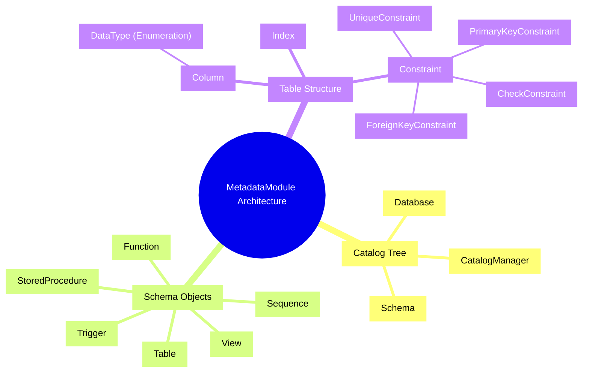

```mermaid
mindmap
  root((MetadataModule Architecture))
    CatalogTree["Catalog Tree"]
      CatalogManager["CatalogManager"]
      Database["Database"]
      Schema["Schema"]
    SchemaObjects["Schema Objects"]
      Table["Table"]
      View["View"]
      Sequence["Sequence"]
      Trigger["Trigger"]
      StoredProcedure["StoredProcedure"]
      Function["Function"]
    TableStructure["Table Structure"]
      Column["Column"]
        DataType["DataType (Enumeration)"]
      Index["Index"]
      Constraint["Constraint"]
        PrimaryKeyConstraint["PrimaryKeyConstraint"]
        ForeignKeyConstraint["ForeignKeyConstraint"]
        UniqueConstraint["UniqueConstraint"]
        CheckConstraint["CheckConstraint"]
```
