# Sơ Đồ Luồng Kiến Trúc (Architecture Flowchart) Module Metadata

Sơ đồ thể hiện luồng liên kết đơn giản dạng mũi tên phân cấp (Flowchart Flow) giữa các Class & Interface trong module `metadata`, từ cấp cao nhất xuống các thành phần chi tiết.

```mermaid
flowchart TD
    %% =====================================================
    %% STYLES DEFINITION
    %% =====================================================
    classDef facade fill:#1e293b,stroke:#38bdf8,stroke-width:2px,color:#fff;
    classDef catalog fill:#1e1b4b,stroke:#818cf8,stroke-width:2px,color:#fff;
    classDef entity fill:#064e3b,stroke:#34d399,stroke-width:2px,color:#fff;
    classDef pattern fill:#4c1d95,stroke:#c084fc,stroke-width:2px,color:#fff;
    classDef leaf fill:#701a75,stroke:#f0abfc,stroke-width:2px,color:#fff;

    %% =====================================================
    %% NODES DEFINITION (FULL CLASS / INTERFACE NAMES)
    %% =====================================================
    MetadataModule["MetadataModule (Facade)"]:::facade
    DDLCommand["DDLCommand (Interface)"]:::pattern
    CreateTableCommand["CreateTableCommand (Command)"]:::pattern

    CatalogManager["CatalogManager (Singleton & Composite)"]:::catalog
    Database["Database (State Context & Composite)"]:::catalog
    DatabaseStatus["DatabaseStatus (Enum)"]:::leaf
    Schema["Schema (Factory Method & Composite)"]:::catalog

    Table["Table (Prototype, Memento, Subject)"]:::entity
    View["View (Observer Subscriber)"]:::entity
    Sequence["Sequence"]:::entity
    Trigger["Trigger (Observer Subscriber)"]:::entity
    StoredProcedure["StoredProcedure"]:::entity
    Function["Function"]:::entity

    TableMemento["TableMemento (Memento)"]:::pattern
    MetadataChangeListener["MetadataChangeListener (Interface)"]:::pattern
    
    ColumnBuilder["ColumnBuilder (Builder)"]:::pattern
    Column["Column (Composite Leaf & Prototype)"]:::leaf
    DataType["DataType (Enum)"]:::leaf

    Index["Index (Strategy Context)"]:::entity
    IndexRebuildStrategy["IndexRebuildStrategy (Interface)"]:::pattern

    ConstraintFactory["ConstraintFactory (Factory Method)"]:::pattern
    ConstraintValidationChain["ConstraintValidationChain (Chain of Resp)"]:::pattern
    Constraint["Constraint (Abstract / Template Method)"]:::pattern

    PrimaryKeyConstraint["PrimaryKeyConstraint"]:::leaf
    ForeignKeyConstraint["ForeignKeyConstraint"]:::leaf
    UniqueConstraint["UniqueConstraint"]:::leaf
    CheckConstraint["CheckConstraint"]:::leaf

    %% =====================================================
    %% HIERARCHICAL ARCHITECTURE FLOW (PURE ARROWS)
    %% =====================================================

    MetadataModule --> CatalogManager
    MetadataModule --> DDLCommand
    DDLCommand --> CreateTableCommand
    CreateTableCommand --> Schema

    CatalogManager --> Database
    Database --> DatabaseStatus
    Database --> Schema

    Schema --> Table
    Schema --> View
    Schema --> Sequence
    Schema --> Trigger
    Schema --> StoredProcedure
    Schema --> Function
    Schema --> ConstraintFactory

    Table --> TableMemento
    Table --> MetadataChangeListener
    MetadataChangeListener --> View
    MetadataChangeListener --> Trigger

    ColumnBuilder --> Column
    Table --> Column
    Column --> DataType

    Table --> Index
    Index --> IndexRebuildStrategy

    ConstraintFactory --> Constraint
    Table --> Constraint
    ConstraintValidationChain --> Constraint

    Constraint --> PrimaryKeyConstraint
    Constraint --> ForeignKeyConstraint
    Constraint --> UniqueConstraint
    Constraint --> CheckConstraint
```

