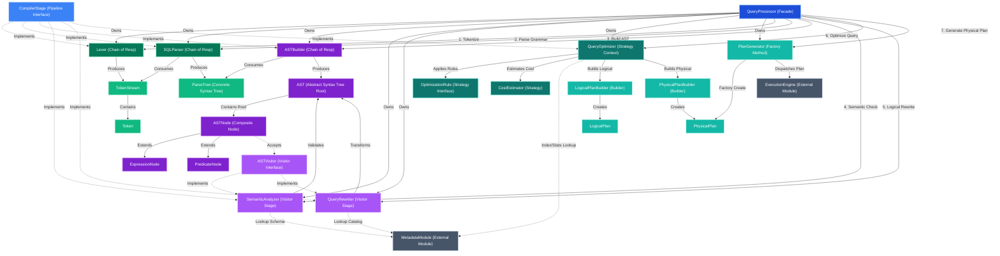

# Sơ Đồ Kiến Trúc Module Query Processor

```mermaid
flowchart TD
    %% =====================================================
    %% STYLES DEFINITION
    %% =====================================================
    classDef facade fill:#1d4ed8,stroke:#93c5fd,stroke-width:2px,color:#ffffff;
    classDef stage fill:#3b82f6,stroke:#dbeafe,stroke-width:2px,color:#ffffff;
    classDef parser fill:#047857,stroke:#a7f3d0,stroke-width:2px,color:#ffffff;
    classDef token fill:#10b981,stroke:#d1fae5,stroke-width:2px,color:#ffffff;
    classDef ast fill:#7e22ce,stroke:#f5d0fe,stroke-width:2px,color:#ffffff;
    classDef visitor fill:#a855f7,stroke:#fae8ff,stroke-width:2px,color:#ffffff;
    classDef optimizer fill:#0f766e,stroke:#99f6e4,stroke-width:2px,color:#ffffff;
    classDef plan fill:#14b8a6,stroke:#ccfbf1,stroke-width:2px,color:#ffffff;
    classDef external fill:#475569,stroke:#cbd5e1,stroke-width:2px,color:#ffffff;

    %% =====================================================
    %% NODES DEFINITION
    %% =====================================================
    QueryProcessor["QueryProcessor (Facade)"]:::facade
    CompilerStage["CompilerStage (Pipeline Interface)"]:::stage

    Lexer["Lexer (Chain of Resp)"]:::parser
    TokenStream["TokenStream"]:::token
    Token["Token"]:::token

    SQLParser["SQLParser (Chain of Resp)"]:::parser
    ParseTree["ParseTree (Concrete Syntax Tree)"]:::token

    ASTBuilder["ASTBuilder (Chain of Resp)"]:::ast
    AST["AST (Abstract Syntax Tree Root)"]:::ast
    ASTNode["ASTNode (Composite Node)"]:::ast
    ASTVisitor["ASTVisitor (Visitor Interface)"]:::visitor

    ExpressionNode["ExpressionNode"]:::ast
    PredicateNode["PredicateNode"]:::ast

    SemanticAnalyzer["SemanticAnalyzer (Visitor Stage)"]:::visitor
    QueryRewriter["QueryRewriter (Visitor Stage)"]:::visitor

    QueryOptimizer["QueryOptimizer (Strategy Context)"]:::optimizer
    OptimizationRule["OptimizationRule (Strategy Interface)"]:::optimizer
    CostEstimator["CostEstimator (Strategy)"]:::optimizer

    LogicalPlanBuilder["LogicalPlanBuilder (Builder)"]:::plan
    LogicalPlan["LogicalPlan"]:::plan

    PhysicalPlanBuilder["PhysicalPlanBuilder (Builder)"]:::plan
    PhysicalPlan["PhysicalPlan"]:::plan
    PlanGenerator["PlanGenerator (Factory Method)"]:::plan

    MetadataModule["MetadataModule (External Module)"]:::external
    ExecutionEngine["ExecutionEngine (External Module)"]:::external

    %% =====================================================
    %% ARCHITECTURE CONNECTIONS & PIPELINE FLOWS
    %% =====================================================

    %% Pipeline Interface Implementations
    CompilerStage -.->|Implements| Lexer
    CompilerStage -.->|Implements| SQLParser
    CompilerStage -.->|Implements| ASTBuilder
    CompilerStage -.->|Implements| SemanticAnalyzer
    CompilerStage -.->|Implements| QueryRewriter
    CompilerStage -.->|Implements| QueryOptimizer

    %% Facade Composition
    QueryProcessor -->|Owns| Lexer
    QueryProcessor -->|Owns| SQLParser
    QueryProcessor -->|Owns| ASTBuilder
    QueryProcessor -->|Owns| SemanticAnalyzer
    QueryProcessor -->|Owns| QueryRewriter
    QueryProcessor -->|Owns| QueryOptimizer
    QueryProcessor -->|Owns| PlanGenerator

    %% Compilation Data Flow
    QueryProcessor -->|1. Tokenize| Lexer
    Lexer -->|Produces| TokenStream
    TokenStream -->|Contains| Token

    QueryProcessor -->|2. Parse Grammar| SQLParser
    SQLParser -->|Consumes| TokenStream
    SQLParser -->|Produces| ParseTree

    QueryProcessor -->|3. Build AST| ASTBuilder
    ASTBuilder -->|Consumes| ParseTree
    ASTBuilder -->|Produces| AST
    AST -->|Contains Root| ASTNode
    ASTNode -->|Extends| ExpressionNode
    ASTNode -->|Extends| PredicateNode

    %% Visitor Pattern Connections
    ASTVisitor -.->|Implements| SemanticAnalyzer
    ASTVisitor -.->|Implements| QueryRewriter
    ASTNode -.->|Accepts| ASTVisitor

    QueryProcessor -->|4. Semantic Check| SemanticAnalyzer
    SemanticAnalyzer -->|Validates| AST
    SemanticAnalyzer -.->|Lookup Schema| MetadataModule

    QueryProcessor -->|5. Logical Rewrite| QueryRewriter
    QueryRewriter -->|Transforms| AST
    QueryRewriter -.->|Lookup Catalog| MetadataModule

    %% Optimization & Plan Generation Flows
    QueryProcessor -->|6. Optimize Query| QueryOptimizer
    QueryOptimizer -->|Applies Rules| OptimizationRule
    QueryOptimizer -->|Estimates Cost| CostEstimator
    QueryOptimizer -.->|Index/Stats Lookup| MetadataModule

    QueryOptimizer -->|Builds Logical| LogicalPlanBuilder
    LogicalPlanBuilder -->|Creates| LogicalPlan

    QueryOptimizer -->|Builds Physical| PhysicalPlanBuilder
    PhysicalPlanBuilder -->|Creates| PhysicalPlan

    QueryProcessor -->|7. Generate Physical Plan| PlanGenerator
    PlanGenerator -->|Factory Create| PhysicalPlan
    PlanGenerator -->|Dispatches Plan| ExecutionEngine
```