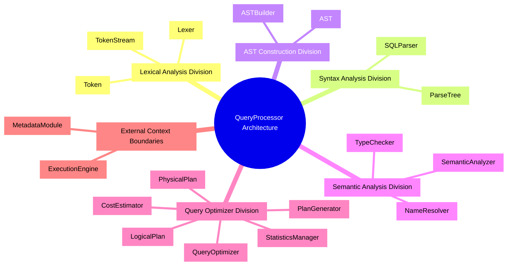

```mermaid
mindmap
  root((QueryProcessor Architecture))
    LexicalAnalysis["Lexical Analysis Division"]
      Lexer["Lexer"]
      TokenStream["TokenStream"]
      Token["Token"]
    SyntaxAnalysis["Syntax Analysis Division"]
      SQLParser["SQLParser"]
      ParseTree["ParseTree"]
    ASTConstruction["AST Construction Division"]
      ASTBuilder["ASTBuilder"]
      AST["AST"]
    SemanticAnalysis["Semantic Analysis Division"]
      SemanticAnalyzer["SemanticAnalyzer"]
      NameResolver["NameResolver"]
      TypeChecker["TypeChecker"]
    QueryOptimizerDivision["Query Optimizer Division"]
      QueryOptimizer["QueryOptimizer"]
      LogicalPlan["LogicalPlan"]
      PhysicalPlan["PhysicalPlan"]
      CostEstimator["CostEstimator"]
      PlanGenerator["PlanGenerator"]
      StatisticsManager["StatisticsManager"]
    ExternalContextBoundaries["External Context Boundaries"]
      MetadataModule["MetadataModule"]
      ExecutionEngine["ExecutionEngine"]
```