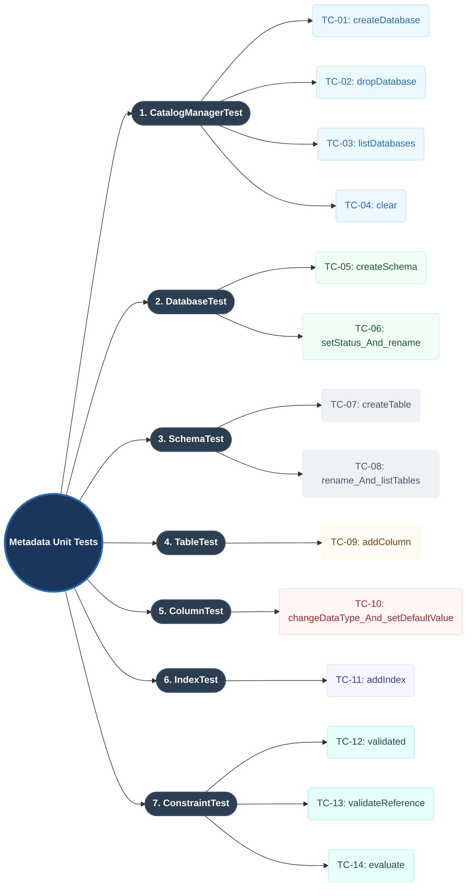

# Metadata Unit Test Scenarios Mindmap

This mindmap represents the structural taxonomy of the Metadata unit test scenarios, showing the coverage across `CatalogManager`, `Database`, `Schema`, `Table`, `Column`, `Index`, and `Constraint` classes.

