# Sequence Diagrams - Metadata Subsystem Level 3 Test Cases

---

## 1. CatalogManager Unit Tests

### TC-01: `createDatabase_ShouldAddDatabaseToCatalog_WhenValidNameIsProvided`

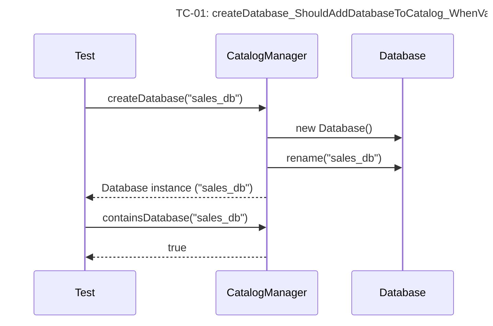
```mermaid
sequenceDiagram
    title TC-01: createDatabase_ShouldAddDatabaseToCatalog_WhenValidNameIsProvided
    participant Test
    participant CatalogManager
    participant Database

    Test->>CatalogManager: createDatabase("sales_db")
    CatalogManager->>Database: new Database()
    CatalogManager->>Database: rename("sales_db")
    CatalogManager-->>Test: Database instance ("sales_db")
    Test->>CatalogManager: containsDatabase("sales_db")
    CatalogManager-->>Test: true
```

---

### TC-02: `dropDatabase_ShouldRemoveDatabaseFromCatalog_WhenDatabaseExists`

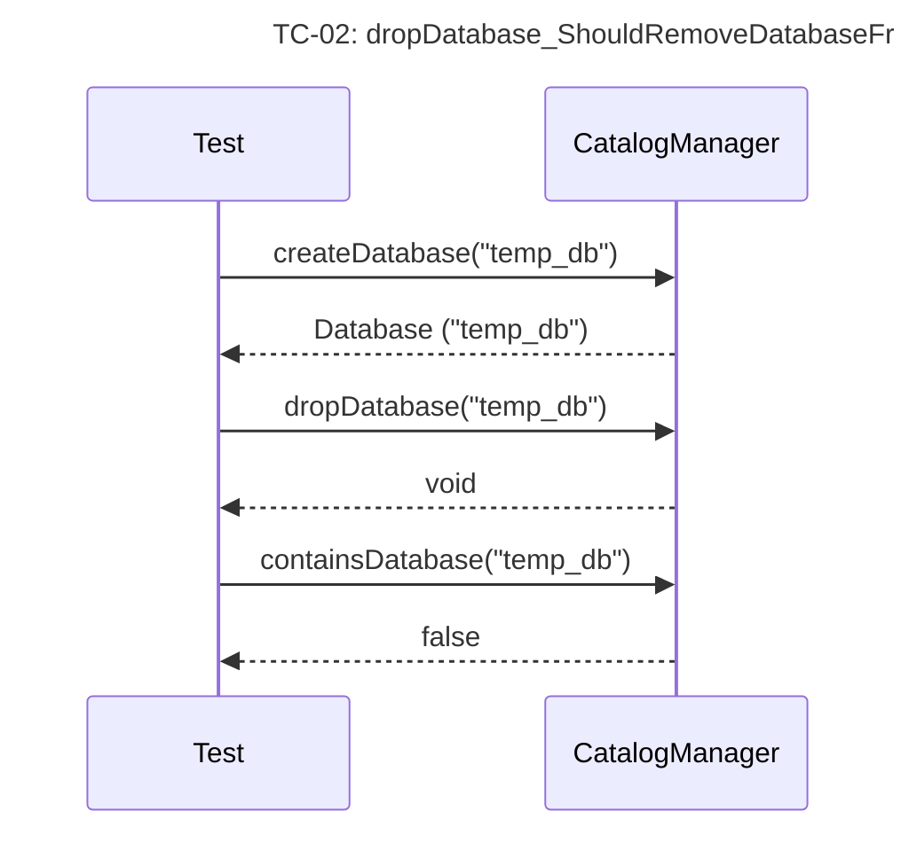
```mermaid
sequenceDiagram
    title TC-02: dropDatabase_ShouldRemoveDatabaseFromCatalog_WhenDatabaseExists
    participant Test
    participant CatalogManager

    Test->>CatalogManager: createDatabase("temp_db")
    CatalogManager-->>Test: Database ("temp_db")
    Test->>CatalogManager: dropDatabase("temp_db")
    CatalogManager-->>Test: void
    Test->>CatalogManager: containsDatabase("temp_db")
    CatalogManager-->>Test: false
```

---

### TC-03: `listDatabases_ShouldReturnAllRegisteredDatabases_WhenDatabasesAreCreated`

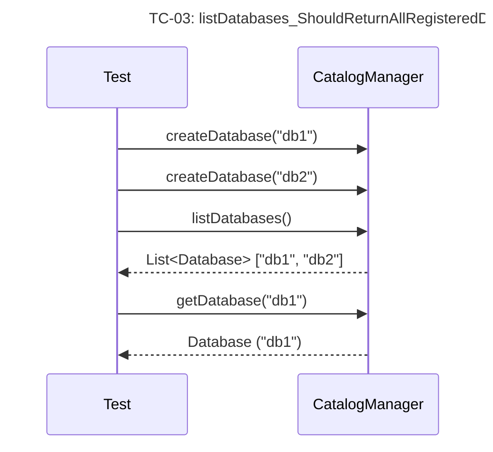
```mermaid
sequenceDiagram
    title TC-03: listDatabases_ShouldReturnAllRegisteredDatabases_WhenDatabasesAreCreated
    participant Test
    participant CatalogManager

    Test->>CatalogManager: createDatabase("db1")
    Test->>CatalogManager: createDatabase("db2")
    Test->>CatalogManager: listDatabases()
    CatalogManager-->>Test: List<Database> ["db1", "db2"]
    Test->>CatalogManager: getDatabase("db1")
    CatalogManager-->>Test: Database ("db1")
```

---

### TC-04: `clear_ShouldRemoveAllDatabases_WhenCatalogIsCleared`

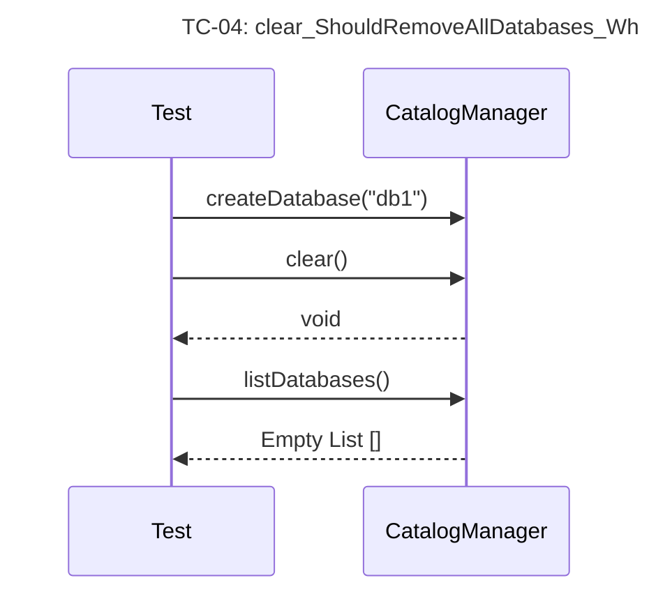
```mermaid
sequenceDiagram
    title TC-04: clear_ShouldRemoveAllDatabases_WhenCatalogIsCleared
    participant Test
    participant CatalogManager

    Test->>CatalogManager: createDatabase("db1")
    Test->>CatalogManager: clear()
    CatalogManager-->>Test: void
    Test->>CatalogManager: listDatabases()
    CatalogManager-->>Test: Empty List []
```

---

## 2. Database Unit Tests

### TC-05: `createSchema_ShouldManageSchemasInDatabase_WhenSchemaIsAddedAndDropped`

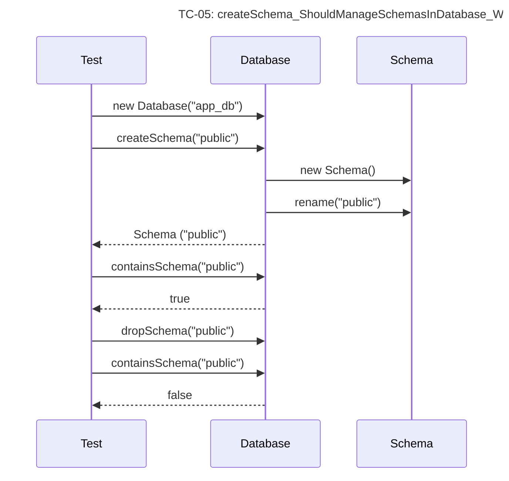
```mermaid
sequenceDiagram
    title TC-05: createSchema_ShouldManageSchemasInDatabase_WhenSchemaIsAddedAndDropped
    participant Test
    participant Database
    participant Schema

    Test->>Database: new Database("app_db")
    Test->>Database: createSchema("public")
    Database->>Schema: new Schema()
    Database->>Schema: rename("public")
    Database-->>Test: Schema ("public")
    Test->>Database: containsSchema("public")
    Database-->>Test: true
    Test->>Database: dropSchema("public")
    Test->>Database: containsSchema("public")
    Database-->>Test: false
```

---

### TC-06: `setStatus_And_rename_ShouldUpdateDatabaseState_WhenModified`

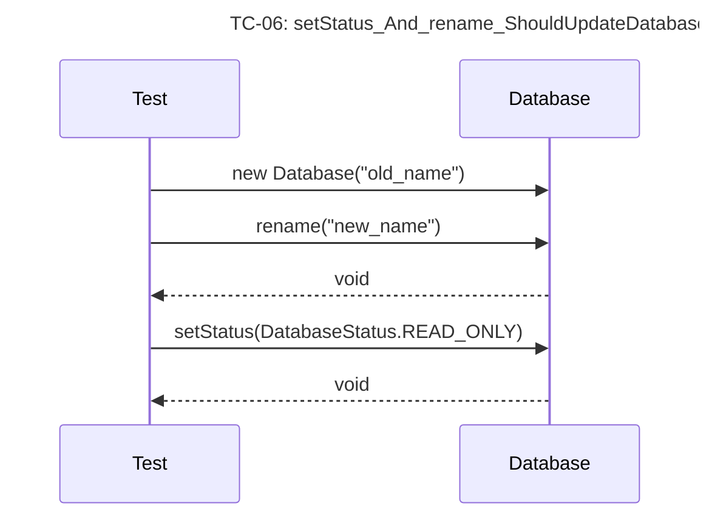
```mermaid
sequenceDiagram
    title TC-06: setStatus_And_rename_ShouldUpdateDatabaseState_WhenModified
    participant Test
    participant Database

    Test->>Database: new Database("old_name")
    Test->>Database: rename("new_name")
    Database-->>Test: void
    Test->>Database: setStatus(DatabaseStatus.READ_ONLY)
    Database-->>Test: void
```

---

## 3. Schema Unit Tests

### TC-07: `createTable_ShouldRegisterTableInSchema_WhenValidTableNameIsProvided`

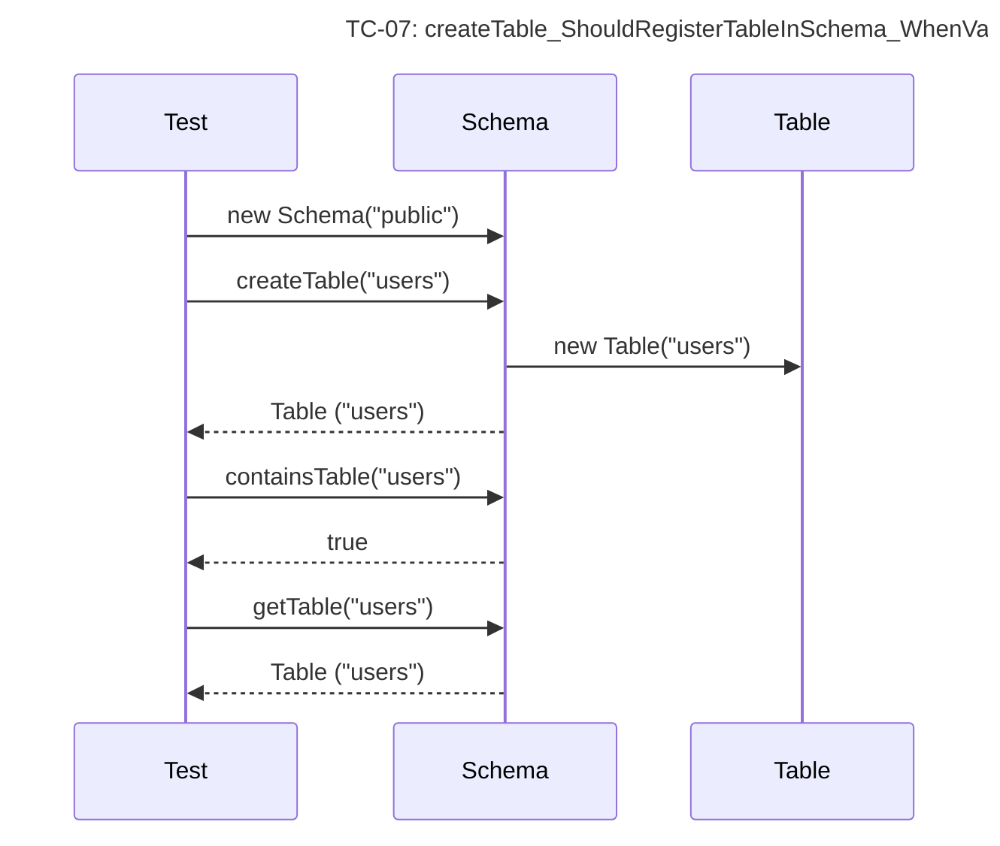
```mermaid
sequenceDiagram
    title TC-07: createTable_ShouldRegisterTableInSchema_WhenValidTableNameIsProvided
    participant Test
    participant Schema
    participant Table

    Test->>Schema: new Schema("public")
    Test->>Schema: createTable("users")
    Schema->>Table: new Table("users")
    Schema-->>Test: Table ("users")
    Test->>Schema: containsTable("users")
    Schema-->>Test: true
    Test->>Schema: getTable("users")
    Schema-->>Test: Table ("users")
```

---

### TC-08: `rename_And_listTables_ShouldUpdateSchemaNameAndMaintainTables_WhenRenamed`

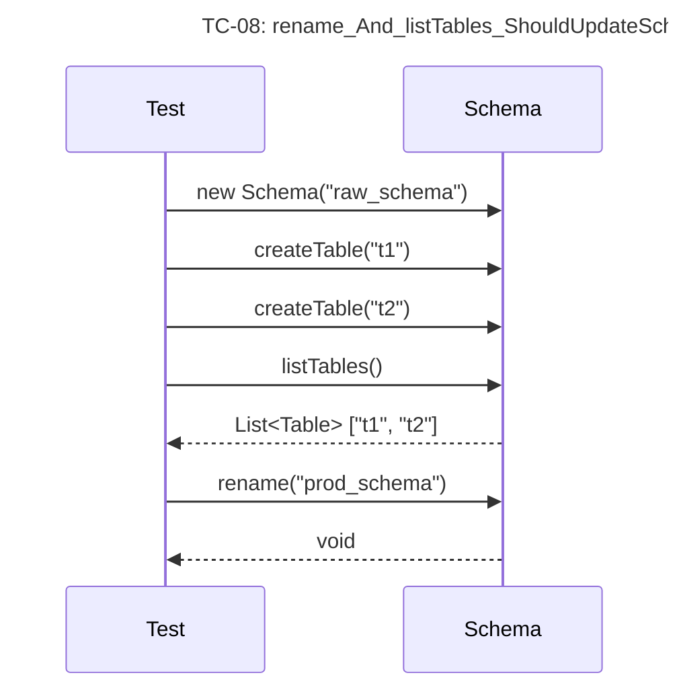
```mermaid
sequenceDiagram
    title TC-08: rename_And_listTables_ShouldUpdateSchemaNameAndMaintainTables_WhenRenamed
    participant Test
    participant Schema

    Test->>Schema: new Schema("raw_schema")
    Test->>Schema: createTable("t1")
    Test->>Schema: createTable("t2")
    Test->>Schema: listTables()
    Schema-->>Test: List<Table> ["t1", "t2"]
    Test->>Schema: rename("prod_schema")
    Schema-->>Test: void
```

---

## 4. Table & Column Unit Tests

### TC-09: `addColumn_ShouldAttachColumnToTable_WhenColumnIsAdded`

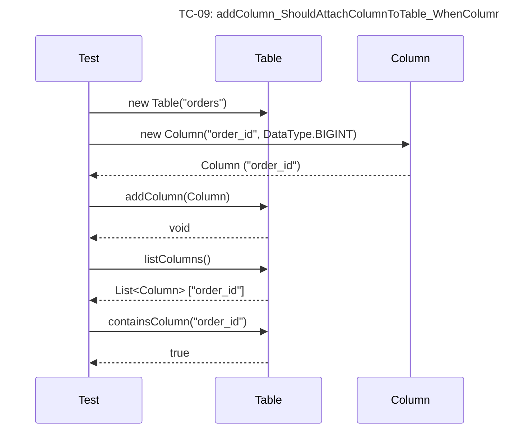
```mermaid
sequenceDiagram
    title TC-09: addColumn_ShouldAttachColumnToTable_WhenColumnIsAdded
    participant Test
    participant Table
    participant Column

    Test->>Table: new Table("orders")
    Test->>Column: new Column("order_id", DataType.BIGINT)
    Column-->>Test: Column ("order_id")
    Test->>Table: addColumn(Column)
    Table-->>Test: void
    Test->>Table: listColumns()
    Table-->>Test: List<Column> ["order_id"]
    Test->>Table: containsColumn("order_id")
    Table-->>Test: true
```

---

### TC-10: `changeDataType_And_setDefaultValue_ShouldUpdateColumnProperties_WhenModified`

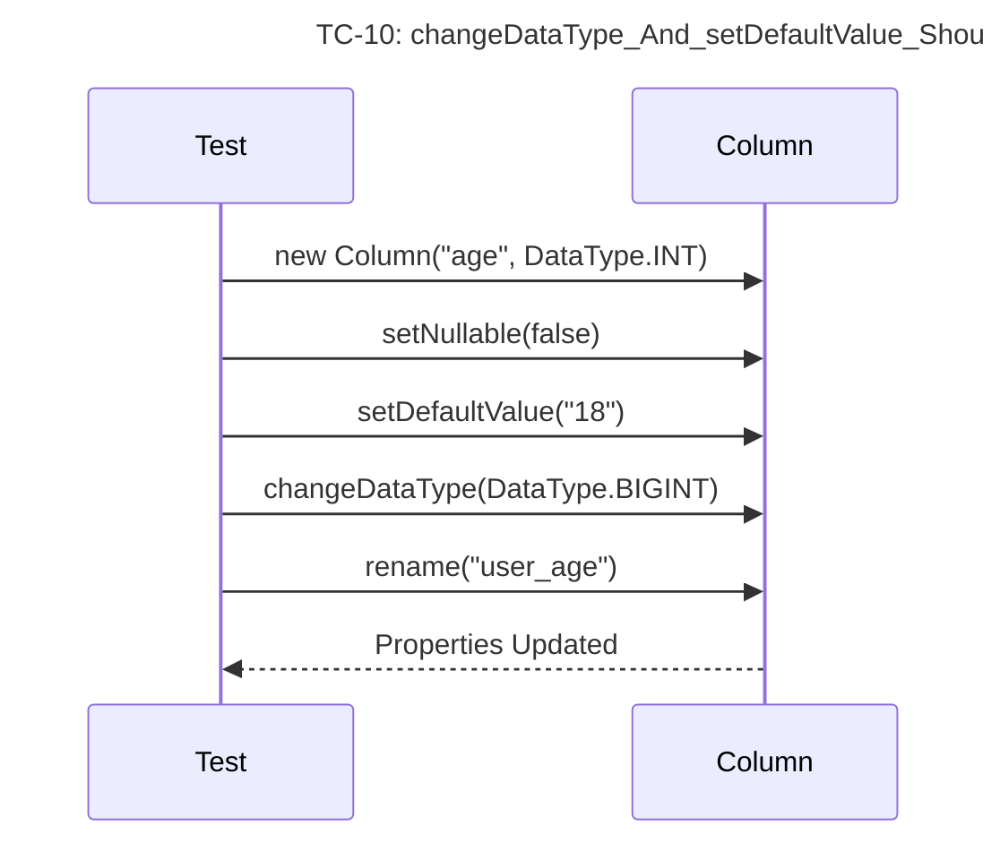
```mermaid
sequenceDiagram
    title TC-10: changeDataType_And_setDefaultValue_ShouldUpdateColumnProperties_WhenModified
    participant Test
    participant Column

    Test->>Column: new Column("age", DataType.INT)
    Test->>Column: setNullable(false)
    Test->>Column: setDefaultValue("18")
    Test->>Column: changeDataType(DataType.BIGINT)
    Test->>Column: rename("user_age")
    Column-->>Test: Properties Updated
```

---

## 5. Index & Constraint Unit Tests

### TC-11: `addIndex_ShouldAttachIndexToTable_WhenIndexIsAddedAndRebuilt`

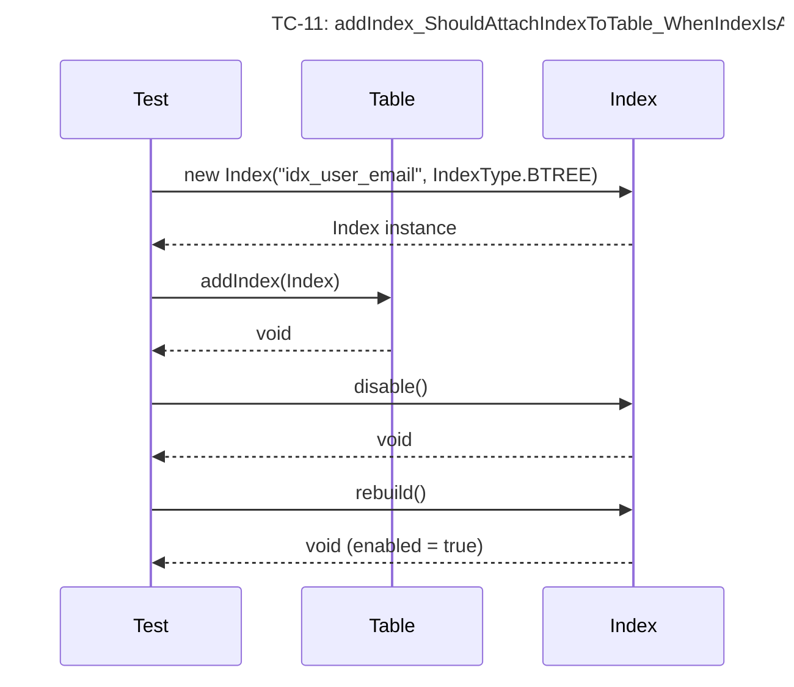
```mermaid
sequenceDiagram
    title TC-11: addIndex_ShouldAttachIndexToTable_WhenIndexIsAddedAndRebuilt
    participant Test
    participant Table
    participant Index

    Test->>Index: new Index("idx_user_email", IndexType.BTREE)
    Index-->>Test: Index instance
    Test->>Table: addIndex(Index)
    Table-->>Test: void
    Test->>Index: disable()
    Index-->>Test: void
    Test->>Index: rebuild()
    Index-->>Test: void (enabled = true)
```

---

### TC-12: `validate_ShouldReturnConstraintStatus_WhenPrimaryKeyIsChecked`

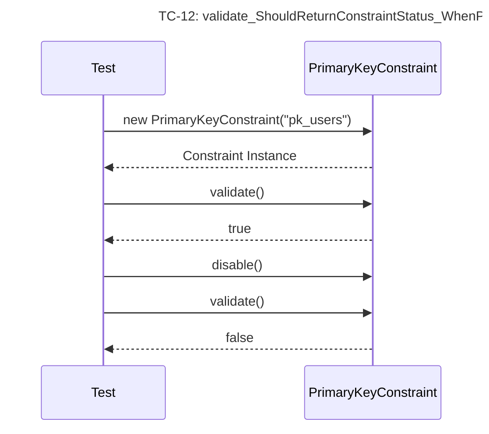
```mermaid
sequenceDiagram
    title TC-12: validate_ShouldReturnConstraintStatus_WhenPrimaryKeyIsChecked
    participant Test
    participant PrimaryKeyConstraint

    Test->>PrimaryKeyConstraint: new PrimaryKeyConstraint("pk_users")
    PrimaryKeyConstraint-->>Test: Constraint Instance
    Test->>PrimaryKeyConstraint: validate()
    PrimaryKeyConstraint-->>Test: true
    Test->>PrimaryKeyConstraint: disable()
    Test->>PrimaryKeyConstraint: validate()
    PrimaryKeyConstraint-->>Test: false
```

---

### TC-13: `validateReference_ShouldReturnTrue_WhenForeignKeyReferencesValidTableAndColumn`

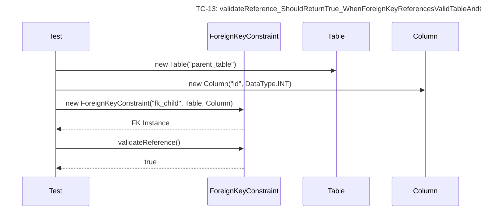
```mermaid
sequenceDiagram
    title TC-13: validateReference_ShouldReturnTrue_WhenForeignKeyReferencesValidTableAndColumn
    participant Test
    participant ForeignKeyConstraint
    participant Table
    participant Column

    Test->>Table: new Table("parent_table")
    Test->>Column: new Column("id", DataType.INT)
    Test->>ForeignKeyConstraint: new ForeignKeyConstraint("fk_child", Table, Column)
    ForeignKeyConstraint-->>Test: FK Instance
    Test->>ForeignKeyConstraint: validateReference()
    ForeignKeyConstraint-->>Test: true
```

---

### TC-14: `evaluate_ShouldReturnTrue_WhenCheckConstraintExpressionIsValid`

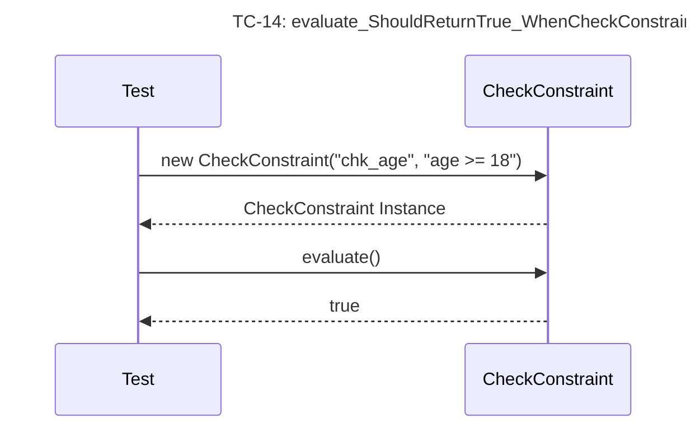
```mermaid
sequenceDiagram
    title TC-14: evaluate_ShouldReturnTrue_WhenCheckConstraintExpressionIsValid
    participant Test
    participant CheckConstraint

    Test->>CheckConstraint: new CheckConstraint("chk_age", "age >= 18")
    CheckConstraint-->>Test: CheckConstraint Instance
    Test->>CheckConstraint: evaluate()
    CheckConstraint-->>Test: true
```
