# SQL Parser Test Scenarios Mindmap

This mindmap represents the structural taxonomy of the SQL Parser unit test scenarios, showing the coverage across `TokenStream`, `Token`, `AST`, and concrete `ASTNode` classes.

```mermaid
flowchart LR
    Root(("SQL Parser Unit Tests"))
    
    %% Categories
    Cat1(["1. TokenStreamTest"])
    Cat2(["2. TokenTest"])
    Cat3(["3. ASTTest"])
    Cat4(["4. SelectASTNodeTest"])
    Cat5(["5. BinaryOpASTNodeTest"])
    Cat6(["6. IdentifierASTNodeTest"])
    Cat7(["7. LiteralASTNodeTest"])
    
    Root --> Cat1
    Root --> Cat2
    Root --> Cat3
    Root --> Cat4
    Root --> Cat5
    Root --> Cat6
    Root --> Cat7
    
    %% TokenStreamTest
    Cat1 --> TC01("TC-01: Create Token Stream")
    Cat1 --> TC02("TC-02: Consume Sequential Tokens")
    Cat1 --> TC03("TC-03: LookAhead Without Advancing")
    Cat1 --> TC04("TC-04: Empty Stream")
    Cat1 --> TC05("TC-05: LookAhead Boundary")
    Cat1 --> TC06("TC-06: Consume After EOF")
    
    %% TokenTest
    Cat2 --> TC07("TC-07: Create Token")
    Cat2 --> TC08("TC-08: Compare Tokens Equality")
    Cat2 --> TC09("TC-09: Default Constructor")
    
    %% ASTTest
    Cat3 --> TC10("TC-10: Create AST")
    Cat3 --> TC11("TC-11: Empty AST")
    Cat3 --> TC12("TC-12: Get Root Node")
    
    %% SelectASTNodeTest
    Cat4 --> TC13("TC-13: Build Select AST Node")
    Cat4 --> TC14("TC-14: Projection Fields")
    Cat4 --> TC15("TC-15: WHERE Condition")
    Cat4 --> TC16("TC-16: Build Complete AST")
    Cat4 --> TC17("TC-17: Default Constructor")
    
    %% BinaryOpASTNodeTest
    Cat5 --> TC18("TC-18: Build Binary Operator AST Node")
    Cat5 --> TC19("TC-19: Child Operands Evaluation")
    Cat5 --> TC20("TC-20: Default Constructor")
    
    %% IdentifierASTNodeTest
    Cat6 --> TC21("TC-21: Build Identifier AST Node")
    Cat6 --> TC22("TC-22: Column Identifier")
    Cat6 --> TC23("TC-23: Default Constructor")
    
    %% LiteralASTNodeTest
    Cat7 --> TC24("TC-24: Build Literal AST Node")
    Cat7 --> TC25("TC-25: Integer Literal")
    Cat7 --> TC26("TC-26: String Literal")
    Cat7 --> TC27("TC-27: Boolean Literal")
    Cat7 --> TC28("TC-28: NULL Literal")
    Cat7 --> TC29("TC-29: Default Constructor")

    %% Node styling for a premium mindmap look
    style Root fill:#1A365D,stroke:#2B6CB0,stroke-width:3px,color:#FFFFFF,font-weight:bold
    
    style Cat1 fill:#2C3E50,stroke:#34495E,stroke-width:2px,color:#FFFFFF,font-weight:bold
    style Cat2 fill:#2C3E50,stroke:#34495E,stroke-width:2px,color:#FFFFFF,font-weight:bold
    style Cat3 fill:#2C3E50,stroke:#34495E,stroke-width:2px,color:#FFFFFF,font-weight:bold
    style Cat4 fill:#2C3E50,stroke:#34495E,stroke-width:2px,color:#FFFFFF,font-weight:bold
    style Cat5 fill:#2C3E50,stroke:#34495E,stroke-width:2px,color:#FFFFFF,font-weight:bold
    style Cat6 fill:#2C3E50,stroke:#34495E,stroke-width:2px,color:#FFFFFF,font-weight:bold
    style Cat7 fill:#2C3E50,stroke:#34495E,stroke-width:2px,color:#FFFFFF,font-weight:bold

    style TC01 fill:#EBF8FF,stroke:#bee3f8,stroke-width:1px,color:#2b6cb0
    style TC02 fill:#EBF8FF,stroke:#bee3f8,stroke-width:1px,color:#2b6cb0
    style TC03 fill:#EBF8FF,stroke:#bee3f8,stroke-width:1px,color:#2b6cb0
    style TC04 fill:#EBF8FF,stroke:#bee3f8,stroke-width:1px,color:#2b6cb0
    style TC05 fill:#EBF8FF,stroke:#bee3f8,stroke-width:1px,color:#2b6cb0
    style TC06 fill:#EBF8FF,stroke:#bee3f8,stroke-width:1px,color:#2b6cb0

    style TC07 fill:#F0FFF4,stroke:#c6f6d5,stroke-width:1px,color:#22543d
    style TC08 fill:#F0FFF4,stroke:#c6f6d5,stroke-width:1px,color:#22543d
    style TC09 fill:#F0FFF4,stroke:#c6f6d5,stroke-width:1px,color:#22543d

    style TC10 fill:#EDF2F7,stroke:#e2e8f0,stroke-width:1px,color:#4a5568
    style TC11 fill:#EDF2F7,stroke:#e2e8f0,stroke-width:1px,color:#4a5568
    style TC12 fill:#EDF2F7,stroke:#e2e8f0,stroke-width:1px,color:#4a5568

    style TC13 fill:#FFFDF5,stroke:#fefcbf,stroke-width:1px,color:#744210
    style TC14 fill:#FFFDF5,stroke:#fefcbf,stroke-width:1px,color:#744210
    style TC15 fill:#FFFDF5,stroke:#fefcbf,stroke-width:1px,color:#744210
    style TC16 fill:#FFFDF5,stroke:#fefcbf,stroke-width:1px,color:#744210
    style TC17 fill:#FFFDF5,stroke:#fefcbf,stroke-width:1px,color:#744210

    style TC18 fill:#FFF5F5,stroke:#fed7d7,stroke-width:1px,color:#9b2c2c
    style TC19 fill:#FFF5F5,stroke:#fed7d7,stroke-width:1px,color:#9b2c2c
    style TC20 fill:#FFF5F5,stroke:#fed7d7,stroke-width:1px,color:#9b2c2c

    style TC21 fill:#F5F5FF,stroke:#e1e1ff,stroke-width:1px,color:#3b3b98
    style TC22 fill:#F5F5FF,stroke:#e1e1ff,stroke-width:1px,color:#3b3b98
    style TC23 fill:#F5F5FF,stroke:#e1e1ff,stroke-width:1px,color:#3b3b98

    style TC24 fill:#E6FFFA,stroke:#b2f5ea,stroke-width:1px,color:#234e52
    style TC25 fill:#E6FFFA,stroke:#b2f5ea,stroke-width:1px,color:#234e52
    style TC26 fill:#E6FFFA,stroke:#b2f5ea,stroke-width:1px,color:#234e52
    style TC27 fill:#E6FFFA,stroke:#b2f5ea,stroke-width:1px,color:#234e52
    style TC28 fill:#E6FFFA,stroke:#b2f5ea,stroke-width:1px,color:#234e52
    style TC29 fill:#E6FFFA,stroke:#b2f5ea,stroke-width:1px,color:#234e52
```

