# Sequence Diagrams - Lexical Stream & AST Hierarchy Test Cases

---

## TC-01. Create Token Stream (`createTokenStream_ShouldInitializeHeadPointer_WhenValidTokenListIsProvided` / SD-01)

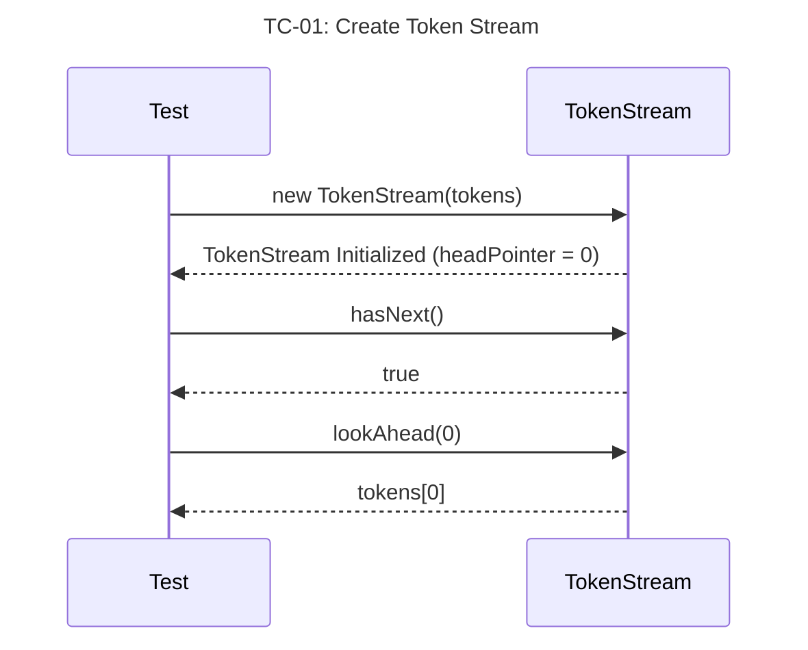
```mermaid
sequenceDiagram
    title TC-01: Create Token Stream
    participant Test
    participant TokenStream

    Test->>TokenStream: new TokenStream(tokens)
    TokenStream-->>Test: TokenStream Initialized (headPointer = 0)
    Test->>TokenStream: hasNext()
    TokenStream-->>Test: true
    Test->>TokenStream: lookAhead(0)
    TokenStream-->>Test: tokens[0]
```

---

## TC-02. Consume Sequential Tokens (`consume_ShouldReturnNextToken_WhenMoreTokensExist` / SD-02)

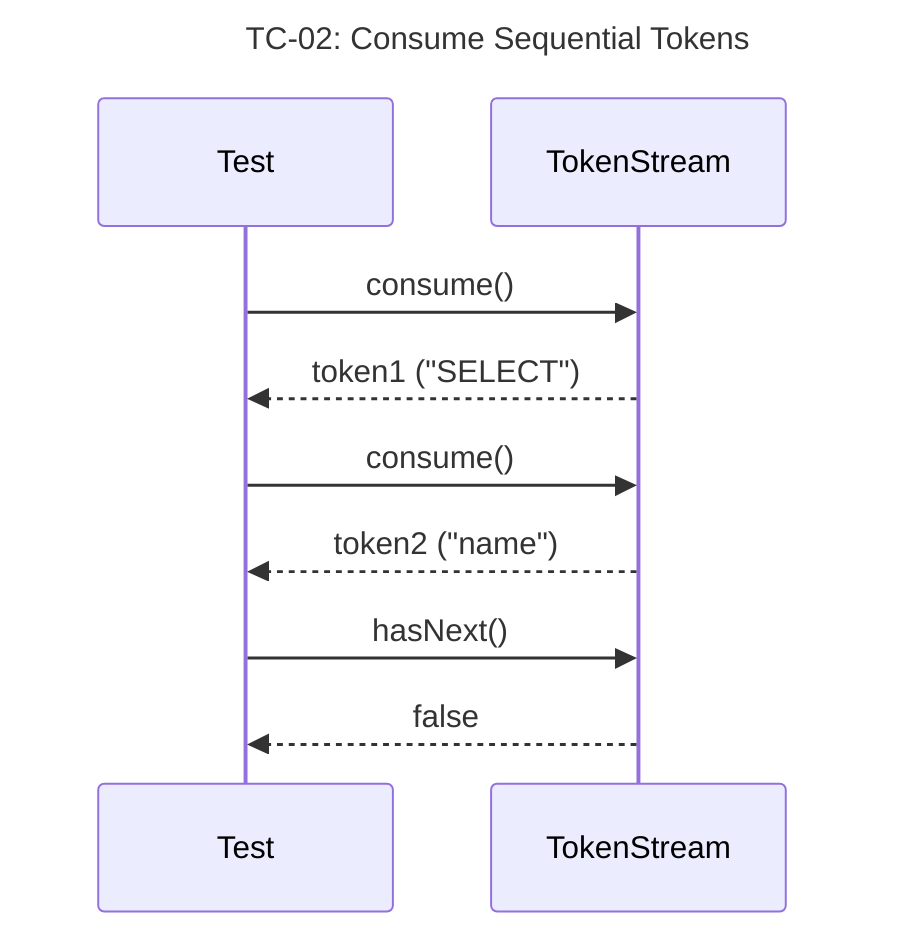
```mermaid
sequenceDiagram
    title TC-02: Consume Sequential Tokens
    participant Test
    participant TokenStream

    Test->>TokenStream: consume()
    TokenStream-->>Test: token1 ("SELECT")
    Test->>TokenStream: consume()
    TokenStream-->>Test: token2 ("name")
    Test->>TokenStream: hasNext()
    TokenStream-->>Test: false
```

---

## TC-03. LookAhead Without Advancing (`lookAhead_ShouldReturnTokenWithoutAdvancingPointer_WhenOffsetIsValid` / SD-03)

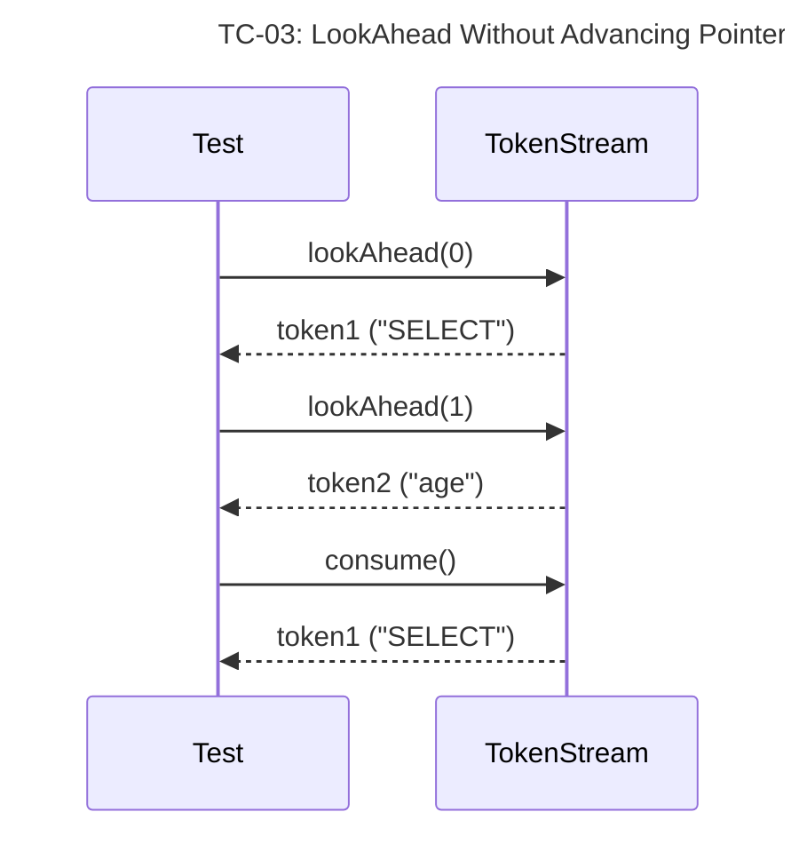
```mermaid
sequenceDiagram
    title TC-03: LookAhead Without Advancing Pointer
    participant Test
    participant TokenStream

    Test->>TokenStream: lookAhead(0)
    TokenStream-->>Test: token1 ("SELECT")
    Test->>TokenStream: lookAhead(1)
    TokenStream-->>Test: token2 ("age")
    Test->>TokenStream: consume()
    TokenStream-->>Test: token1 ("SELECT")
```

---

## TC-04. Empty Stream (`emptyStream_ShouldBeEmpty`)

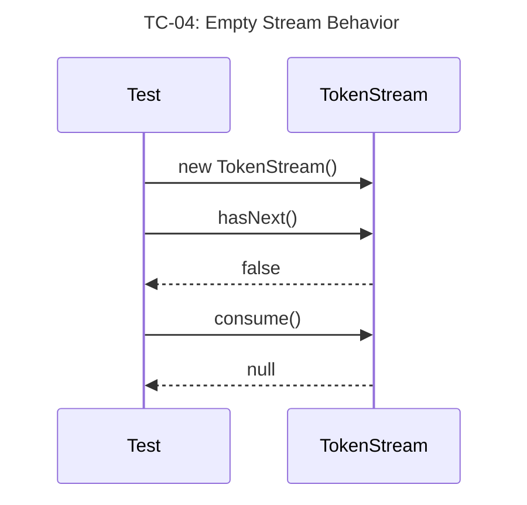
```mermaid
sequenceDiagram
    title TC-04: Empty Stream Behavior
    participant Test
    participant TokenStream

    Test->>TokenStream: new TokenStream()
    Test->>TokenStream: hasNext()
    TokenStream-->>Test: false
    Test->>TokenStream: consume()
    TokenStream-->>Test: null
```

---

## TC-05. LookAhead Boundary (`lookAhead_ShouldReturnNull_WhenOffsetIsOutOfBounds`)

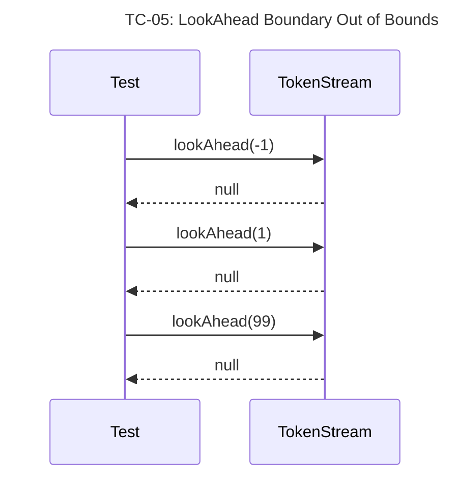
```mermaid
sequenceDiagram
    title TC-05: LookAhead Boundary Out of Bounds
    participant Test
    participant TokenStream

    Test->>TokenStream: lookAhead(-1)
    TokenStream-->>Test: null
    Test->>TokenStream: lookAhead(1)
    TokenStream-->>Test: null
    Test->>TokenStream: lookAhead(99)
    TokenStream-->>Test: null
```

---

## TC-06. Consume After EOF (`consume_ShouldReturnNull_WhenConsumedPastEOF`)

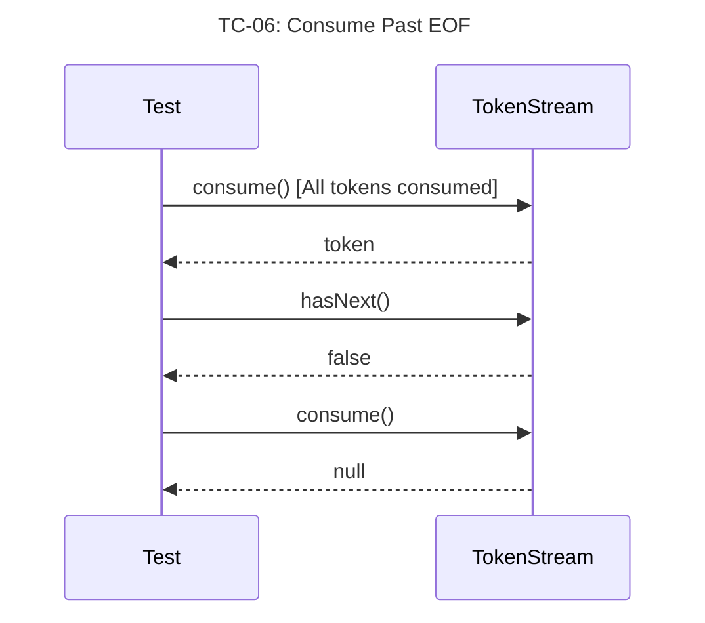
```mermaid
sequenceDiagram
    title TC-06: Consume Past EOF
    participant Test
    participant TokenStream

    Test->>TokenStream: consume() [All tokens consumed]
    TokenStream-->>Test: token
    Test->>TokenStream: hasNext()
    TokenStream-->>Test: false
    Test->>TokenStream: consume()
    TokenStream-->>Test: null
```

---

## TC-07. Create Token (`createToken_ShouldStoreTypeAndValue_WhenTokenIsConstructed` / SD-04)

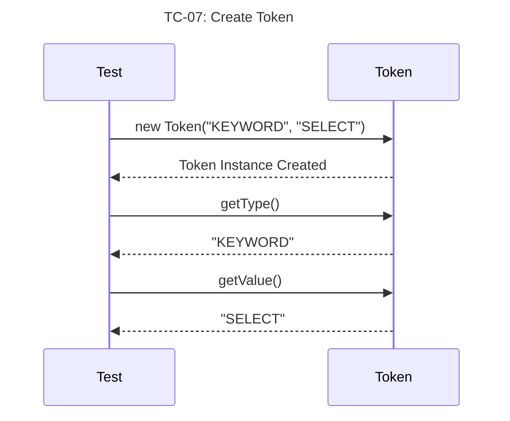
```mermaid
sequenceDiagram
    title TC-07: Create Token
    participant Test
    participant Token

    Test->>Token: new Token("KEYWORD", "SELECT")
    Token-->>Test: Token Instance Created
    Test->>Token: getType()
    Token-->>Test: "KEYWORD"
    Test->>Token: getValue()
    Token-->>Test: "SELECT"
```

---

## TC-08. Compare Tokens Equality (`equals_ShouldReturnTrue_WhenTokensContainIdenticalTypeAndValue` / SD-05)

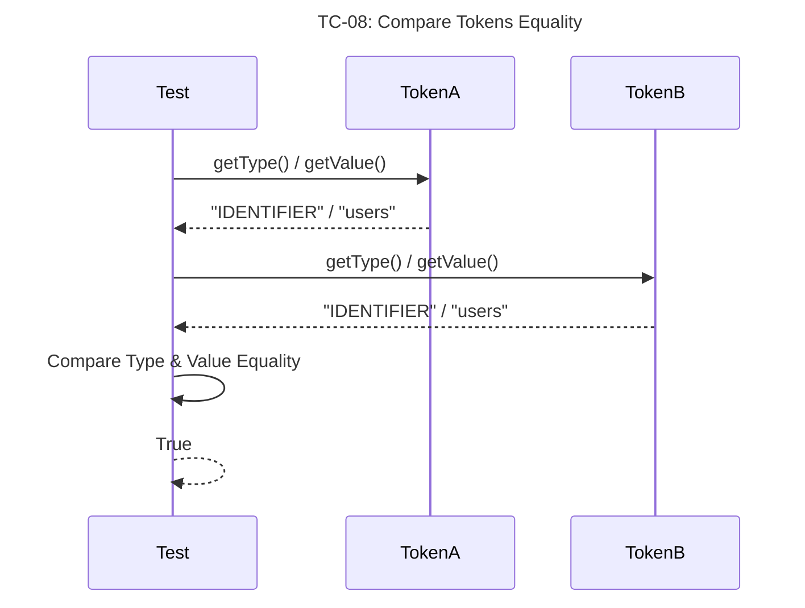
```mermaid
sequenceDiagram
    title TC-08: Compare Tokens Equality
    participant Test
    participant TokenA
    participant TokenB

    Test->>TokenA: getType() / getValue()
    TokenA-->>Test: "IDENTIFIER" / "users"
    Test->>TokenB: getType() / getValue()
    TokenB-->>Test: "IDENTIFIER" / "users"
    Test->>Test: Compare Type & Value Equality
    Test-->>Test: True
```

---

## TC-09. Default Constructor (`defaultConstructor_ShouldInitializeWithNullValues`)

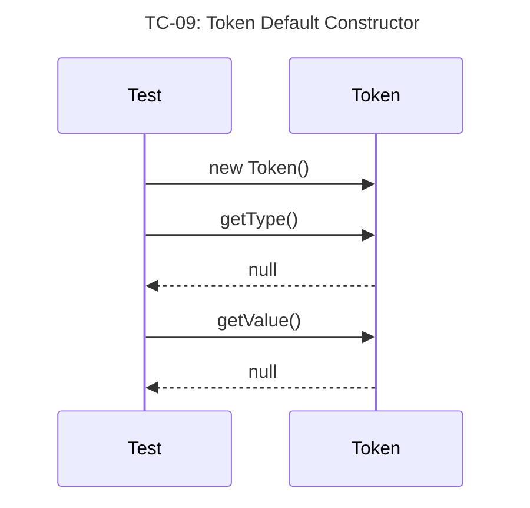
```mermaid
sequenceDiagram
    title TC-09: Token Default Constructor
    participant Test
    participant Token

    Test->>Token: new Token()
    Test->>Token: getType()
    Token-->>Test: null
    Test->>Token: getValue()
    Token-->>Test: null
```

---

## TC-10. Create AST (`createAST_ShouldAssignRootNode_WhenRootNodeIsProvided` / SD-06)

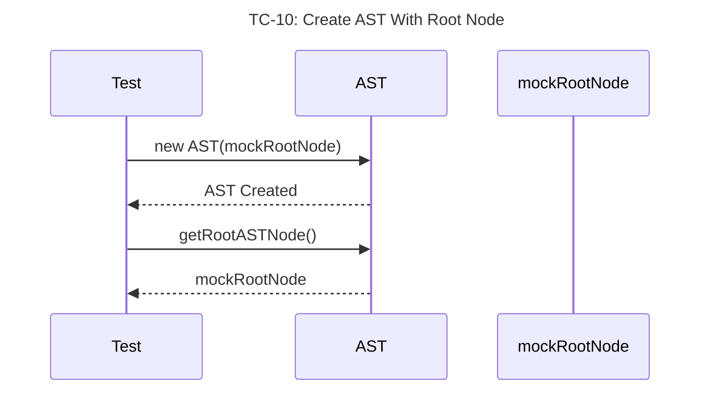
```mermaid
sequenceDiagram
    title TC-10: Create AST With Root Node
    participant Test
    participant AST
    participant mockRootNode

    Test->>AST: new AST(mockRootNode)
    AST-->>Test: AST Created
    Test->>AST: getRootASTNode()
    AST-->>Test: mockRootNode
```

---

## TC-11. Empty AST (`defaultConstructor_ShouldInitializeWithNullRootNode`)

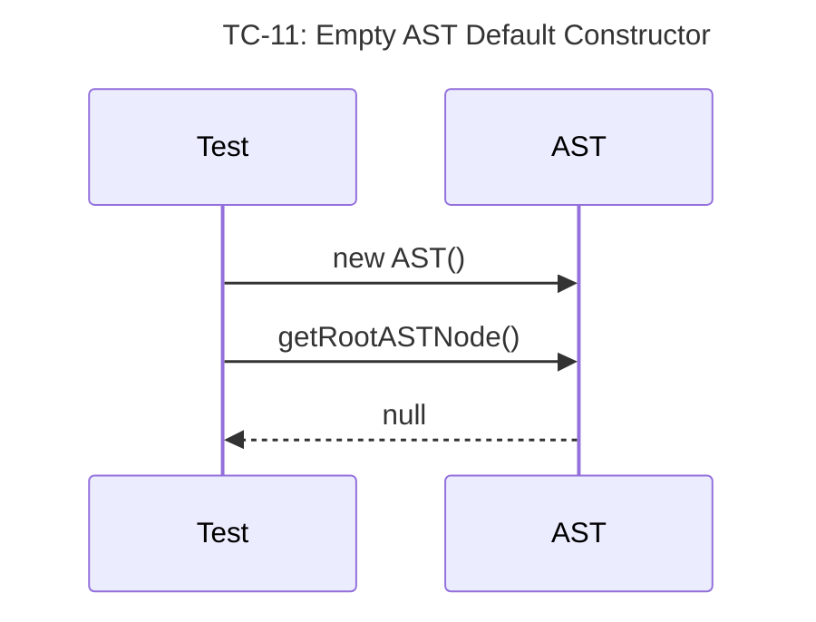
```mermaid
sequenceDiagram
    title TC-11: Empty AST Default Constructor
    participant Test
    participant AST

    Test->>AST: new AST()
    Test->>AST: getRootASTNode()
    AST-->>Test: null
```

---

## TC-12. Get Root Node (`getRootASTNode_ShouldReturnAssignedRootNode` / SD-07)

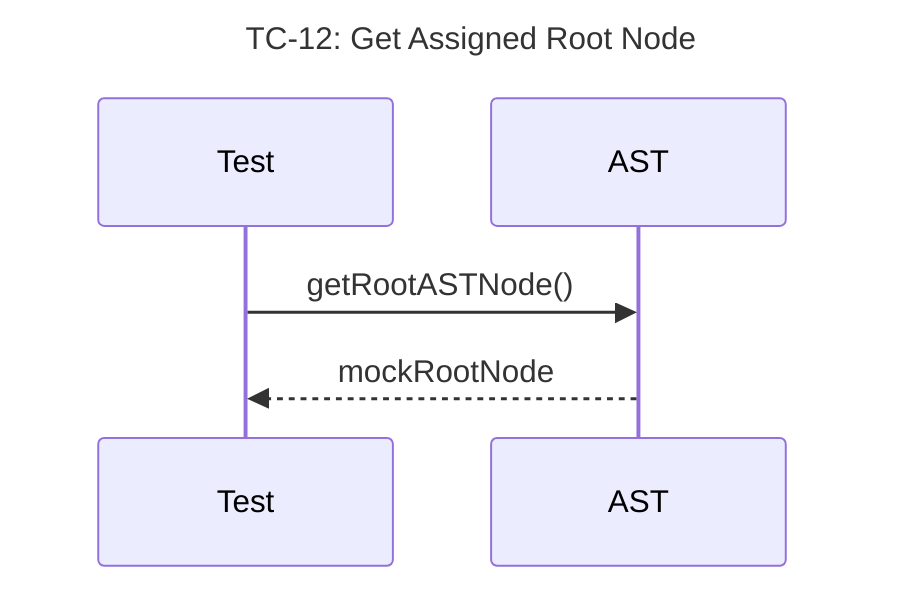
```mermaid
sequenceDiagram
    title TC-12: Get Assigned Root Node
    participant Test
    participant AST

    Test->>AST: getRootASTNode()
    AST-->>Test: mockRootNode
```

---

## TC-13. Build Select AST Node (`buildSelectASTNode_ShouldPopulateTableProjectionAndWhereClause_WhenParsingSelectStatement` / SD-08)

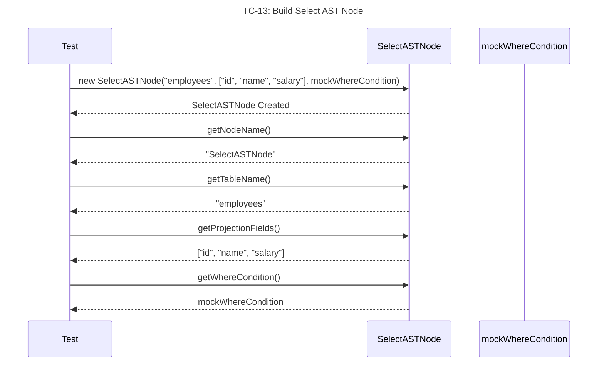
```mermaid
sequenceDiagram
    title TC-13: Build Select AST Node
    participant Test
    participant SelectASTNode
    participant mockWhereCondition

    Test->>SelectASTNode: new SelectASTNode("employees", ["id", "name", "salary"], mockWhereCondition)
    SelectASTNode-->>Test: SelectASTNode Created
    Test->>SelectASTNode: getNodeName()
    SelectASTNode-->>Test: "SelectASTNode"
    Test->>SelectASTNode: getTableName()
    SelectASTNode-->>Test: "employees"
    Test->>SelectASTNode: getProjectionFields()
    SelectASTNode-->>Test: ["id", "name", "salary"]
    Test->>SelectASTNode: getWhereCondition()
    SelectASTNode-->>Test: mockWhereCondition
```

---

## TC-14. Projection Fields (`projectionFields_ShouldMaintainListOfColumns`)

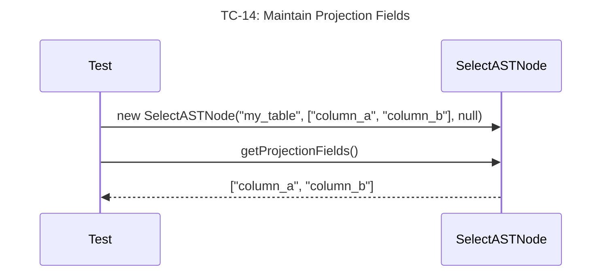
```mermaid
sequenceDiagram
    title TC-14: Maintain Projection Fields
    participant Test
    participant SelectASTNode

    Test->>SelectASTNode: new SelectASTNode("my_table", ["column_a", "column_b"], null)
    Test->>SelectASTNode: getProjectionFields()
    SelectASTNode-->>Test: ["column_a", "column_b"]
```

---

## TC-15. WHERE Condition (`whereCondition_ShouldReturnAssignedCondition`)

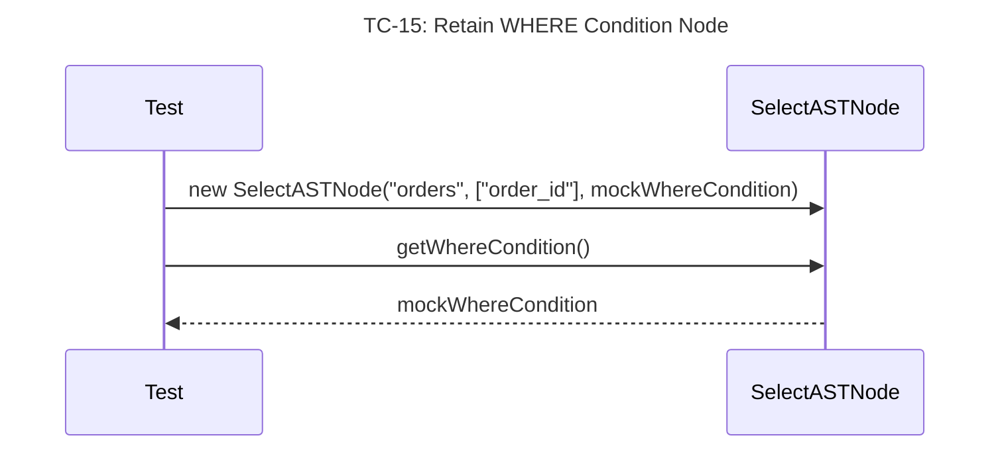
```mermaid
sequenceDiagram
    title TC-15: Retain WHERE Condition Node
    participant Test
    participant SelectASTNode

    Test->>SelectASTNode: new SelectASTNode("orders", ["order_id"], mockWhereCondition)
    Test->>SelectASTNode: getWhereCondition()
    SelectASTNode-->>Test: mockWhereCondition
```

---

## TC-16. Build Complete AST (`buildAST_ShouldConstructCompleteSyntaxTree_WhenParsingSelectStatement` / SD-12)

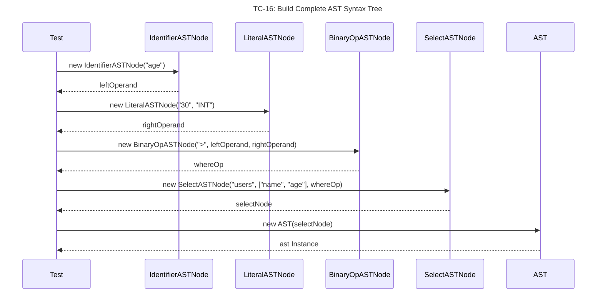
```mermaid
sequenceDiagram
    title TC-16: Build Complete AST Syntax Tree
    participant Test
    participant IdentifierASTNode
    participant LiteralASTNode
    participant BinaryOpASTNode
    participant SelectASTNode
    participant AST

    Test->>IdentifierASTNode: new IdentifierASTNode("age")
    IdentifierASTNode-->>Test: leftOperand
    Test->>LiteralASTNode: new LiteralASTNode("30", "INT")
    LiteralASTNode-->>Test: rightOperand
    Test->>BinaryOpASTNode: new BinaryOpASTNode(">", leftOperand, rightOperand)
    BinaryOpASTNode-->>Test: whereOp
    Test->>SelectASTNode: new SelectASTNode("users", ["name", "age"], whereOp)
    SelectASTNode-->>Test: selectNode
    Test->>AST: new AST(selectNode)
    AST-->>Test: ast Instance
```

---

## TC-17. Default Constructor (`defaultConstructor_ShouldSetNodeName`)

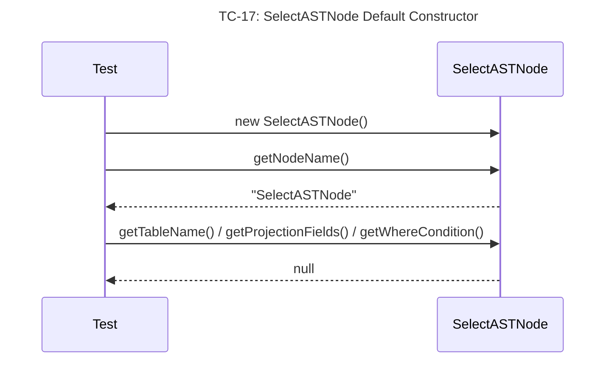
```mermaid
sequenceDiagram
    title TC-17: SelectASTNode Default Constructor
    participant Test
    participant SelectASTNode

    Test->>SelectASTNode: new SelectASTNode()
    Test->>SelectASTNode: getNodeName()
    SelectASTNode-->>Test: "SelectASTNode"
    Test->>SelectASTNode: getTableName() / getProjectionFields() / getWhereCondition()
    SelectASTNode-->>Test: null
```

---

## TC-18. Build Binary Operator AST Node (`buildBinaryOperatorASTNode_ShouldLinkLeftAndRightOperands_WhenParsingBinaryExpression` / SD-09)

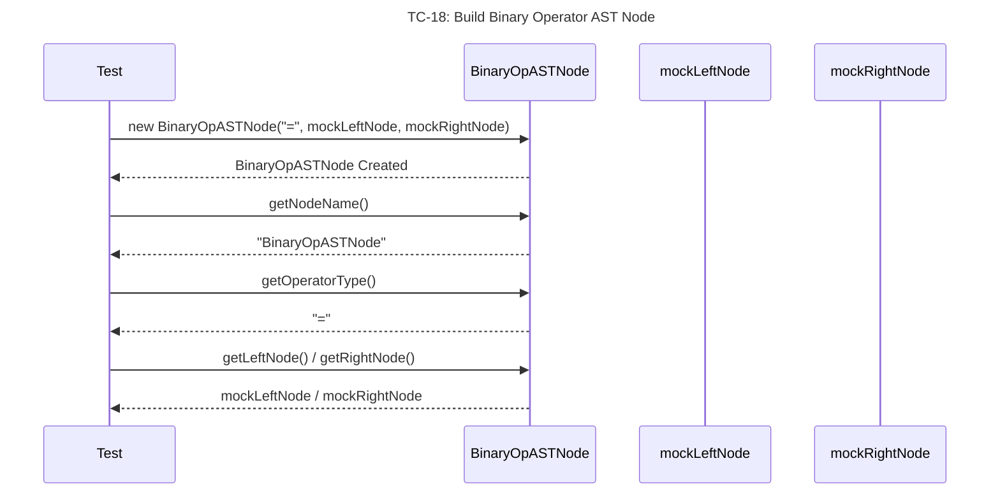
```mermaid
sequenceDiagram
    title TC-18: Build Binary Operator AST Node
    participant Test
    participant BinaryOpASTNode
    participant mockLeftNode
    participant mockRightNode

    Test->>BinaryOpASTNode: new BinaryOpASTNode("=", mockLeftNode, mockRightNode)
    BinaryOpASTNode-->>Test: BinaryOpASTNode Created
    Test->>BinaryOpASTNode: getNodeName()
    BinaryOpASTNode-->>Test: "BinaryOpASTNode"
    Test->>BinaryOpASTNode: getOperatorType()
    BinaryOpASTNode-->>Test: "="
    Test->>BinaryOpASTNode: getLeftNode() / getRightNode()
    BinaryOpASTNode-->>Test: mockLeftNode / mockRightNode
```

---

## TC-19. Child Operands Evaluation (`getLeftNode_And_getRightNode_ShouldReturnChildNodes`)

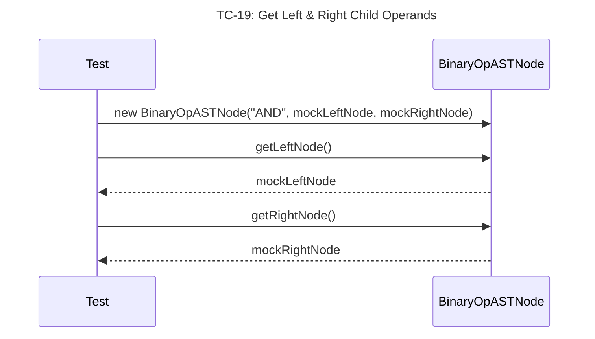
```mermaid
sequenceDiagram
    title TC-19: Get Left & Right Child Operands
    participant Test
    participant BinaryOpASTNode

    Test->>BinaryOpASTNode: new BinaryOpASTNode("AND", mockLeftNode, mockRightNode)
    Test->>BinaryOpASTNode: getLeftNode()
    BinaryOpASTNode-->>Test: mockLeftNode
    Test->>BinaryOpASTNode: getRightNode()
    BinaryOpASTNode-->>Test: mockRightNode
```

---

## TC-20. Default Constructor (`defaultConstructor_ShouldSetNodeName`)

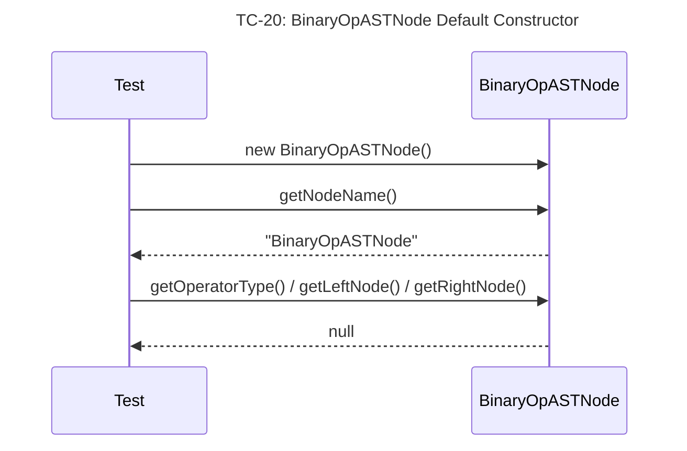
```mermaid
sequenceDiagram
    title TC-20: BinaryOpASTNode Default Constructor
    participant Test
    participant BinaryOpASTNode

    Test->>BinaryOpASTNode: new BinaryOpASTNode()
    Test->>BinaryOpASTNode: getNodeName()
    BinaryOpASTNode-->>Test: "BinaryOpASTNode"
    Test->>BinaryOpASTNode: getOperatorType() / getLeftNode() / getRightNode()
    BinaryOpASTNode-->>Test: null
```

---

## TC-21. Build Identifier AST Node (`buildIdentifierASTNode_ShouldPreserveQualifiedIdentifier_WhenParsingIdentifier` / SD-10)

```mermaid
sequenceDiagram
    title TC-21: Preserve Qualified Identifier
    participant Test
    participant IdentifierASTNode

    Test->>IdentifierASTNode: new IdentifierASTNode("users.user_id")
    IdentifierASTNode-->>Test: IdentifierASTNode Created
    Test->>IdentifierASTNode: getNodeName()
    IdentifierASTNode-->>Test: "IdentifierASTNode"
    Test->>IdentifierASTNode: getValue()
    IdentifierASTNode-->>Test: "users.user_id"
```

---

## TC-22. Column Identifier (`columnIdentifier_ShouldStoreSimpleColumnName`)

```mermaid
sequenceDiagram
    title TC-22: Simple Column Identifier
    participant Test
    participant IdentifierASTNode

    Test->>IdentifierASTNode: new IdentifierASTNode("email")
    Test->>IdentifierASTNode: getValue()
    IdentifierASTNode-->>Test: "email"
```

---

## TC-23. Default Constructor (`defaultConstructor_ShouldInitializeWithNullValue`)

```mermaid
sequenceDiagram
    title TC-23: IdentifierASTNode Default Constructor
    participant Test
    participant IdentifierASTNode

    Test->>IdentifierASTNode: new IdentifierASTNode()
    Test->>IdentifierASTNode: getNodeName()
    IdentifierASTNode-->>Test: "IdentifierASTNode"
    Test->>IdentifierASTNode: getValue()
    IdentifierASTNode-->>Test: null
```

---

## TC-24. Build Literal AST Node (`buildLiteralASTNode_ShouldInferDataType_WhenParsingLiteralValue` / SD-11)

```mermaid
sequenceDiagram
    title TC-24: Build Literal AST Node
    participant Test
    participant LiteralASTNode

    Test->>LiteralASTNode: new LiteralASTNode("100", "INTEGER")
    LiteralASTNode-->>Test: LiteralASTNode Created
    Test->>LiteralASTNode: getNodeName()
    LiteralASTNode-->>Test: "LiteralASTNode"
    Test->>LiteralASTNode: getValue()
    LiteralASTNode-->>Test: "100"
    Test->>LiteralASTNode: getInferredType()
    LiteralASTNode-->>Test: "INTEGER"
```

---

## TC-25. Integer Literal (`integerLiteral_ShouldStoreIntegerDataType`)

```mermaid
sequenceDiagram
    title TC-25: Integer Literal
    participant Test
    participant LiteralASTNode

    Test->>LiteralASTNode: new LiteralASTNode("42", "INT")
    Test->>LiteralASTNode: getValue() / getInferredType()
    LiteralASTNode-->>Test: "42" / "INT"
```

---

## TC-26. String Literal (`stringLiteral_ShouldStoreStringDataType`)

```mermaid
sequenceDiagram
    title TC-26: String Literal
    participant Test
    participant LiteralASTNode

    Test->>LiteralASTNode: new LiteralASTNode("'John Doe'", "VARCHAR")
    Test->>LiteralASTNode: getValue() / getInferredType()
    LiteralASTNode-->>Test: "'John Doe'" / "VARCHAR"
```

---

## TC-27. Boolean Literal (`booleanLiteral_ShouldStoreBooleanDataType`)

```mermaid
sequenceDiagram
    title TC-27: Boolean Literal
    participant Test
    participant LiteralASTNode

    Test->>LiteralASTNode: new LiteralASTNode("TRUE", "BOOLEAN")
    Test->>LiteralASTNode: getValue() / getInferredType()
    LiteralASTNode-->>Test: "TRUE" / "BOOLEAN"
```

---

## TC-28. NULL Literal (`nullLiteral_ShouldStoreNullDataType`)

```mermaid
sequenceDiagram
    title TC-28: NULL Literal
    participant Test
    participant LiteralASTNode

    Test->>LiteralASTNode: new LiteralASTNode("NULL", "NULL")
    Test->>LiteralASTNode: getValue() / getInferredType()
    LiteralASTNode-->>Test: "NULL" / "NULL"
```

---

## TC-29. Default Constructor (`defaultConstructor_ShouldInitializeWithNullFields`)

```mermaid
sequenceDiagram
    title TC-29: LiteralASTNode Default Constructor
    participant Test
    participant LiteralASTNode

    Test->>LiteralASTNode: new LiteralASTNode()
    Test->>LiteralASTNode: getNodeName()
    LiteralASTNode-->>Test: "LiteralASTNode"
    Test->>LiteralASTNode: getValue() / getInferredType()
    LiteralASTNode-->>Test: null
```