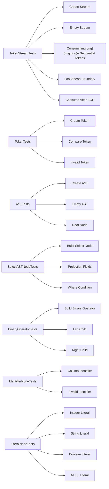

```mermaid
flowchart LR

TokenStreamTests

CreateStream["Create Stream"]
EmptyStream["Empty Stream"]
ConsumeSequential["Consum![img.png](img.png)e Sequential Tokens"]
LookAheadBoundary["LookAhead Boundary"]
ConsumeAfterEOF["Consume After EOF"]

TokenTests

CreateToken["Create Token"]
CompareToken["Compare Token"]
InvalidToken["Invalid Token"]

ASTTests

CreateAST["Create AST"]
EmptyAST["Empty AST"]
RootNode["Root Node"]

SelectASTNodeTests

BuildSelectNode["Build Select Node"]
ProjectionFields["Projection Fields"]
WhereCondition["Where Condition"]

BinaryOperatorTests

BuildBinaryOperator["Build Binary Operator"]
EvaluateLeft["Left Child"]
EvaluateRight["Right Child"]

IdentifierNodeTests

ColumnIdentifier["Column Identifier"]
InvalidIdentifier["Invalid Identifier"]

LiteralNodeTests

IntegerLiteral["Integer Literal"]
StringLiteral["String Literal"]
BooleanLiteral["Boolean Literal"]
NullLiteral["NULL Literal"]

TokenStreamTests --> CreateStream
TokenStreamTests --> EmptyStream
TokenStreamTests --> ConsumeSequential
TokenStreamTests --> LookAheadBoundary
TokenStreamTests --> ConsumeAfterEOF

TokenTests --> CreateToken
TokenTests --> CompareToken
TokenTests --> InvalidToken

ASTTests --> CreateAST
ASTTests --> EmptyAST
ASTTests --> RootNode

SelectASTNodeTests --> BuildSelectNode
SelectASTNodeTests --> ProjectionFields
SelectASTNodeTests --> WhereCondition

BinaryOperatorTests --> BuildBinaryOperator
BinaryOperatorTests --> EvaluateLeft
BinaryOperatorTests --> EvaluateRight

IdentifierNodeTests --> ColumnIdentifier
IdentifierNodeTests --> InvalidIdentifier

LiteralNodeTests --> IntegerLiteral
LiteralNodeTests --> StringLiteral
LiteralNodeTests --> BooleanLiteral
LiteralNodeTests --> NullLiteral
```