# Unit Test Specification - StorageEngine (Level 2)

Sơ đồ dưới đây chi tiết hóa các kịch bản Unit Test cho các thành phần trong bộ lưu trữ dữ liệu (**StorageEngine**), bao gồm tên phương thức, tham số đầu vào (Input) và kết quả kỳ vọng (Output).

```mermaid
graph TD
    SE["StorageEngine Unit Tests"] --> FileMgr["DiskFileManagerTest"]
    SE --> Page["DataPageTest"]
    SE --> BufferPool["BufferPoolManagerTest"]
    SE --> Replacer["LruPageReplacerTest"]
    SE --> LockMgr["LockManagerTest"]

    %% ==========================================
    %% DISK FILE MANAGER
    %% ==========================================
    subgraph DiskFileManager Test Cases
        FileMgr --> FM1["Method: testReadPageFromDiskSuccess()<br/>Input: pageID: 1 (Tệp tồn tại trên đĩa)<br/>Output: byte[] chứa dữ liệu trang tương ứng"]
        FileMgr --> FM2["Method: testReadPageFromDiskNotFound()<br/>Input: pageID: 999 (Tệp không tồn tại)<br/>Output: Ném ngoại lệ hoặc trả về byte[] rỗng"]
        FileMgr --> FM3["Method: testWritePageToDiskSuccess()<br/>Input: pageID: 2, pageData: byte[4096]<br/>Output: void (Tệp tin được cập nhật/ghi mới xuống đĩa)"]
    end

    %% ==========================================
    %% DATA PAGE
    %% ==========================================
    subgraph DataPage Test Cases
        Page --> DP1["Method: testInsertRecordSuccess()<br/>Input: recordBytes: byte[] (Vừa kích thước trống)<br/>Output: boolean: true, slotCount tăng thêm 1"]
        Page --> DP2["Method: testGetRecordSuccess()<br/>Input: slotNumber: 0 (Slot hợp lệ)<br/>Output: byte[] khớp với dữ liệu đã chèn"]
        Page --> DP3["Method: testGetRecordInvalidSlot()<br/>Input: slotNumber: 99 (Slot không tồn tại)<br/>Output: byte[]: null hoặc ném IndexOutOfBoundsException"]
        Page --> DP4["Method: testInsertRecordPageOverflow()<br/>Input: recordBytes: byte[] (Lớn hơn kích thước buffer còn trống)<br/>Output: boolean: false"]
    end

    %% ==========================================
    %% BUFFER POOL MANAGER
    %% ==========================================
    subgraph BufferPoolManager Test Cases
        BufferPool --> BPM1["Method: testFetchPageCacheHit()<br/>Input: pageID: 1 (Trang đã nằm trong pageCacheMap)<br/>Output: Trả về đối tượng DataPage trực tiếp từ cache"]
        BufferPool --> BPM2["Method: testFetchPageCacheMiss()<br/>Input: pageID: 2 (Trang chưa có trong cache, cache chưa đầy)<br/>Output: Gọi DiskFileManager đọc từ đĩa, lưu vào cache, và trả về trang"]
        BufferPool --> BPM3["Method: testFetchPageCacheEvictionLRU()<br/>Input: pageID: 3 (Cache đã đầy poolCapacity)<br/>Output: Chọn victim page nhờ LruPageReplacer, ghi xuống đĩa (nếu dirty), xóa khỏi cache, nạp trang mới"]
        BufferPool --> BPM4["Method: testFlushPageSuccess()<br/>Input: pageID: 1 (Yêu cầu lưu trang xuống đĩa)<br/>Output: void (Gọi DiskFileManager.writePageToDisk)"]
    end

    %% ==========================================
    %% LRU PAGE REPLACER
    %% ==========================================
    subgraph LruPageReplacer Test Cases
        Replacer --> LPR1["Method: testSelectVictimPageSimple()<br/>Input: cacheMap: {1: Page1, 2: Page2}, lruList: [1, 2]<br/>Output: int: 1 (Page 1 ít được truy cập nhất và được chọn để giải phóng)"]
        Replacer --> LPR2["Method: testSelectVictimPageEmptyCache()<br/>Input: cacheMap: empty<br/>Output: int: -1"]
    end

    %% ==========================================
    %% LOCK MANAGER
    %% ==========================================
    subgraph LockManager Test Cases
        LockMgr --> LM1["Method: testAcquireSharedLockSuccess()<br/>Input: resourceID: 10, txID: 1, lockMode: 'S'<br/>Output: boolean: true (Cấp khóa đọc thành công)"]
        LockMgr --> LM2["Method: testAcquireSharedLockConcurrent()<br/>Input: resourceID: 10, txID: 2, lockMode: 'S' (Khi txID: 1 đang giữ S)<br/>Output: boolean: true (Khóa đọc tương thích nhau)"]
        LockMgr --> LM3["Method: testAcquireExclusiveLockConflict()<br/>Input: resourceID: 10, txID: 3, lockMode: 'X' (Khi txID: 1 đang giữ S)<br/>Output: boolean: false (Khóa ghi xung đột với khóa đọc)"]
        LockMgr --> LM4["Method: testReleaseLockSuccess()<br/>Input: resourceID: 10, txID: 1<br/>Output: void (Giải phóng khóa, đánh thức các yêu cầu đang đợi tiếp theo)"]
    end
```

