# 🏗️ DBMS High-Level System Architecture (Mindmap View)

This document provides a high-level architectural view of the Relational Database Management System (DBMS) structured and formatted into **Mermaid Mindmaps** based on system modules defined in [HighLevel.md](file:///d:/BBV/Database_Management_BBV/DBMS/Diagram/ClassDiagram/HighLevel.md).

---

## 🏛️ 1. Master System Architecture Mindmap

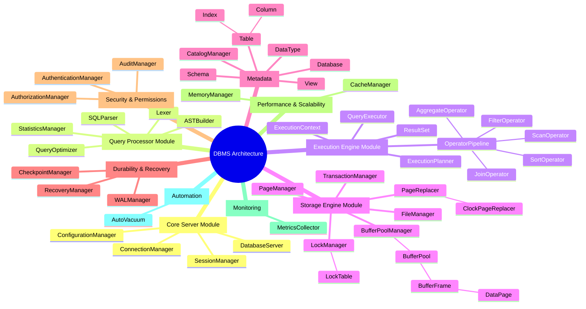

---

## 📑 2. Subsystem & Module Breakdown (Mindmap Format)

Detailed breakdown and individual Mermaid mindmap diagrams for each module defined in the architecture.

### 2.1. Database Core Server Module (`DatabaseCoreServer`)
Manages client connections, user session contexts, server lifecycle, and global system configurations.

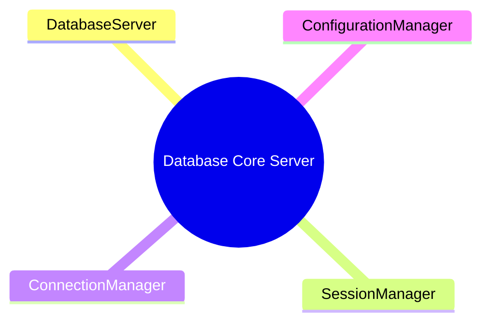

---

### 2.2. Query Processor Module (`QueryProcessor`)
Handles tokenization (`Lexer`), parsing (`SQLParser`), AST generation (`ASTBuilder`), cost estimations (`StatisticsManager`), and logical/physical query optimization (`QueryOptimizer`).

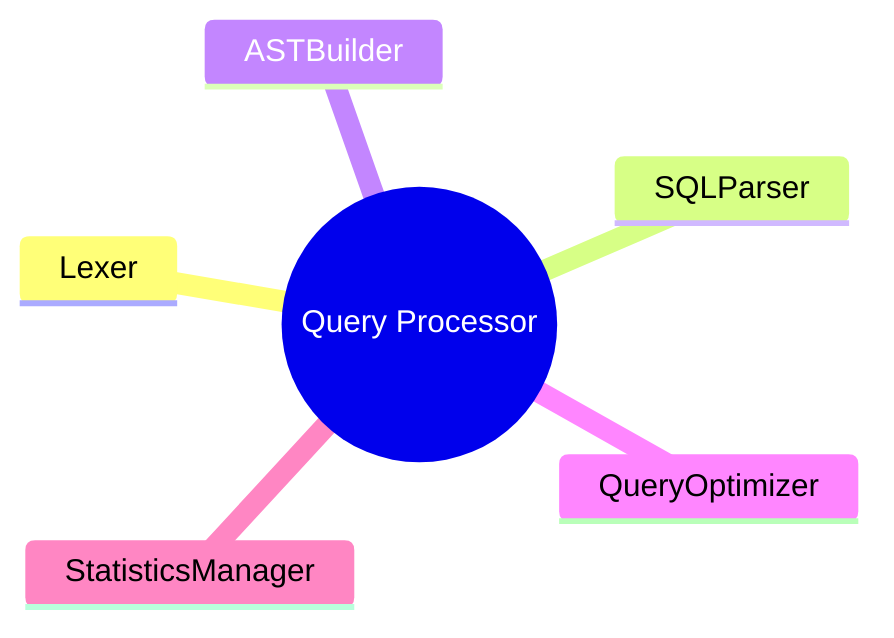

---

### 2.3. Execution Engine Module (`ExecutionEngine`)
Receives physical execution plans (`ExecutionPlanner`), manages execution context (`ExecutionContext`), executes operator pipelines (`QueryExecutor`, `OperatorPipeline`), and formats output streams (`ResultSet`).

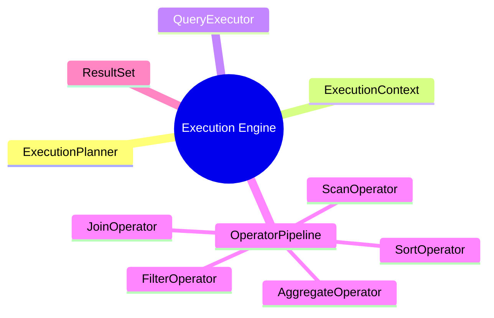

---

### 2.4. Storage Engine Module (`StorageEngine`)
Manages physical data files (`FileManager`), page frames (`PageManager`, `DataPage`), buffer replacement strategies (`BufferPoolManager`, `BufferPool`, `BufferFrame`, `PageReplacer`, `ClockPageReplacer`), concurrency locks (`LockManager`, `LockTable`), and ACID transactions (`TransactionManager`).

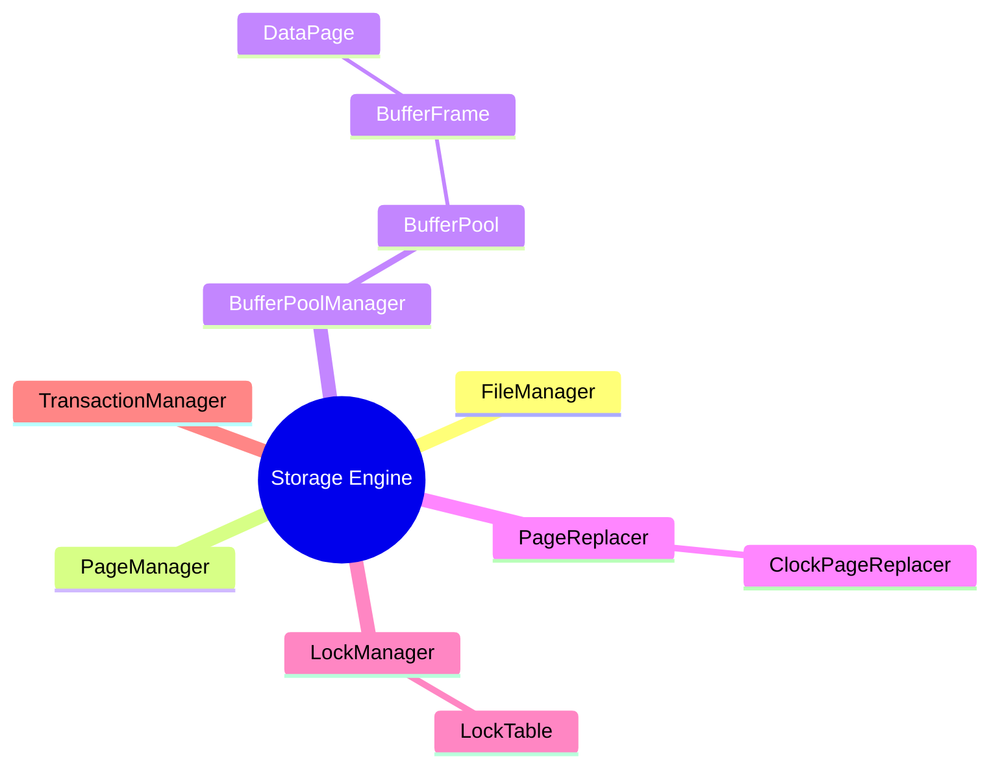

---

### 2.5. Metadata (`Metadata`)
Encapsulates database objects, schemas, tables, columns, indexes, views, and data types (`CatalogManager`, `Database`, `Schema`, `Table`, `Column`, `Index`, `View`, `DataType`).

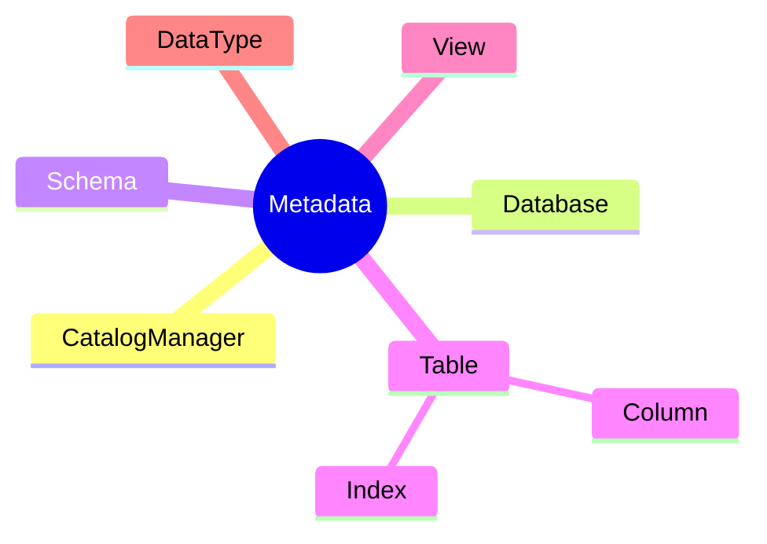

---

### 2.6. Durability & Recovery Data Module (`DurabilityData`)
Ensures write-ahead logging (`WALManager`), dirty page synchronization (`CheckpointManager`), and system recovery post-crash (`RecoveryManager`).

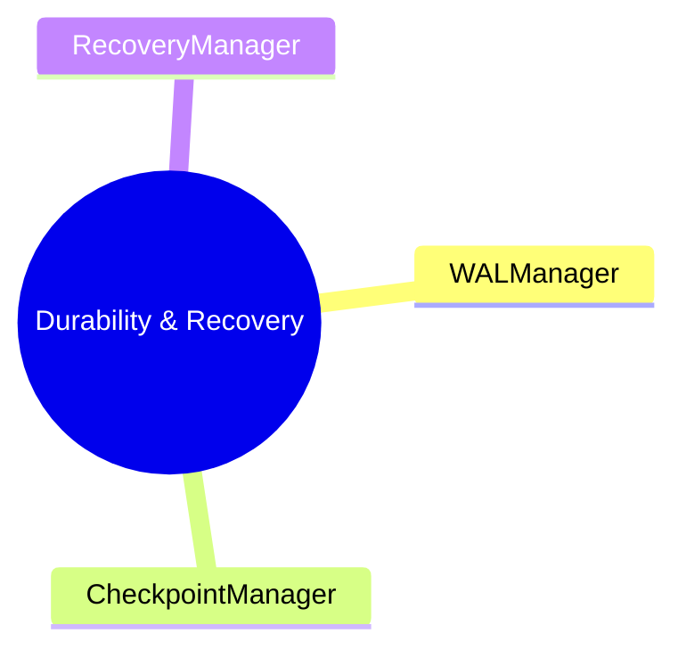

---

### 2.7. Security & Permissions Module (`SecurityPermission`)
Handles user authentication (`AuthenticationManager`), object permission verification (`AuthorizationManager`), and action logging (`AuditManager`).

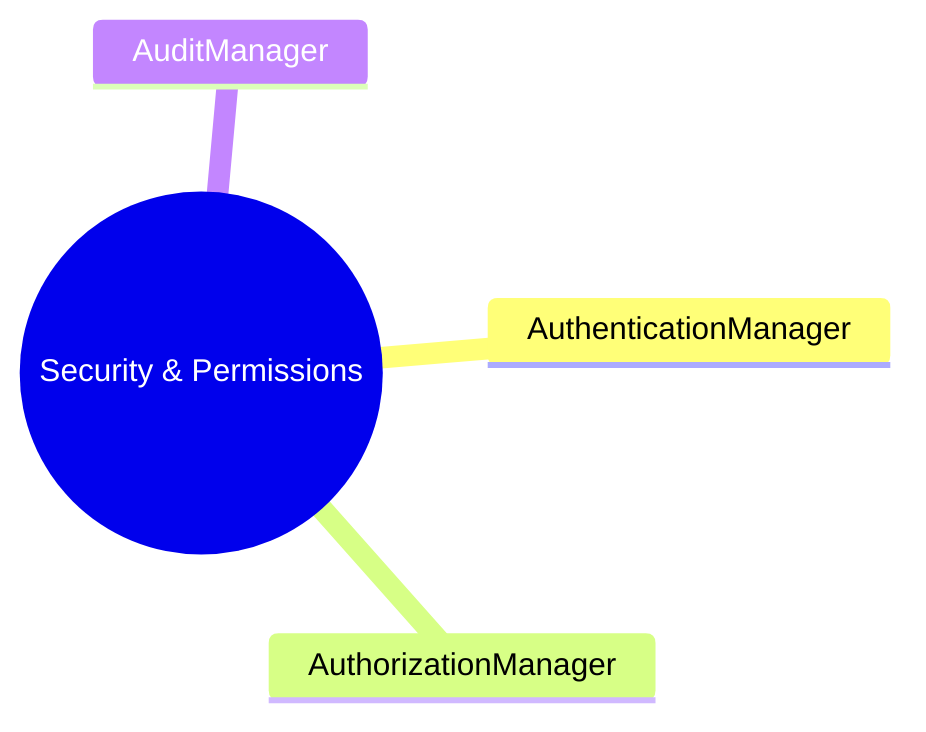

---

### 2.8. Performance & Scalability Module (`PerformanceScalability`)
Provides memory allocations and result caching layers (`CacheManager`, `MemoryManager`).

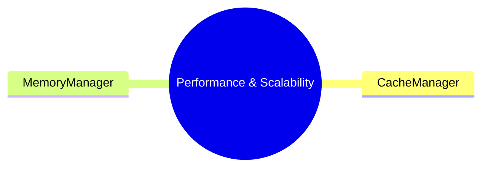

---

### 2.9. Monitoring Module (`Monitoring`)
Collects internal performance metrics and diagnostic indicators (`MetricsCollector`).

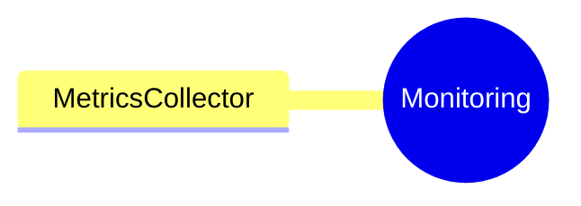

---

### 2.10. Automation Module (`Automation`)
Manages automated maintenance tasks, background cleanup, and dead tuple compaction (`AutoVacuum`).

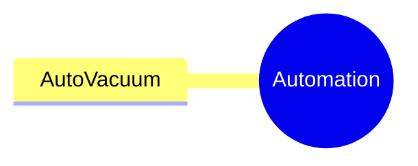
