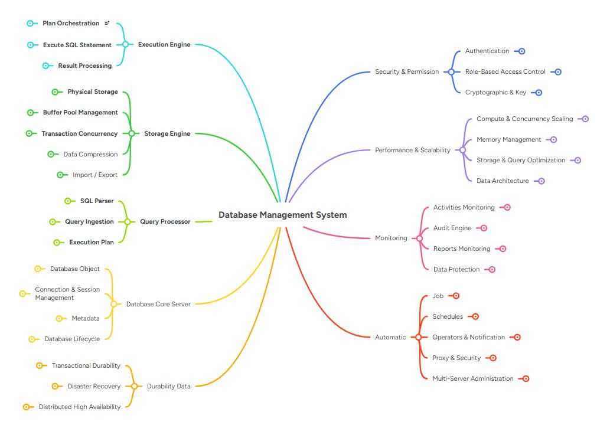
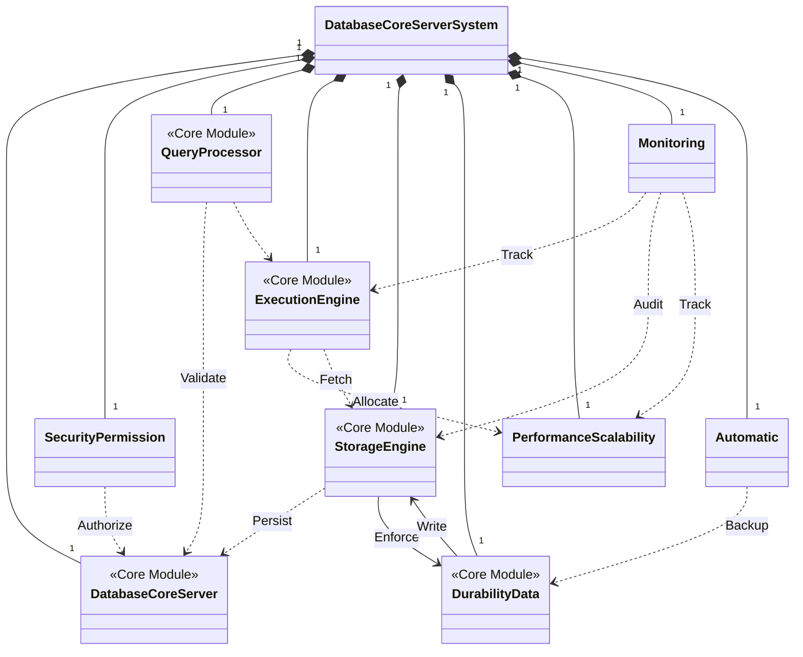
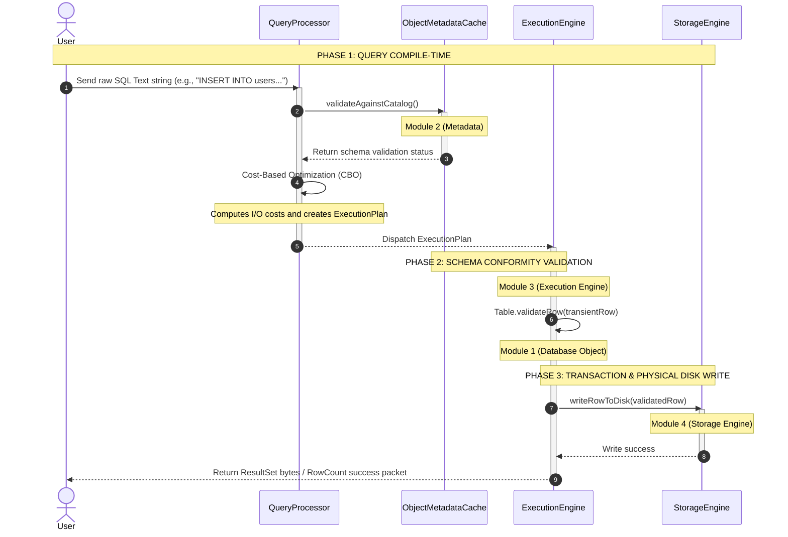

# 📚 Database Management System (BBV Assignment)

This project implements a full-fledged **Relational Database Management System (DBMS)** in **Java**, following a modular architecture with distinct layers for storage, catalog, transaction management, query processing, and execution.

---

# 🏗️ Architecture



---

# 📐 High-Level Class Diagram



---

# 🔄 High-Level Sequence Diagram



---

# 📂 Project Structure

```text
src/
 ├── catalog/
 ├── execution/
 ├── query/
 ├── storage/
 ├── transaction/
 ├── security/
 └── monitoring/
```