# Sequence Diagrams - Lexical Stream & AST Hierarchy

---

## SD-01. CreateTokenStream_ShouldInitializeHeadPointer_WhenValidTokenListIsProvided

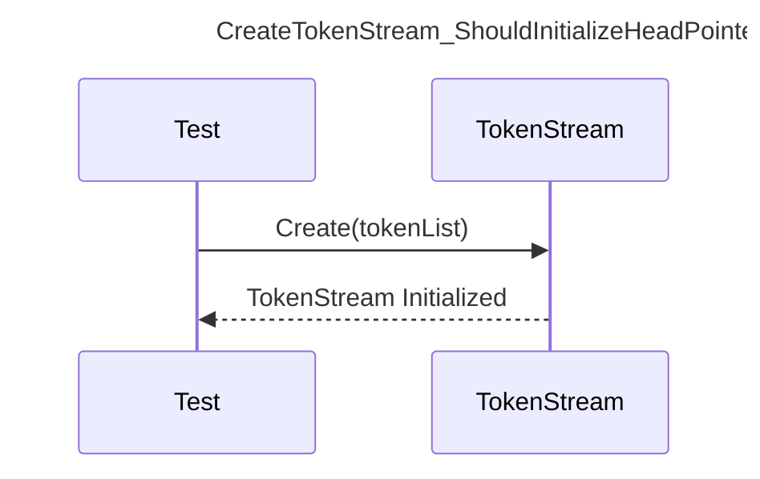

---

## SD-02. Consume_ShouldReturnNextToken_WhenMoreTokensExist

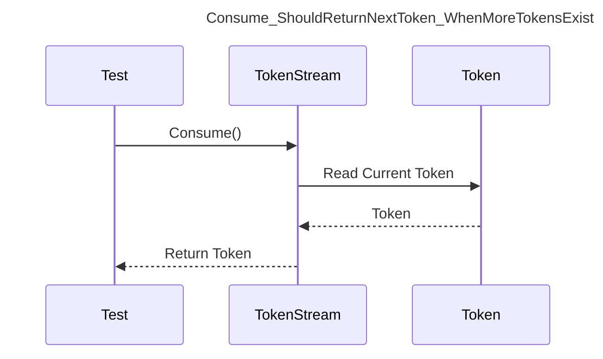

---

## SD-03. LookAhead_ShouldReturnTokenWithoutAdvancingPointer_WhenOffsetIsValid

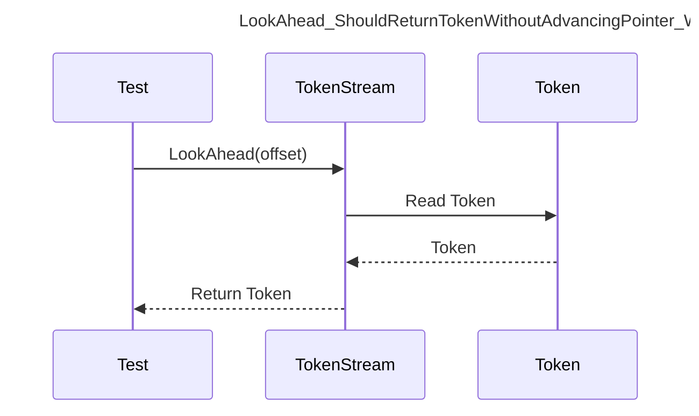

---

## SD-04. CreateToken_ShouldStoreTypeAndValue_WhenTokenIsConstructed

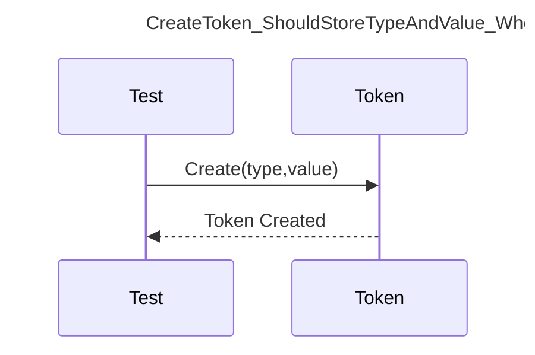

---

## SD-05. Equals_ShouldReturnTrue_WhenTokensContainIdenticalTypeAndValue

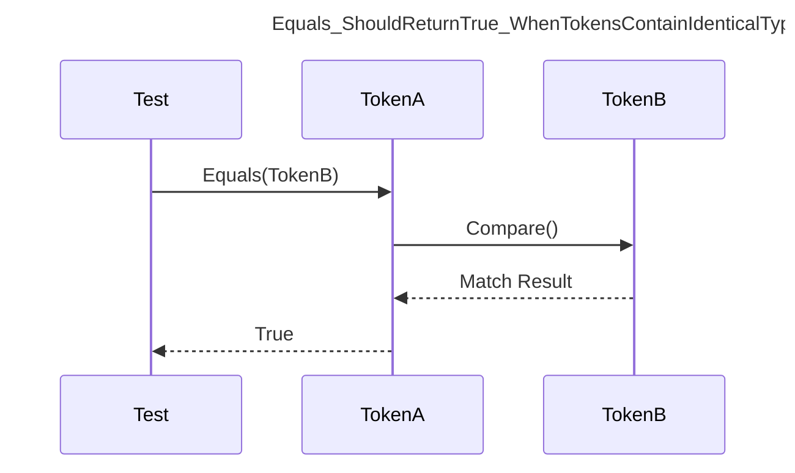

---

## SD-06. CreateAST_ShouldAssignRootNode_WhenRootNodeIsProvided

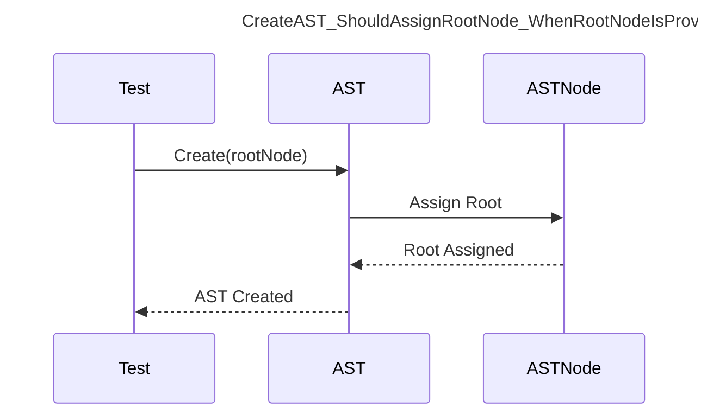

---

## SD-07. SetRoot_ShouldReplaceExistingRoot_WhenNewRootNodeIsAssigned

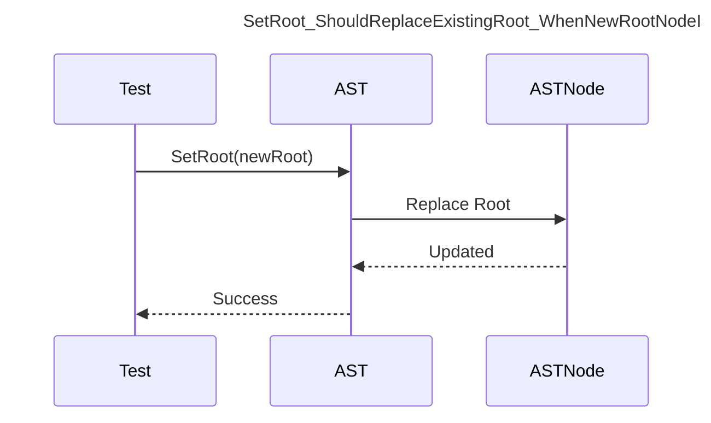

---

## SD-08. BuildSelectASTNode_ShouldPopulateTableProjectionAndWhereClause_WhenParsingSelectStatement

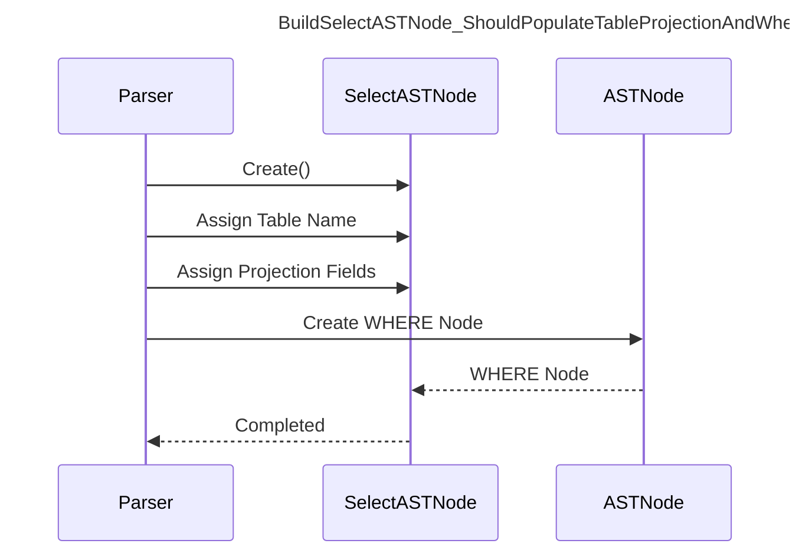

---

## SD-09. BuildBinaryOperatorASTNode_ShouldLinkLeftAndRightOperands_WhenParsingBinaryExpression

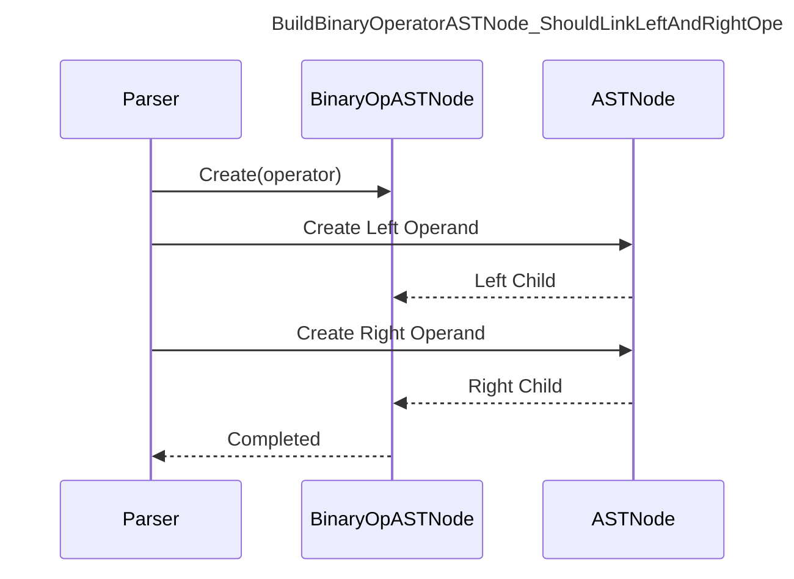

---

## SD-10. BuildIdentifierASTNode_ShouldPreserveQualifiedIdentifier_WhenParsingIdentifier

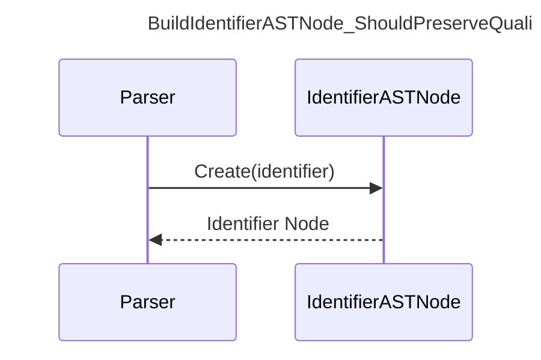

---

## SD-11. BuildLiteralASTNode_ShouldInferDataType_WhenParsingLiteralValue

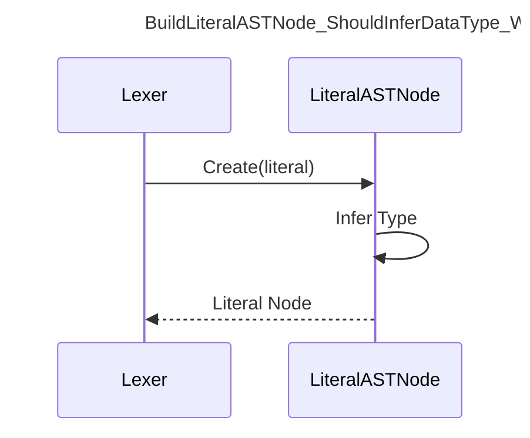

---

## SD-12. BuildAST_ShouldConstructCompleteSyntaxTree_WhenParsingSelectStatement

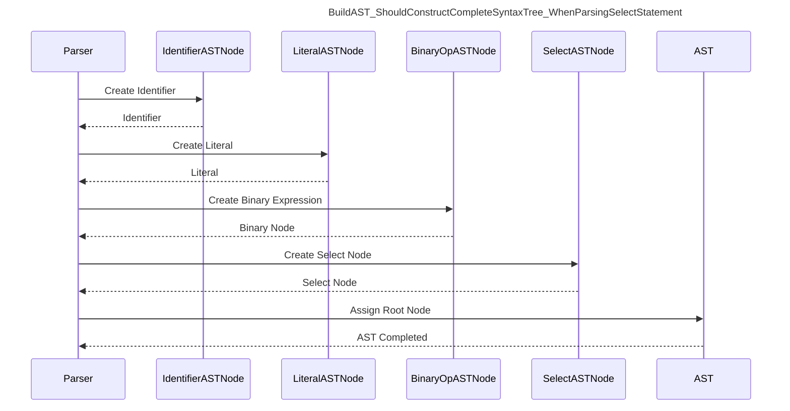