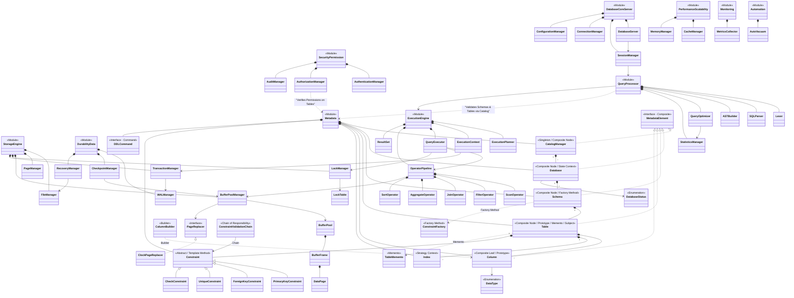

```mermaid
classDiagram
    direction TD

%% =========================================================
%% SYSTEM MODULE BOUNDARIES
%% =========================================================
    class DatabaseCoreServer {
        <<Module>>
    }

    class QueryProcessor {
        <<Module>>
    }

    class ExecutionEngine {
        <<Module>>
    }

    class StorageEngine {
        <<Module>>
    }

    class Metadata {
        <<Module>>
    }

    class DurabilityData {
        <<Module>>
    }

    class SecurityPermission {
        <<Module>>
    }

    class PerformanceScalability {
        <<Module>>
    }

    class Monitoring {
        <<Module>>
    }

    class Automation {
        <<Module>>
    }

%% =========================================================
%% METADATA MODULE INNER COMPONENTS
%% =========================================================
    class CatalogManager {
        <<Singleton / Composite Node>>
    }
    class Database {
        <<Composite Node / State Context>>
    }
    class DatabaseStatus {
        <<Enumeration>>
    }
    class Schema {
        <<Composite Node / Factory Method>>
    }
    class Table {
        <<Composite Node / Prototype / Memento / Subject>>
    }
    class Column {
        <<Composite Leaf / Prototype>>
    }
    class DataType {
        <<Enumeration>>
    }
    class Index {
        <<Strategy Context>>
    }
    class Constraint {
        <<Abstract / Template Method>>
    }
    class PrimaryKeyConstraint
    class ForeignKeyConstraint
    class UniqueConstraint
    class CheckConstraint

    class MetadataElement {
        <<Interface - Composite>>
    }
    class DDLCommand {
        <<Interface - Command>>
    }
    class TableMemento {
        <<Memento>>
    }
    class ColumnBuilder {
        <<Builder>>
    }
    class ConstraintFactory {
        <<Factory Method>>
    }
    class ConstraintValidationChain {
        <<Chain of Responsibility>>
    }

%% =========================================================
%% DATABASE CORE SERVER INNER COMPONENTS
%% =========================================================
    class DatabaseServer
    class SessionManager
    class ConnectionManager
    class ConfigurationManager

%% =========================================================
%% QUERY PROCESSOR INNER COMPONENTS
%% =========================================================
    class Lexer
    class SQLParser
    class ASTBuilder
    class QueryOptimizer
    class StatisticsManager

%% =========================================================
%% EXECUTION ENGINE INNER COMPONENTS
%% =========================================================
    class ExecutionPlanner
    class ExecutionContext
    class QueryExecutor
    class OperatorPipeline
    class ResultSet

    class ScanOperator
    class FilterOperator
    class JoinOperator
    class AggregateOperator
    class SortOperator

%% =========================================================
%% STORAGE ENGINE INNER COMPONENTS
%% =========================================================
    class FileManager
    class PageManager
    class BufferPoolManager
    class BufferPool
    class BufferFrame

    class PageReplacer{
        <<Interface>>
    }

    class ClockPageReplacer

    class LockManager
    class LockTable
    class TransactionManager
    class DataPage

%% =========================================================
%% DURABILITY INNER COMPONENTS
%% =========================================================
    class WALManager
    class CheckpointManager
    class RecoveryManager

%% =========================================================
%% SECURITY INNER COMPONENTS
%% =========================================================
    class AuthenticationManager
    class AuthorizationManager
    class AuditManager

%% =========================================================
%% PERFORMANCE INNER COMPONENTS
%% =========================================================
    class CacheManager
    class MemoryManager

%% =========================================================
%% MONITORING INNER COMPONENTS
%% =========================================================
    class MetricsCollector

%% =========================================================
%% AUTOMATION INNER COMPONENTS
%% =========================================================
    class AutoVacuum

%% =========================================================
%% MODULE COMPOSITION
%% =========================================================

%% Metadata Module Composition
    Metadata *-- CatalogManager
    Metadata *-- Database
    Metadata *-- Schema
    Metadata *-- Table
    Metadata *-- Column
    Metadata *-- Index
    Metadata *-- Constraint
    Metadata *-- DDLCommand

    MetadataElement <|.. CatalogManager
    MetadataElement <|.. Database
    MetadataElement <|.. Schema
    MetadataElement <|.. Table
    MetadataElement <|.. Column

    CatalogManager "1" *-- "*" Database
    Database "1" *-- "*" Schema
    Database --> DatabaseStatus
    Schema "1" *-- "*" Table
    Table "1" *-- "*" Column
    Table "1" *-- "*" Index
    Table "1" *-- "*" Constraint
    Column --> DataType

    Constraint <|-- PrimaryKeyConstraint
    Constraint <|-- ForeignKeyConstraint
    Constraint <|-- UniqueConstraint
    Constraint <|-- CheckConstraint

    Table ..> TableMemento : Memento
    ColumnBuilder ..> Column : Builder
    Schema ..> ConstraintFactory : Factory Method
    ConstraintValidationChain --> Constraint : Chain

%% Database Core Server Composition
    DatabaseCoreServer *-- DatabaseServer
    DatabaseCoreServer *-- SessionManager
    DatabaseCoreServer *-- ConnectionManager
    DatabaseCoreServer *-- ConfigurationManager

%% Query Processor Composition
    QueryProcessor *-- Lexer
    QueryProcessor *-- SQLParser
    QueryProcessor *-- ASTBuilder
    QueryProcessor *-- QueryOptimizer
    QueryProcessor *-- StatisticsManager

%% Execution Engine Composition
    ExecutionEngine *-- ExecutionPlanner
    ExecutionEngine *-- ExecutionContext
    ExecutionEngine *-- QueryExecutor
    ExecutionEngine *-- OperatorPipeline
    ExecutionEngine *-- ResultSet

    OperatorPipeline *-- ScanOperator
    OperatorPipeline *-- FilterOperator
    OperatorPipeline *-- JoinOperator
    OperatorPipeline *-- AggregateOperator
    OperatorPipeline *-- SortOperator

%% Storage Engine Composition
    StorageEngine *-- FileManager
    StorageEngine *-- PageManager
    StorageEngine *-- BufferPoolManager
    StorageEngine *-- LockManager
    StorageEngine *-- TransactionManager

    BufferPoolManager --> BufferPool
    BufferPool *-- BufferFrame
    BufferFrame *-- DataPage

    PageReplacer <|.. ClockPageReplacer
    BufferPoolManager --> PageReplacer

    LockManager --> LockTable

%% Infrastructure Modules Compositions
    DurabilityData *-- WALManager
    DurabilityData *-- CheckpointManager
    DurabilityData *-- RecoveryManager

    SecurityPermission *-- AuthenticationManager
    SecurityPermission *-- AuthorizationManager
    SecurityPermission *-- AuditManager

    PerformanceScalability *-- CacheManager
    PerformanceScalability *-- MemoryManager

    Monitoring *-- MetricsCollector

    Automation *-- AutoVacuum

%% =========================================================
%% CROSS MODULE DEPENDENCIES
%% =========================================================

%% Core Flows
    DatabaseServer --> SessionManager
    SessionManager --> QueryProcessor

%% Query Processor interacts with Metadata Module
    QueryProcessor ..> Metadata : "Validates Schemas & Tables via Catalog"
    QueryOptimizer --> StatisticsManager

    QueryProcessor --> ExecutionEngine

    QueryExecutor --> OperatorPipeline
    OperatorPipeline --> BufferPoolManager

    QueryExecutor --> TransactionManager
    QueryExecutor --> LockManager

    TransactionManager --> WALManager

    CheckpointManager --> BufferPoolManager

    RecoveryManager --> FileManager

%% Security & Permissions link to Metadata
    AuthorizationManager ..> Metadata : "Verifies Permissions on Tables"
```