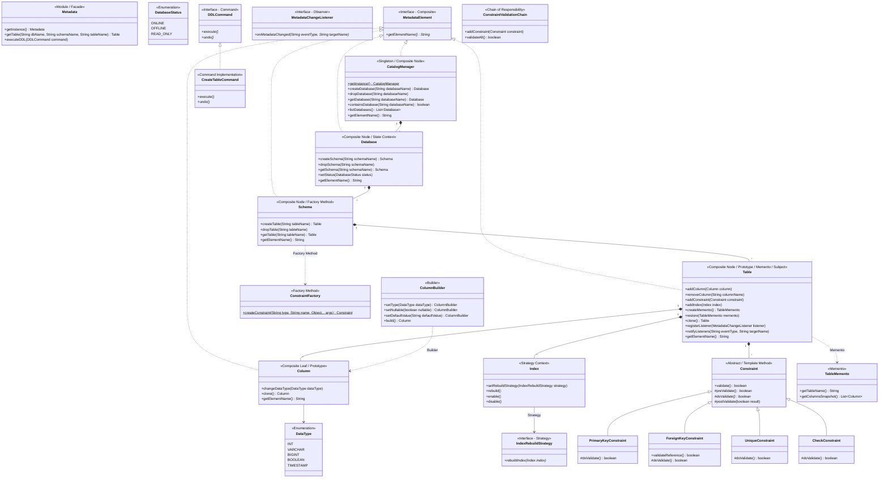
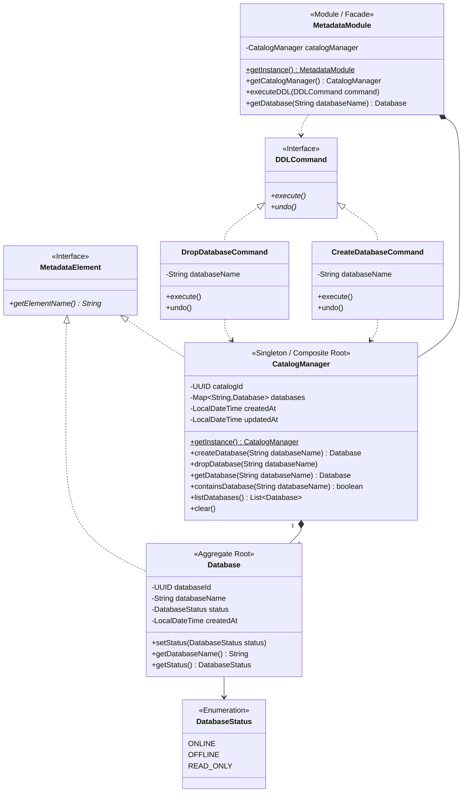
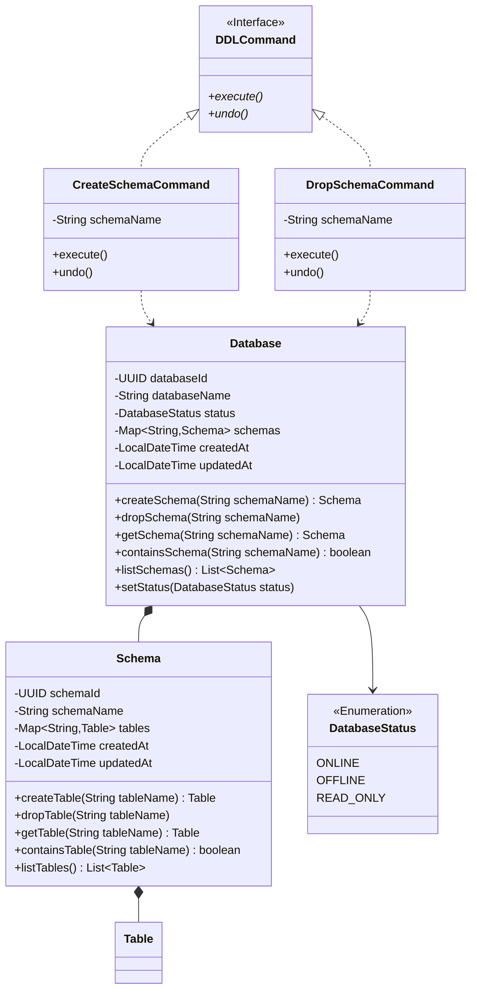
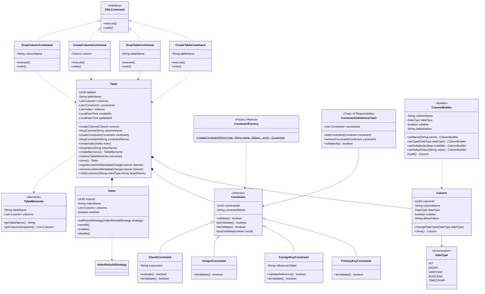
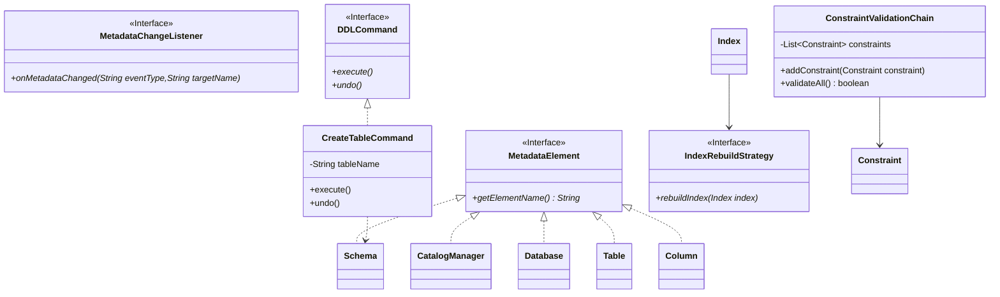
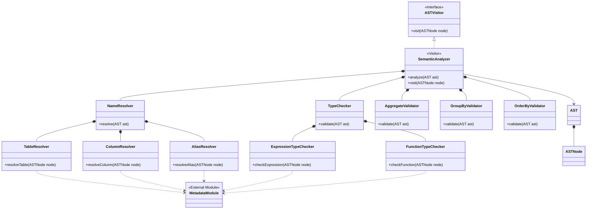
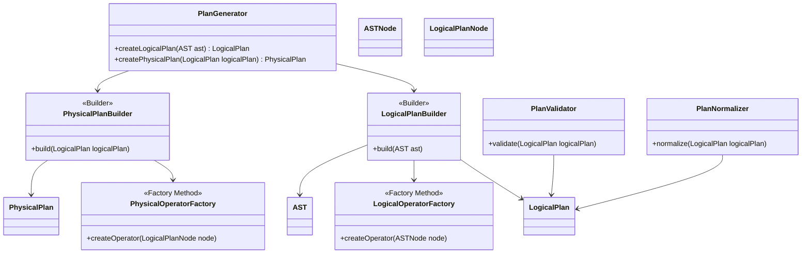

# DBMS Class Diagrams

This document contains the comprehensive class diagrams for the Database Management System (DBMS), including the overall System Architecture Overview, the Metadata Subsystem, the Query Processor Module, and their detailed sub-component diagrams.

---

## 1. System Architecture Overview Class Diagram

The following Mermaid class diagram illustrates the high-level system module boundaries, inner components, composition relationships, and cross-module interaction flows across the entire DBMS.

```mermaid
classDiagram
    direction TD

%% =========================================================
%% SYSTEM MODULE BOUNDARIES
%% =========================================================
    class DatabaseCoreServer {
        <<Module>>
    }

    class QueryProcessor {
        <<Module>>
    }

    class ExecutionEngine {
        <<Module>>
    }

    class StorageEngine {
        <<Module>>
    }

    class Metadata {
        <<Module>>
    }

    class DurabilityData {
        <<Module>>
    }

    class SecurityPermission {
        <<Module>>
    }

    class PerformanceScalability {
        <<Module>>
    }

    class Monitoring {
        <<Module>>
    }

    class Automation {
        <<Module>>
    }

%% =========================================================
%% METADATA MODULE INNER COMPONENTS
%% =========================================================
    class CatalogManager {
        <<Singleton / Composite Node>>
    }
    class Database {
        <<Composite Node / State Context>>
    }
    class DatabaseStatus {
        <<Enumeration>>
    }
    class Schema {
        <<Composite Node / Factory Method>>
    }
    class Table {
        <<Composite Node / Prototype / Memento / Subject>>
    }
    class Column {
        <<Composite Leaf / Prototype>>
    }
    class DataType {
        <<Enumeration>>
    }
    class Index {
        <<Strategy Context>>
    }
    class Constraint {
        <<Abstract / Template Method>>
    }
    class PrimaryKeyConstraint
    class ForeignKeyConstraint
    class UniqueConstraint
    class CheckConstraint

    class MetadataElement {
        <<Interface - Composite>>
    }
    class DDLCommand {
        <<Interface - Command>>
    }
    class TableMemento {
        <<Memento>>
    }
    class MetadataChangeListener {
        <<Interface - Observer>>
    }
    class IndexRebuildStrategy {
        <<Interface - Strategy>>
    }
    class ConstraintFactory {
        <<Factory Method>>
    }
    class ColumnBuilder {
        <<Builder>>
    }

%% =========================================================
%% QUERY PROCESSOR INNER COMPONENTS
%% =========================================================
    class Lexer {
        <<Chain of Responsibility>>
    }
    class SQLParser {
        <<Chain of Responsibility>>
    }
    class ASTBuilder {
        <<Chain of Responsibility>>
    }
    class SemanticAnalyzer {
        <<Visitor>>
    }
    class QueryRewriter {
        <<Visitor>>
    }
    class QueryOptimizer {
        <<Strategy Context>>
    }
    class PlanGenerator {
        <<Factory Method>>
    }

%% =========================================================
%% COMPOSITION & AGGREGATION RELATIONSHIPS
%% =========================================================
    CatalogManager "1" *-- "*" Database : Owns Databases
    Database "1" *-- "*" Schema : Owns Schemas
    Schema "1" *-- "*" Table : Owns Tables
    Table "1" *-- "*" Column : Owns Columns
    Table "1" *-- "*" Index : Owns Indexes
    Table "1" *-- "*" Constraint : Owns Constraints

    Database --> DatabaseStatus : Tracks State
    Column --> DataType : Defines Type

    Constraint <|-- PrimaryKeyConstraint
    Constraint <|-- ForeignKeyConstraint
    Constraint <|-- UniqueConstraint
    Constraint <|-- CheckConstraint

    MetadataElement <|.. CatalogManager
    MetadataElement <|.. Database
    MetadataElement <|.. Schema
    MetadataElement <|.. Table
    MetadataElement <|.. Column

    Index --> IndexRebuildStrategy : Delegates Rebuild
    Table ..> TableMemento : Creates/Restores
    Schema ..> ConstraintFactory : Uses
    ColumnBuilder ..> Column : Builds

    QueryProcessor *-- Lexer : Owns Lexer
    QueryProcessor *-- SQLParser : Owns Parser
    QueryProcessor *-- ASTBuilder : Owns ASTBuilder
    QueryProcessor *-- SemanticAnalyzer : Owns SemanticAnalyzer
    QueryProcessor *-- QueryRewriter : Owns QueryRewriter
    QueryProcessor *-- QueryOptimizer : Owns QueryOptimizer
    QueryProcessor *-- PlanGenerator : Owns PlanGenerator

%% =========================================================
%% CROSS-MODULE INTERACTION FLOWS
%% =========================================================
    DatabaseCoreServer --> SecurityPermission : Authenticates & Authorizes
    DatabaseCoreServer --> QueryProcessor : Passes SQL Query Text
    QueryProcessor --> Metadata : Reads Schema & Validates Symbols
    QueryProcessor --> ExecutionEngine : Dispatches Physical Plan
    ExecutionEngine --> StorageEngine : Executes Records IO
    ExecutionEngine --> DurabilityData : Logs WAL Transactions
    DatabaseCoreServer --> Monitoring : Emits Metrics & Logs
    PerformanceScalability --> StorageEngine : Optimizes Caching & Indexing
    Automation --> DatabaseCoreServer : Triggers Maintenance Tasks
```

---

## 2. Metadata Subsystem Class Diagram

The Metadata Subsystem Class Diagram illustrates the structural hierarchy, domain entities, management components, design patterns, and DDL command representations for managing database metadata.

### 2.1 Metadata Subsystem Details

#### 2.1.1 Catalog & Database Management

#### 2.1.2 Schema & Table Hierarchy

#### 2.1.3 Table Structure, Columns, Constraints & Indexes

#### 2.1.4 Behavioral Patterns & Infrastructure

---

## 3. Query Processor Module Class Diagram

The Query Processor Module Class Diagram represents the complete SQL compilation pipeline, AST construction, semantic analysis, query optimization, and physical plan generation.

```mermaid
classDiagram
    direction TD

%% =====================================================
%% QUERY PROCESSOR MODULE
%% =====================================================

class QueryProcessor{
    <<Facade>>
    +compile(String sqlText) PhysicalPlan
}

%% =====================================================
%% SQL COMPILATION PIPELINE
%% =====================================================

class CompilerStage{
    <<Interface>>
    +process(Object input) Object*
}

class Lexer{
    <<Chain of Responsibility>>
    +process(String sqlText) TokenStream
}

class SQLParser{
    <<Chain of Responsibility>>
    +process(TokenStream stream) ParseTree
}

class ASTBuilder{
    <<Chain of Responsibility>>
    +process(ParseTree tree) AST
}

class SemanticAnalyzer{
    <<Visitor>>
    +process(AST ast) AST
    +visit(ASTNode node)
}

class QueryRewriter{
    <<Visitor>>
    +process(AST ast) AST
    +visit(ASTNode node)
}

class QueryOptimizer{
    <<Strategy Context>>
    +process(AST ast) PhysicalPlan
    +setOptimizationRule(OptimizationRule rule)
}

class PlanGenerator{
    +createPhysicalPlan(LogicalPlan plan) PhysicalPlan
}

%% =====================================================
%% LEXICAL STRUCTURES
%% =====================================================

class TokenStream
class Token
class ParseTree

%% =====================================================
%% ABSTRACT SYNTAX TREE
%% =====================================================

class AST{
    +getRoot() ASTNode
}

class ASTNode{
    <<Composite>>
    +accept(ASTVisitor visitor)
}

class ASTVisitor{
    <<Interface>>
    +visit(ASTNode node)*
}

%% =====================================================
%% EXPRESSION TREE
%% =====================================================

class ExpressionNode{
    +evaluate()
}

class PredicateNode{
    +evaluate()
}

%% =====================================================
%% PLAN BUILDERS
%% =====================================================

class LogicalPlanBuilder{
    <<Builder>>
    +build(AST ast) LogicalPlan
}

class PhysicalPlanBuilder{
    <<Builder>>
    +build(LogicalPlan plan) PhysicalPlan
}

%% =====================================================
%% OPTIMIZATION
%% =====================================================

class OptimizationRule{
    <<Interface / Strategy>>
    +optimize(LogicalPlan plan) LogicalPlan*
}

class CostEstimator{
    <<Strategy>>
    +estimate(LogicalPlan plan)
}

%% =====================================================
%% PLANS
%% =====================================================

class LogicalPlan
class PhysicalPlan

%% =====================================================
%% EXTERNAL MODULE
%% =====================================================

class MetadataModule{
    <<External Module>>
}

class ExecutionEngine{
    <<External Module>>
}

%% =====================================================
%% RELATIONSHIPS
%% =====================================================

CompilerStage <|.. Lexer
CompilerStage <|.. SQLParser
CompilerStage <|.. ASTBuilder
CompilerStage <|.. SemanticAnalyzer
CompilerStage <|.. QueryRewriter
CompilerStage <|.. QueryOptimizer

ASTVisitor <|.. SemanticAnalyzer
ASTVisitor <|.. QueryRewriter

QueryProcessor *-- Lexer
QueryProcessor *-- SQLParser
QueryProcessor *-- ASTBuilder
QueryProcessor *-- SemanticAnalyzer
QueryProcessor *-- QueryRewriter
QueryProcessor *-- QueryOptimizer
QueryProcessor *-- PlanGenerator

Lexer --> TokenStream
TokenStream *-- Token

SQLParser --> ParseTree

ASTBuilder --> AST

AST *-- ASTNode

ASTNode <|-- ExpressionNode
ASTNode <|-- PredicateNode

QueryOptimizer --> OptimizationRule
QueryOptimizer --> CostEstimator

LogicalPlanBuilder --> LogicalPlan
PhysicalPlanBuilder --> PhysicalPlan

PlanGenerator --> PhysicalPlan

SemanticAnalyzer ..> MetadataModule
QueryRewriter ..> MetadataModule
QueryOptimizer ..> MetadataModule

PlanGenerator --> ExecutionEngine
```

### 3.1 Query Processor Subsystem Details

#### 3.1.1 Semantic Analysis & Name Resolution

#### 3.1.2 Query Optimization Engine

```mermaid
classDiagram
    direction TD

%% =====================================================
%% QUERY OPTIMIZER
%% =====================================================

class QueryOptimizer{
    <<Strategy Context>>
    +optimize(LogicalPlan logicalPlan) PhysicalPlan
    +setOptimizationRule(OptimizationRule rule)
}

class OptimizationRule{
    <<Interface>>
    +optimize(LogicalPlan logicalPlan)*
}

%% =====================================================
%% QUERY REWRITE
%% =====================================================

class QueryRewriter{
    +rewrite(LogicalPlan logicalPlan)
}

class PredicatePushdownOptimizer{
    +optimize(LogicalPlan logicalPlan)
}

class ProjectionPushdownOptimizer{
    +optimize(LogicalPlan logicalPlan)
}

class ConstantFoldingOptimizer{
    +optimize(LogicalPlan logicalPlan)
}

%% =====================================================
%% JOIN OPTIMIZATION
%% =====================================================

class JoinOptimizer{
    +optimize(LogicalPlan logicalPlan)
}

class JoinOrderOptimizer{
    +optimize(LogicalPlan logicalPlan)
}

class JoinMethodSelector{
    +selectJoinMethod(LogicalPlan logicalPlan)
}

%% =====================================================
%% COST OPTIMIZATION
%% =====================================================

class CostEstimator{
    +estimate(LogicalPlan logicalPlan)
}

class CardinalityEstimator{
    +estimate(LogicalPlan logicalPlan)
}

class StatisticsManager{
    +estimateCardinality()
    +estimateSelectivity()
}

%% =====================================================
%% PLAN SEARCH
%% =====================================================

class PlanEnumerator{
    +enumerate(LogicalPlan logicalPlan)
}

class AccessPathSelector{
    +select(LogicalPlan logicalPlan)
}

%% =====================================================
%% SHARED OBJECTS
%% =====================================================

class LogicalPlan
class PhysicalPlan

%% =====================================================
%% RELATIONSHIPS
%% =====================================================

QueryOptimizer --> QueryRewriter
QueryOptimizer --> JoinOptimizer
QueryOptimizer --> CostEstimator
QueryOptimizer --> PlanEnumerator

OptimizationRule <|.. QueryRewriter
OptimizationRule <|.. JoinOptimizer
OptimizationRule <|.. CostEstimator

QueryRewriter *-- PredicatePushdownOptimizer
QueryRewriter *-- ProjectionPushdownOptimizer
QueryRewriter *-- ConstantFoldingOptimizer

JoinOptimizer *-- JoinOrderOptimizer
JoinOptimizer *-- JoinMethodSelector

CostEstimator --> CardinalityEstimator
CostEstimator --> StatisticsManager

PlanEnumerator --> AccessPathSelector
PlanEnumerator --> PhysicalPlan
```

#### 3.1.3 Plan Generation & Building

