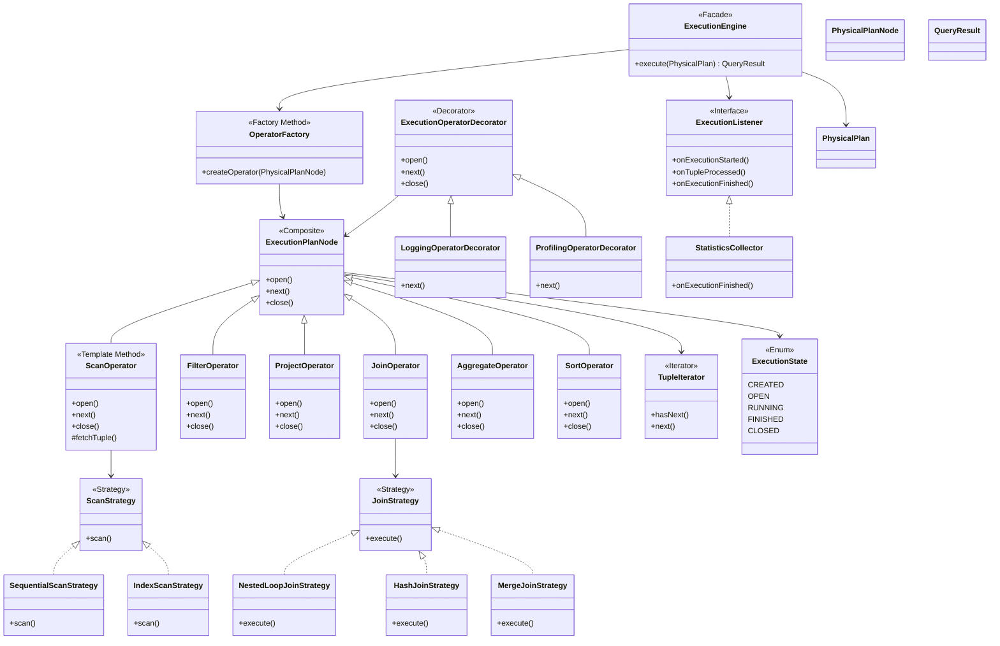

```mermaid
classDiagram
    direction TD

%% =====================================================
%% EXECUTION ENGINE
%% =====================================================

    class ExecutionEngine{
        <<Facade>>
        +execute(PhysicalPlan) QueryResult
    }

%% =====================================================
%% EXECUTION PLAN TREE
%% =====================================================

    class ExecutionPlanNode{
        <<Composite>>
        +open()
        +next()
        +close()
    }

    class ScanOperator{
<<Template Method>>
+open()
+next()
+close()
#fetchTuple()
}

class FilterOperator{
+open()
+next()
+close()
}

class ProjectOperator{
+open()
+next()
+close()
}

class JoinOperator{
+open()
+next()
+close()
}

class AggregateOperator{
+open()
+next()
+close()
}

class SortOperator{
+open()
+next()
+close()
}

%% =====================================================
%% FACTORY METHOD
%% =====================================================

class OperatorFactory{
<<Factory Method>>
+createOperator(PhysicalPlanNode)
}

%% =====================================================
%% STRATEGY
%% =====================================================

class JoinStrategy{
<<Strategy>>
+execute()
}

class NestedLoopJoinStrategy{
+execute()
}

class HashJoinStrategy{
+execute()
}

class MergeJoinStrategy{
+execute()
}

class ScanStrategy{
<<Strategy>>
+scan()
}

class SequentialScanStrategy{
+scan()
}

class IndexScanStrategy{
+scan()
}

%% =====================================================
%% ITERATOR
%% =====================================================

class TupleIterator{
<<Iterator>>
+hasNext()
+next()
}

%% =====================================================
%% DECORATOR
%% =====================================================

class ExecutionOperatorDecorator{
<<Decorator>>
+open()
+next()
+close()
}

class LoggingOperatorDecorator{
+next()
}

class ProfilingOperatorDecorator{
+next()
}

%% =====================================================
%% STATE
%% =====================================================

class ExecutionState{
<<Enum>>
CREATED
OPEN
RUNNING
FINISHED
CLOSED
}

%% =====================================================
%% OBSERVER
%% =====================================================

class ExecutionListener{
<<Interface>>
+onExecutionStarted()
+onTupleProcessed()
+onExecutionFinished()
}

class StatisticsCollector{
+onExecutionFinished()
}

%% =====================================================
%% SHARED OBJECTS
%% =====================================================

class PhysicalPlan

class PhysicalPlanNode

class QueryResult

%% =====================================================
%% RELATIONSHIPS
%% =====================================================

ExecutionEngine --> OperatorFactory
ExecutionEngine --> PhysicalPlan
ExecutionEngine --> ExecutionListener

ExecutionPlanNode <|-- ScanOperator
ExecutionPlanNode <|-- FilterOperator
ExecutionPlanNode <|-- ProjectOperator
ExecutionPlanNode <|-- JoinOperator
ExecutionPlanNode <|-- AggregateOperator
ExecutionPlanNode <|-- SortOperator

OperatorFactory --> ExecutionPlanNode

JoinOperator --> JoinStrategy
JoinStrategy <|.. NestedLoopJoinStrategy
JoinStrategy <|.. HashJoinStrategy
JoinStrategy <|.. MergeJoinStrategy

ScanOperator --> ScanStrategy
ScanStrategy <|.. SequentialScanStrategy
ScanStrategy <|.. IndexScanStrategy

ExecutionPlanNode --> TupleIterator

ExecutionOperatorDecorator <|-- LoggingOperatorDecorator
ExecutionOperatorDecorator <|-- ProfilingOperatorDecorator
ExecutionOperatorDecorator --> ExecutionPlanNode

ExecutionPlanNode --> ExecutionState

ExecutionListener <|.. StatisticsCollector
```