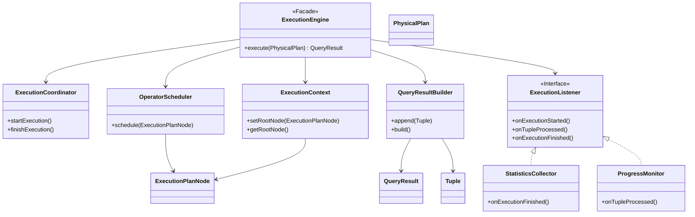

```mermaid
classDiagram
direction TD

%% =====================================================
%% EXECUTION ENGINE
%% =====================================================

class ExecutionEngine{
    <<Facade>>
    +execute(PhysicalPlan) QueryResult
}

class ExecutionCoordinator{
    +startExecution()
    +finishExecution()
}

class OperatorScheduler{
    +schedule(ExecutionPlanNode)
}

class ExecutionContext{
    +setRootNode(ExecutionPlanNode)
    +getRootNode()
}

class QueryResultBuilder{
    +append(Tuple)
    +build()
}

%% =====================================================
%% OBSERVER
%% =====================================================

class ExecutionListener{
    <<Interface>>
    +onExecutionStarted()
    +onTupleProcessed()
    +onExecutionFinished()
}

class StatisticsCollector{
    +onExecutionFinished()
}

class ProgressMonitor{
    +onTupleProcessed()
}

%% =====================================================
%% SHARED
%% =====================================================

class PhysicalPlan
class QueryResult
class ExecutionPlanNode
class Tuple

%% =====================================================
%% RELATIONSHIPS
%% =====================================================

ExecutionEngine --> ExecutionCoordinator
ExecutionEngine --> OperatorScheduler
ExecutionEngine --> ExecutionContext
ExecutionEngine --> QueryResultBuilder

ExecutionEngine --> ExecutionListener

ExecutionListener <|.. StatisticsCollector
ExecutionListener <|.. ProgressMonitor

OperatorScheduler --> ExecutionPlanNode
ExecutionContext --> ExecutionPlanNode
QueryResultBuilder --> QueryResult
QueryResultBuilder --> Tuple
```