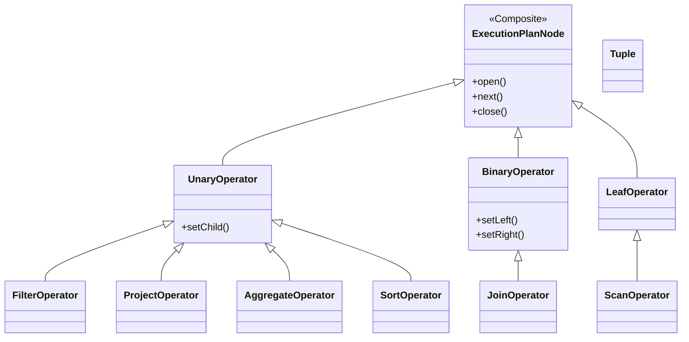

```mermaid
classDiagram
direction TD

%% =====================================================
%% COMPOSITE
%% =====================================================

class ExecutionPlanNode{
    <<Composite>>
    +open()
    +next()
    +close()
}

class UnaryOperator{
    +setChild()
}

class BinaryOperator{
    +setLeft()
    +setRight()
}

class LeafOperator

%% =====================================================
%% OPERATORS
%% =====================================================

class ScanOperator

class FilterOperator

class ProjectOperator

class JoinOperator

class AggregateOperator

class SortOperator

%% =====================================================
%% SHARED
%% =====================================================

class Tuple

%% =====================================================
%% RELATIONSHIPS
%% =====================================================

ExecutionPlanNode <|-- UnaryOperator
ExecutionPlanNode <|-- BinaryOperator
ExecutionPlanNode <|-- LeafOperator

UnaryOperator <|-- FilterOperator
UnaryOperator <|-- ProjectOperator
UnaryOperator <|-- AggregateOperator
UnaryOperator <|-- SortOperator

BinaryOperator <|-- JoinOperator

LeafOperator <|-- ScanOperator
```