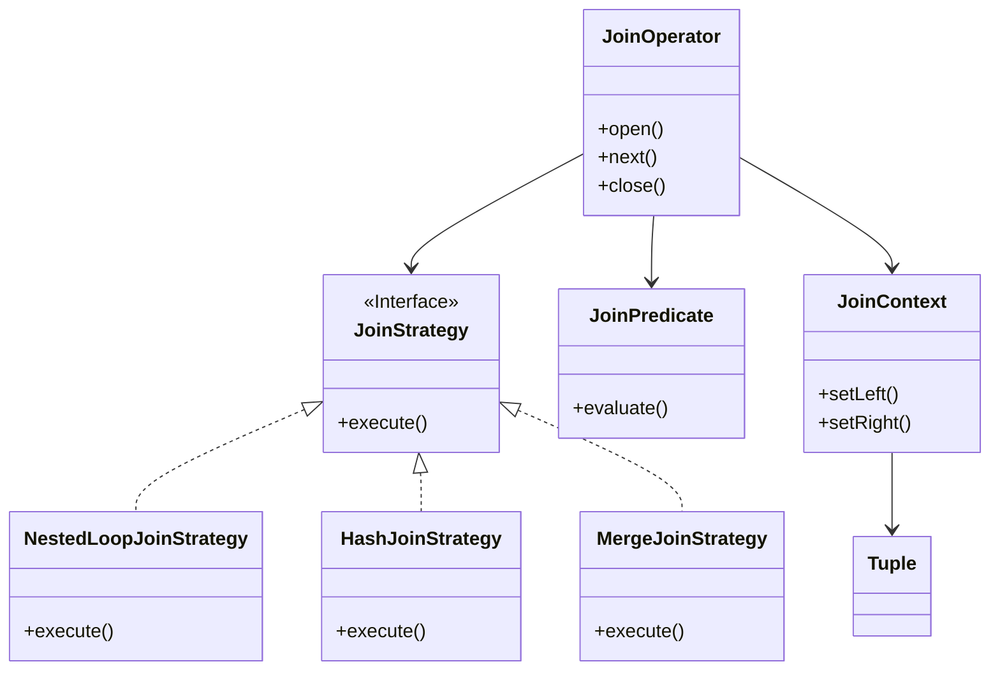

```mermaid
classDiagram
direction TD

%% =====================================================
%% JOIN OPERATOR
%% =====================================================

class JoinOperator{
    +open()
    +next()
    +close()
}

%% =====================================================
%% STRATEGY
%% =====================================================

class JoinStrategy{
    <<Interface>>
    +execute()
}

class NestedLoopJoinStrategy{
    +execute()
}

class HashJoinStrategy{
    +execute()
}

class MergeJoinStrategy{
    +execute()
}

%% =====================================================
%% HELPERS
%% =====================================================

class JoinPredicate{
    +evaluate()
}

class JoinContext{
    +setLeft()
    +setRight()
}

class Tuple

%% =====================================================
%% RELATIONSHIPS
%% =====================================================

JoinOperator --> JoinStrategy

JoinStrategy <|.. NestedLoopJoinStrategy
JoinStrategy <|.. HashJoinStrategy
JoinStrategy <|.. MergeJoinStrategy

JoinOperator --> JoinPredicate
JoinOperator --> JoinContext

JoinContext --> Tuple
```