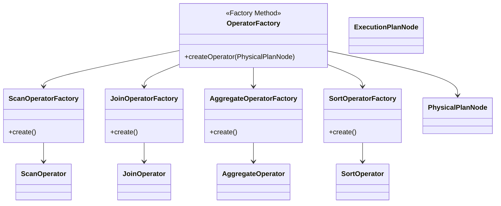

```mermaid
classDiagram
direction TD

%% =====================================================
%% FACTORY METHOD
%% =====================================================

class OperatorFactory{
    <<Factory Method>>
    +createOperator(PhysicalPlanNode)
}

class ScanOperatorFactory{
    +create()
}

class JoinOperatorFactory{
    +create()
}

class AggregateOperatorFactory{
    +create()
}

class SortOperatorFactory{
    +create()
}

%% =====================================================
%% SHARED
%% =====================================================

class PhysicalPlanNode

class ExecutionPlanNode

class ScanOperator

class JoinOperator

class AggregateOperator

class SortOperator

%% =====================================================
%% RELATIONSHIPS
%% =====================================================

OperatorFactory --> ScanOperatorFactory
OperatorFactory --> JoinOperatorFactory
OperatorFactory --> AggregateOperatorFactory
OperatorFactory --> SortOperatorFactory

ScanOperatorFactory --> ScanOperator
JoinOperatorFactory --> JoinOperator
AggregateOperatorFactory --> AggregateOperator
SortOperatorFactory --> SortOperator

OperatorFactory --> PhysicalPlanNode
```