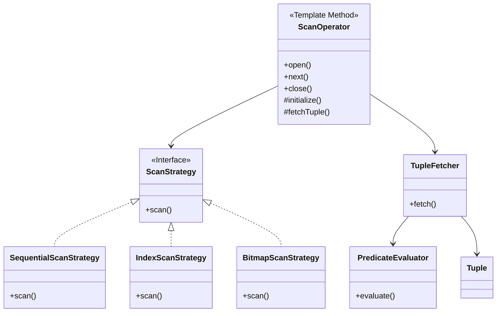

```mermaid
classDiagram
direction TD

%% =====================================================
%% TEMPLATE METHOD
%% =====================================================

class ScanOperator{
    <<Template Method>>
    +open()
    +next()
    +close()
    #initialize()
    #fetchTuple()
}

%% =====================================================
%% STRATEGY
%% =====================================================

class ScanStrategy{
    <<Interface>>
    +scan()
}

class SequentialScanStrategy{
    +scan()
}

class IndexScanStrategy{
    +scan()
}

class BitmapScanStrategy{
    +scan()
}

%% =====================================================
%% HELPERS
%% =====================================================

class TupleFetcher{
    +fetch()
}

class PredicateEvaluator{
    +evaluate()
}

class Tuple

%% =====================================================
%% RELATIONSHIPS
%% =====================================================

ScanOperator --> ScanStrategy
ScanStrategy <|.. SequentialScanStrategy
ScanStrategy <|.. IndexScanStrategy
ScanStrategy <|.. BitmapScanStrategy

ScanOperator --> TupleFetcher
TupleFetcher --> PredicateEvaluator
TupleFetcher --> Tuple
```