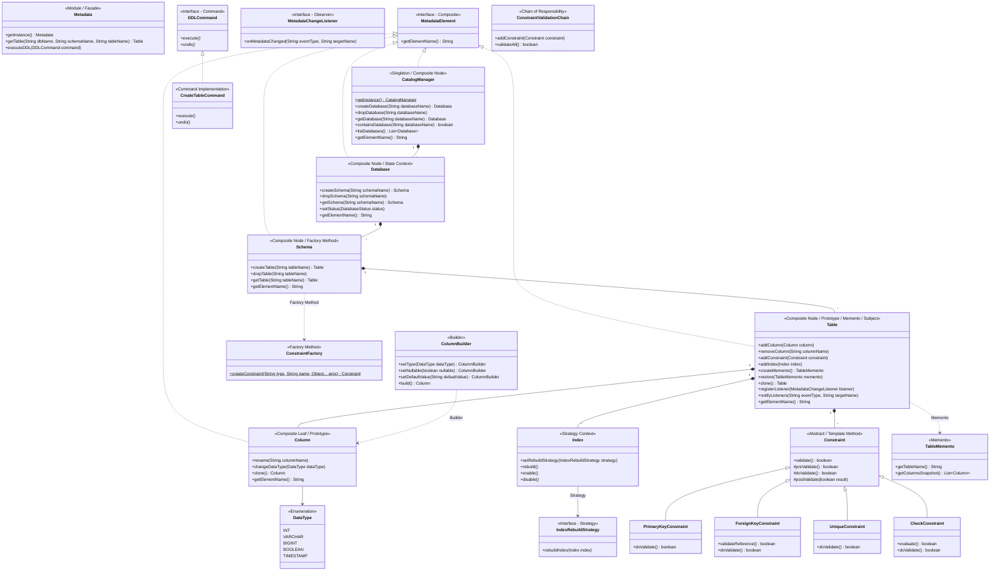

```mermaid
classDiagram
    direction TD

    %% =====================================================
    %% METADATA MODULE & FACADE
    %% =====================================================

    class Metadata{
        <<Module / Facade>>
        +getInstance() Metadata
        +getTable(String dbName, String schemaName, String tableName) Table
        +executeDDL(DDLCommand command)
    }

    %% =====================================================
    %% CORE CATALOG TREE & DOMAIN ENTITIES
    %% =====================================================

    class CatalogManager{
        <<Singleton / Composite Node>>
        +getInstance() CatalogManager$
        +createDatabase(String databaseName) Database
        +dropDatabase(String databaseName)
        +getDatabase(String databaseName) Database
        +containsDatabase(String databaseName) boolean
        +listDatabases() List~Database~
        +getElementName() String
    }

    class Database{
        <<Composite Node / State Context>>
        +createSchema(String schemaName) Schema
        +dropSchema(String schemaName)
        +getSchema(String schemaName) Schema
        +setStatus(DatabaseStatus status)
        +getElementName() String
    }

    class Schema{
        <<Composite Node / Factory Method>>
        +createTable(String tableName) Table
        +dropTable(String tableName)
        +getTable(String tableName) Table
        +getElementName() String
    }

    class Table{
        <<Composite Node / Prototype / Memento / Subject>>
        +addColumn(Column column)
        +removeColumn(String columnName)
        +addConstraint(Constraint constraint)
        +addIndex(Index index)
        +createMemento() TableMemento
        +restore(TableMemento memento)
        +clone() Table
        +registerListener(MetadataChangeListener listener)
        +notifyListeners(String eventType, String targetName)
        +getElementName() String
    }

    class Column{
        <<Composite Leaf / Prototype>>
        +rename(String columnName)
        +changeDataType(DataType dataType)
        +clone() Column
        +getElementName() String
    }

    class DataType{
        <<Enumeration>>
        INT
        VARCHAR
        BIGINT
        BOOLEAN
        TIMESTAMP
    }

    class Index{
        <<Strategy Context>>
        +setRebuildStrategy(IndexRebuildStrategy strategy)
        +rebuild()
        +enable()
        +disable()
    }


    class Constraint{
        <<Abstract / Template Method>>
        +validate() boolean
        #preValidate() boolean
        #doValidate() boolean
        #postValidate(boolean result)
    }

    class PrimaryKeyConstraint{
        +doValidate() boolean
    }

    class ForeignKeyConstraint{
        +validateReference() boolean
        +doValidate() boolean
    }

    class UniqueConstraint{
        +doValidate() boolean
    }

    class CheckConstraint{
        +evaluate() boolean
        +doValidate() boolean
    }

    %% =====================================================
    %% CORE PATTERN INTERFACES & HELPER CLASSES (GROUP 1 & 2)
    %% =====================================================

    class MetadataElement{
        <<Interface - Composite>>
        +getElementName() String*
    }

    class MetadataChangeListener{
        <<Interface - Observer>>
        +onMetadataChanged(String eventType, String targetName)*
    }

    class DDLCommand{
        <<Interface - Command>>
        +execute()*
        +undo()*
    }

    class CreateTableCommand{
        <<Command Implementation>>
        +execute()
        +undo()
    }

    class IndexRebuildStrategy{
        <<Interface - Strategy>>
        +rebuildIndex(Index index)*
    }

    class ConstraintFactory{
        <<Factory Method>>
        +createConstraint(String type, String name, Object... args)$ Constraint
    }

    class ColumnBuilder{
        <<Builder>>
        +setType(DataType dataType) ColumnBuilder
        +setNullable(boolean nullable) ColumnBuilder
        +setDefaultValue(String defaultValue) ColumnBuilder
        +build() Column
    }

    class TableMemento{
        <<Memento>>
        +getTableName() String
        +getColumnsSnapshot() List~Column~
    }

    class ConstraintValidationChain{
        <<Chain of Responsibility>>
        +addConstraint(Constraint constraint)
        +validateAll() boolean
    }

    %% =====================================================
    %% RELATIONSHIPS & PATTERNS MAP
    %% =====================================================

    MetadataElement <|.. CatalogManager
    MetadataElement <|.. Database
    MetadataElement <|.. Schema
    MetadataElement <|.. Table
    MetadataElement <|.. Column

    DDLCommand <|.. CreateTableCommand

    CatalogManager "1" *-- "*" Database
    Database "1" *-- "*" Schema
    Schema "1" *-- "*" Table

    Table "1" *-- "*" Column
    Table "1" *-- "*" Index
    Table "1" *-- "*" Constraint
    Column --> DataType

    Constraint <|-- PrimaryKeyConstraint
    Constraint <|-- ForeignKeyConstraint
    Constraint <|-- UniqueConstraint
    Constraint <|-- CheckConstraint

    Index --> IndexRebuildStrategy : Strategy
    Table ..> TableMemento : Memento
    Schema ..> ConstraintFactory : Factory Method
    ColumnBuilder ..> Column : Builder
```