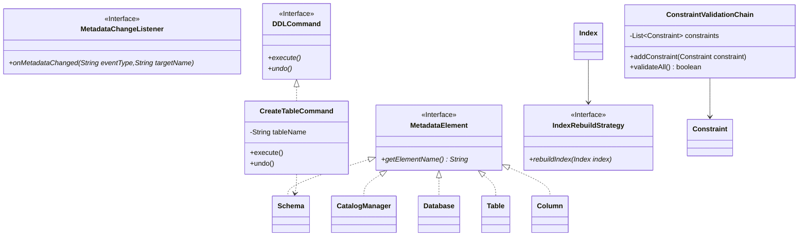

```mermaid
classDiagram
direction TD

%% =====================================================
%% COMPOSITE
%% =====================================================

class MetadataElement{
<<Interface>>

    +getElementName() String*
}

%% =====================================================
%% OBSERVER
%% =====================================================

class MetadataChangeListener{
<<Interface>>

    +onMetadataChanged(String eventType,String targetName)*
}

%% =====================================================
%% COMMAND
%% =====================================================

class DDLCommand{
<<Interface>>

    +execute()*
    +undo()*
}

class CreateTableCommand{

    -String tableName

    +execute()
    +undo()
}

%% =====================================================
%% STRATEGY
%% =====================================================

class IndexRebuildStrategy{
<<Interface>>

    +rebuildIndex(Index index)*
}

%% =====================================================
%% CHAIN OF RESPONSIBILITY
%% =====================================================

class ConstraintValidationChain{

    -List~Constraint~ constraints

    +addConstraint(Constraint constraint)
    +validateAll() boolean
}

%% =====================================================
%% REFERENCES
%% =====================================================

class Schema

class Table

class Index

class Constraint

%% =====================================================
%% RELATIONSHIPS
%% =====================================================

MetadataElement <|.. CatalogManager
MetadataElement <|.. Database
MetadataElement <|.. Schema
MetadataElement <|.. Table
MetadataElement <|.. Column

DDLCommand <|.. CreateTableCommand

Index --> IndexRebuildStrategy

ConstraintValidationChain --> Constraint

CreateTableCommand ..> Schema
```