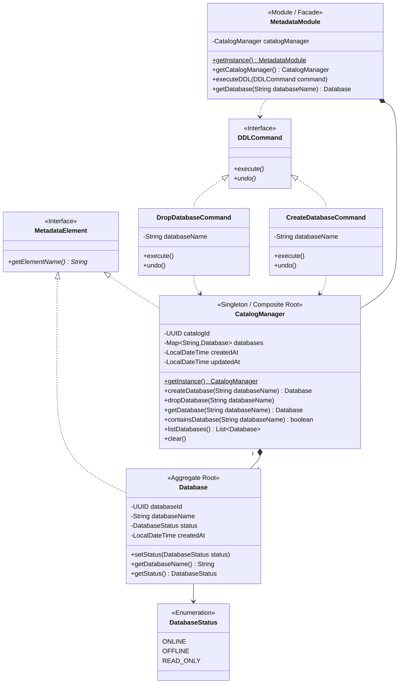

```mermaid
classDiagram
    direction TD

%% =====================================================
%% METADATA MODULE (FACADE)
%% =====================================================

    class MetadataModule{
<<Module / Facade>>

-CatalogManager catalogManager

+getInstance() MetadataModule$
+getCatalogManager() CatalogManager
+executeDDL(DDLCommand command)
+getDatabase(String databaseName) Database
}

%% =====================================================
%% CATALOG MANAGER (AGGREGATE ROOT)
%% =====================================================

class CatalogManager{
<<Singleton / Composite Root>>

-UUID catalogId
-Map~String,Database~ databases
-LocalDateTime createdAt
-LocalDateTime updatedAt

+getInstance() CatalogManager$
+createDatabase(String databaseName) Database
+dropDatabase(String databaseName)
+getDatabase(String databaseName) Database
+containsDatabase(String databaseName) boolean
+listDatabases() List~Database~
+clear()
}

%% =====================================================
%% DATABASE (AGGREGATE REFERENCE)
%% =====================================================

class Database{
<<Aggregate Root>>

-UUID databaseId
-String databaseName
-DatabaseStatus status
-LocalDateTime createdAt

+setStatus(DatabaseStatus status)
+getDatabaseName() String
+getStatus() DatabaseStatus
}

%% =====================================================
%% COMPOSITE
%% =====================================================

class MetadataElement{
<<Interface>>

+getElementName() String*
}

%% =====================================================
%% COMMAND PATTERN
%% =====================================================

class DDLCommand{
<<Interface>>

+execute()*
+undo()*
}

class CreateDatabaseCommand{

-String databaseName

+execute()
+undo()
}

class DropDatabaseCommand{

-String databaseName

+execute()
+undo()
}

%% =====================================================
%% ENUM
%% =====================================================

class DatabaseStatus{
<<Enumeration>>

ONLINE
OFFLINE
READ_ONLY
}

%% =====================================================
%% RELATIONSHIPS
%% =====================================================

MetadataModule *-- CatalogManager

CatalogManager "1" *-- "*" Database

MetadataElement <|.. CatalogManager
MetadataElement <|.. Database

Database --> DatabaseStatus

DDLCommand <|.. CreateDatabaseCommand
DDLCommand <|.. DropDatabaseCommand

MetadataModule ..> DDLCommand

CreateDatabaseCommand ..> CatalogManager
DropDatabaseCommand ..> CatalogManager
```