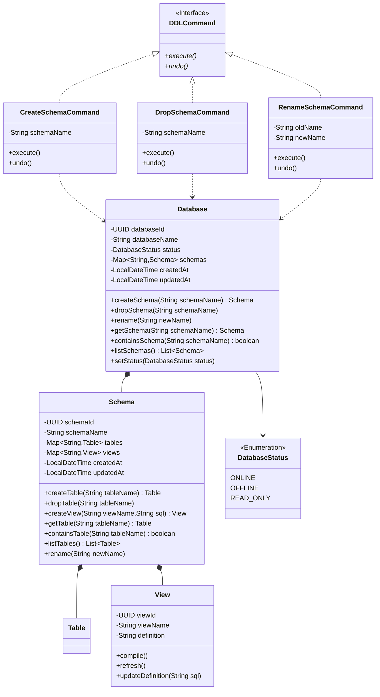

```mermaid
classDiagram
    direction TD

%% =====================================================
%% DATABASE
%% =====================================================

    class Database{

        -UUID databaseId
        -String databaseName
        -DatabaseStatus status
        -Map~String,Schema~ schemas
        -LocalDateTime createdAt
        -LocalDateTime updatedAt

        +createSchema(String schemaName) Schema
        +dropSchema(String schemaName)
        +rename(String newName)

        +getSchema(String schemaName) Schema
        +containsSchema(String schemaName) boolean
        +listSchemas() List~Schema~

        +setStatus(DatabaseStatus status)
    }

%% =====================================================
%% SCHEMA
%% =====================================================

    class Schema{

        -UUID schemaId
        -String schemaName

        -Map~String,Table~ tables
        -Map~String,View~ views

        -LocalDateTime createdAt
        -LocalDateTime updatedAt

        +createTable(String tableName) Table
        +dropTable(String tableName)

        +createView(String viewName,String sql) View

        +getTable(String tableName) Table
        +containsTable(String tableName) boolean
        +listTables() List~Table~

        +rename(String newName)
    }

%% =====================================================
%% DATABASE OBJECTS
%% =====================================================

    class Table

    class View{

        -UUID viewId
        -String viewName
        -String definition

        +compile()
        +refresh()
        +updateDefinition(String sql)
    }

%% =====================================================
%% COMMAND PATTERN
%% =====================================================

    class DDLCommand{
        <<Interface>>

        +execute()*
        +undo()*
    }

    class CreateSchemaCommand{

        -String schemaName

        +execute()
        +undo()
    }

    class DropSchemaCommand{

        -String schemaName

        +execute()
        +undo()
    }

    class RenameSchemaCommand{

        -String oldName
        -String newName

        +execute()
        +undo()
    }

%% =====================================================
%% ENUM
%% =====================================================

    class DatabaseStatus{
        <<Enumeration>>

        ONLINE
        OFFLINE
        READ_ONLY
    }

%% =====================================================
%% RELATIONSHIPS
%% =====================================================

    Database *-- Schema

    Schema *-- Table
    Schema *-- View

    Database --> DatabaseStatus

    DDLCommand <|.. CreateSchemaCommand
    DDLCommand <|.. DropSchemaCommand
    DDLCommand <|.. RenameSchemaCommand

    CreateSchemaCommand ..> Database
    DropSchemaCommand ..> Database
    RenameSchemaCommand ..> Database
```