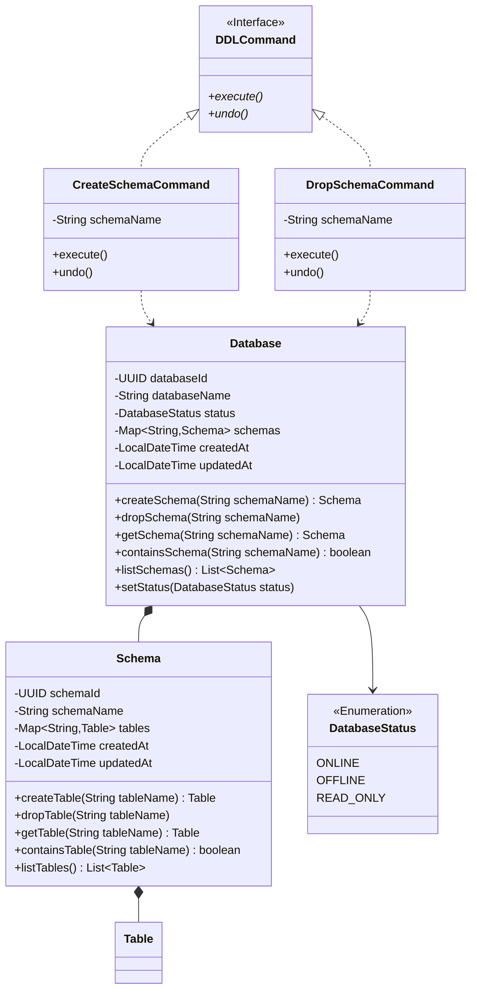

```mermaid
classDiagram
    direction TD

%% =====================================================
%% DATABASE
%% =====================================================

    class Database{

        -UUID databaseId
        -String databaseName
        -DatabaseStatus status
        -Map~String,Schema~ schemas
        -LocalDateTime createdAt
        -LocalDateTime updatedAt

        +createSchema(String schemaName) Schema
        +dropSchema(String schemaName)

        +getSchema(String schemaName) Schema
        +containsSchema(String schemaName) boolean
        +listSchemas() List~Schema~

        +setStatus(DatabaseStatus status)
    }

%% =====================================================
%% SCHEMA
%% =====================================================

    class Schema{

        -UUID schemaId
        -String schemaName

        -Map~String,Table~ tables

        -LocalDateTime createdAt
        -LocalDateTime updatedAt

        +createTable(String tableName) Table
        +dropTable(String tableName)

        +getTable(String tableName) Table
        +containsTable(String tableName) boolean
        +listTables() List~Table~
    }

%% =====================================================
%% DATABASE OBJECTS
%% =====================================================

    class Table

%% =====================================================
%% COMMAND PATTERN
%% =====================================================

    class DDLCommand{
        <<Interface>>

        +execute()*
        +undo()*
    }

    class CreateSchemaCommand{

        -String schemaName

        +execute()
        +undo()
    }

    class DropSchemaCommand{

        -String schemaName

        +execute()
        +undo()
    }

%% =====================================================
%% ENUM
%% =====================================================

    class DatabaseStatus{
        <<Enumeration>>

        ONLINE
        OFFLINE
        READ_ONLY
    }

%% =====================================================
%% RELATIONSHIPS
%% =====================================================

    Database *-- Schema

    Schema *-- Table

    Database --> DatabaseStatus

    DDLCommand <|.. CreateSchemaCommand
    DDLCommand <|.. DropSchemaCommand

    CreateSchemaCommand ..> Database
    DropSchemaCommand ..> Database
```