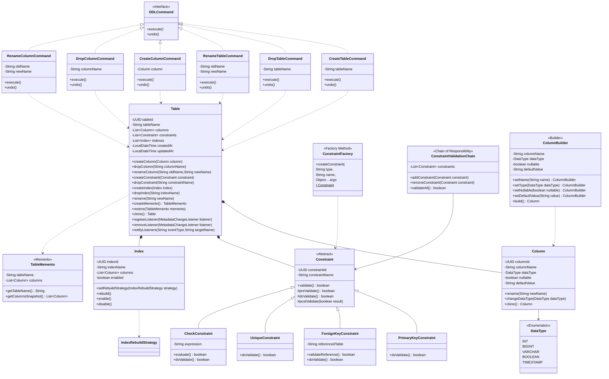

```mermaid
classDiagram
    direction TD


%% =====================================================
%% TABLE
%% =====================================================

    class Table{

        -UUID tableId
        -String tableName

        -List~Column~ columns
        -List~Constraint~ constraints
        -List~Index~ indexes

        -LocalDateTime createdAt
        -LocalDateTime updatedAt


        +createColumn(Column column)
        +dropColumn(String columnName)
        +renameColumn(String oldName,String newName)


        +createConstraint(Constraint constraint)
        +dropConstraint(String constraintName)


        +createIndex(Index index)
        +dropIndex(String indexName)


        +rename(String newName)

        +createMemento() TableMemento
        +restore(TableMemento memento)

        +clone() Table


        +registerListener(MetadataChangeListener listener)
        +removeListener(MetadataChangeListener listener)
        +notifyListeners(String eventType,String targetName)
    }


%% =====================================================
%% COLUMN
%% =====================================================

    class Column{

        -UUID columnId
        -String columnName
        -DataType dataType

        -boolean nullable
        -String defaultValue


        +rename(String newName)

        +changeDataType(DataType dataType)

        +clone() Column
    }


%% =====================================================
%% DATA TYPE
%% =====================================================

    class DataType{
        <<Enumeration>>

        INT
        BIGINT
        VARCHAR
        BOOLEAN
        TIMESTAMP
    }


%% =====================================================
%% INDEX
%% =====================================================

    class Index{

        -UUID indexId
        -String indexName

        -List~Column~ columns

        -boolean enabled


        +setRebuildStrategy(IndexRebuildStrategy strategy)

        +rebuild()

        +enable()

        +disable()
    }


%% =====================================================
%% CONSTRAINT
%% =====================================================

    class Constraint{
        <<Abstract>>


        -UUID constraintId
        -String constraintName


        +validate() boolean


        #preValidate() boolean

        #doValidate() boolean

        #postValidate(boolean result)
    }


    class PrimaryKeyConstraint{

        +doValidate() boolean
    }


    class ForeignKeyConstraint{

        -String referencedTable

        +validateReference() boolean

        +doValidate() boolean
    }


    class UniqueConstraint{

        +doValidate() boolean
    }


    class CheckConstraint{

        -String expression

        +evaluate() boolean

        +doValidate() boolean
    }


%% =====================================================
%% CONSTRAINT FACTORY
%% =====================================================

    class ConstraintFactory{
<<Factory Method>>


+createConstraint(
String type,
String name,
Object... args
) Constraint$
}


%% =====================================================
%% CONSTRAINT VALIDATION CHAIN
%% =====================================================

class ConstraintValidationChain{
<<Chain of Responsibility>>


-List~Constraint~ constraints


+addConstraint(Constraint constraint)

+removeConstraint(Constraint constraint)

+validateAll() boolean
}


%% =====================================================
%% COLUMN BUILDER
%% =====================================================

class ColumnBuilder{
<<Builder>>


-String columnName
-DataType dataType
-boolean nullable
-String defaultValue


+setName(String name) ColumnBuilder

+setType(DataType dataType) ColumnBuilder

+setNullable(boolean nullable) ColumnBuilder

+setDefaultValue(String value) ColumnBuilder


+build() Column
}


%% =====================================================
%% MEMENTO
%% =====================================================

class TableMemento{
<<Memento>>


-String tableName

-List~Column~ columns


+getTableName() String

+getColumnsSnapshot() List~Column~
}


%% =====================================================
%% COMMAND PATTERN
%% =====================================================

class DDLCommand{
<<Interface>>

+execute()*

+undo()*
}


class CreateTableCommand{

-String tableName


+execute()

+undo()
}


class DropTableCommand{

-String tableName


+execute()

+undo()
}


class RenameTableCommand{

-String oldName

-String newName


+execute()

+undo()
}


class CreateColumnCommand{

-Column column


+execute()

+undo()
}


class DropColumnCommand{

-String columnName


+execute()

+undo()
}


class RenameColumnCommand{

-String oldName

-String newName


+execute()

+undo()
}


%% =====================================================
%% RELATIONSHIPS
%% =====================================================


Table *-- Column

Table *-- Constraint

Table *-- Index


Column --> DataType


Constraint <|-- PrimaryKeyConstraint

Constraint <|-- ForeignKeyConstraint

Constraint <|-- UniqueConstraint

Constraint <|-- CheckConstraint


ConstraintFactory ..> Constraint


ConstraintValidationChain --> Constraint


ColumnBuilder ..> Column


Table ..> TableMemento


DDLCommand <|.. CreateTableCommand

DDLCommand <|.. DropTableCommand

DDLCommand <|.. RenameTableCommand

DDLCommand <|.. CreateColumnCommand

DDLCommand <|.. DropColumnCommand

DDLCommand <|.. RenameColumnCommand


CreateTableCommand ..> Table

DropTableCommand ..> Table

RenameTableCommand ..> Table

CreateColumnCommand ..> Table

DropColumnCommand ..> Table

RenameColumnCommand ..> Table


Index ..> IndexRebuildStrategy
```