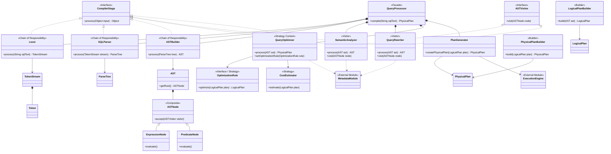

```mermaid
classDiagram
    direction TD

%% =====================================================
%% QUERY PROCESSOR MODULE
%% =====================================================

class QueryProcessor{
    <<Facade>>
    +compile(String sqlText) PhysicalPlan
}

%% =====================================================
%% SQL COMPILATION PIPELINE
%% =====================================================

class CompilerStage{
    <<Interface>>
    +process(Object input) Object*
}

class Lexer{
    <<Chain of Responsibility>>
    +process(String sqlText) TokenStream
}

class SQLParser{
    <<Chain of Responsibility>>
    +process(TokenStream stream) ParseTree
}

class ASTBuilder{
    <<Chain of Responsibility>>
    +process(ParseTree tree) AST
}

class SemanticAnalyzer{
    <<Visitor>>
    +process(AST ast) AST
    +visit(ASTNode node)
}

class QueryRewriter{
    <<Visitor>>
    +process(AST ast) AST
    +visit(ASTNode node)
}

class QueryOptimizer{
    <<Strategy Context>>
    +process(AST ast) PhysicalPlan
    +setOptimizationRule(OptimizationRule rule)
}

class PlanGenerator{
    +createPhysicalPlan(LogicalPlan plan) PhysicalPlan
}

%% =====================================================
%% LEXICAL STRUCTURES
%% =====================================================

class TokenStream
class Token
class ParseTree

%% =====================================================
%% ABSTRACT SYNTAX TREE
%% =====================================================

class AST{
    +getRoot() ASTNode
}

class ASTNode{
    <<Composite>>
    +accept(ASTVisitor visitor)
}

class ASTVisitor{
    <<Interface>>
    +visit(ASTNode node)*
}

%% =====================================================
%% EXPRESSION TREE
%% =====================================================

class ExpressionNode{
    +evaluate()
}

class PredicateNode{
    +evaluate()
}

%% =====================================================
%% PLAN BUILDERS
%% =====================================================

class LogicalPlanBuilder{
    <<Builder>>
    +build(AST ast) LogicalPlan
}

class PhysicalPlanBuilder{
    <<Builder>>
    +build(LogicalPlan plan) PhysicalPlan
}

%% =====================================================
%% OPTIMIZATION
%% =====================================================

class OptimizationRule{
    <<Interface / Strategy>>
    +optimize(LogicalPlan plan) LogicalPlan*
}

class CostEstimator{
    <<Strategy>>
    +estimate(LogicalPlan plan)
}

%% =====================================================
%% PLANS
%% =====================================================

class LogicalPlan
class PhysicalPlan

%% =====================================================
%% EXTERNAL MODULE
%% =====================================================

class MetadataModule{
    <<External Module>>
}

class ExecutionEngine{
    <<External Module>>
}

%% =====================================================
%% RELATIONSHIPS
%% =====================================================

CompilerStage <|.. Lexer
CompilerStage <|.. SQLParser
CompilerStage <|.. ASTBuilder
CompilerStage <|.. SemanticAnalyzer
CompilerStage <|.. QueryRewriter
CompilerStage <|.. QueryOptimizer

ASTVisitor <|.. SemanticAnalyzer
ASTVisitor <|.. QueryRewriter

QueryProcessor *-- Lexer
QueryProcessor *-- SQLParser
QueryProcessor *-- ASTBuilder
QueryProcessor *-- SemanticAnalyzer
QueryProcessor *-- QueryRewriter
QueryProcessor *-- QueryOptimizer
QueryProcessor *-- PlanGenerator

Lexer --> TokenStream
TokenStream *-- Token

SQLParser --> ParseTree

ASTBuilder --> AST

AST *-- ASTNode

ASTNode <|-- ExpressionNode
ASTNode <|-- PredicateNode

QueryOptimizer --> OptimizationRule
QueryOptimizer --> CostEstimator

LogicalPlanBuilder --> LogicalPlan
PhysicalPlanBuilder --> PhysicalPlan

PlanGenerator --> PhysicalPlan

SemanticAnalyzer ..> MetadataModule
QueryRewriter ..> MetadataModule
QueryOptimizer ..> MetadataModule

PlanGenerator --> ExecutionEngine
```