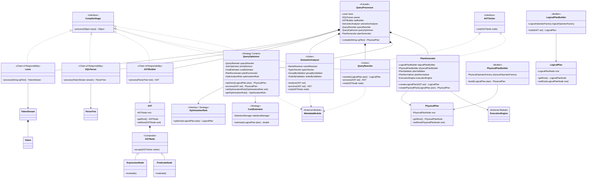

```mermaid
classDiagram
    direction TD

%% =====================================================
%% QUERY PROCESSOR MODULE
%% =====================================================

class QueryProcessor{
    <<Facade>>
    -Lexer lexer
    -SQLParser parser
    -ASTBuilder astBuilder
    -SemanticAnalyzer semanticAnalyzer
    -QueryRewriter queryRewriter
    -QueryOptimizer queryOptimizer
    -PlanGenerator planGenerator
    +compile(String sqlText) PhysicalPlan
}

%% =====================================================
%% SQL COMPILATION PIPELINE
%% =====================================================

class CompilerStage{
    <<Interface>>
    +process(Object input) Object*
}

class Lexer{
    <<Chain of Responsibility>>
    +process(String sqlText) TokenStream
}

class SQLParser{
    <<Chain of Responsibility>>
    +process(TokenStream stream) ParseTree
}

class ASTBuilder{
    <<Chain of Responsibility>>
    +process(ParseTree tree) AST
}

class SemanticAnalyzer{
    <<Visitor>>
    -NameResolver nameResolver
    -TypeChecker typeChecker
    -GroupByValidator groupByValidator
    -OrderByValidator orderByValidator
    +analyze(AST ast)
    +process(AST ast) AST
    +visit(ASTNode node)
}

class QueryRewriter{
    <<Visitor>>
    +rewrite(LogicalPlan plan) LogicalPlan
    +process(AST ast) AST
    +visit(ASTNode node)
}

class QueryOptimizer{
    <<Strategy Context>>
    -QueryRewriter queryRewriter
    -JoinOptimizer joinOptimizer
    -CostEstimator costEstimator
    -PlanEnumerator planEnumerator
    -OptimizationRule optimizationRule
    +optimize(LogicalPlan plan) PhysicalPlan
    +process(AST ast) PhysicalPlan
    +setOptimizationRule(OptimizationRule rule)
    +getOptimizationRule() OptimizationRule
}

class PlanGenerator{
    -LogicalPlanBuilder logicalPlanBuilder
    -PhysicalPlanBuilder physicalPlanBuilder
    -PlanValidator planValidator
    -PlanNormalizer planNormalizer
    -ExecutionEngine executionEngine
    +createLogicalPlan(AST ast) LogicalPlan
    +createPhysicalPlan(LogicalPlan plan) PhysicalPlan
}

%% =====================================================
%% LEXICAL STRUCTURES
%% =====================================================

class TokenStream
class Token
class ParseTree

%% =====================================================
%% ABSTRACT SYNTAX TREE
%% =====================================================

class AST{
    -ASTNode root
    +getRoot() ASTNode
    +setRoot(ASTNode root)
}

class ASTNode{
    <<Composite>>
    +accept(ASTVisitor visitor)
}

class ASTVisitor{
    <<Interface>>
    +visit(ASTNode node)*
}

%% =====================================================
%% EXPRESSION TREE
%% =====================================================

class ExpressionNode{
    +evaluate()
}

class PredicateNode{
    +evaluate()
}

%% =====================================================
%% PLAN BUILDERS
%% =====================================================

class LogicalPlanBuilder{
    <<Builder>>
    -LogicalOperatorFactory logicalOperatorFactory
    +build(AST ast) LogicalPlan
}

class PhysicalPlanBuilder{
    <<Builder>>
    -PhysicalOperatorFactory physicalOperatorFactory
    +build(LogicalPlan plan) PhysicalPlan
}

%% =====================================================
%% OPTIMIZATION
%% =====================================================

class OptimizationRule{
    <<Interface / Strategy>>
    +optimize(LogicalPlan plan) LogicalPlan*
}

class CostEstimator{
    <<Strategy>>
    -StatisticsManager statisticsManager
    +estimate(LogicalPlan plan) double
}

%% =====================================================
%% PLANS
%% =====================================================

class LogicalPlan{
    -LogicalPlanNode root
    +getRoot() LogicalPlanNode
    +setRoot(LogicalPlanNode root)
}

class PhysicalPlan{
    -PhysicalPlanNode root
    +getRoot() PhysicalPlanNode
    +setRoot(PhysicalPlanNode root)
}

%% =====================================================
%% EXTERNAL MODULE
%% =====================================================

class MetadataModule{
    <<External Module>>
}

class ExecutionEngine{
    <<External Module>>
}

%% =====================================================
%% RELATIONSHIPS
%% =====================================================

CompilerStage <|.. Lexer
CompilerStage <|.. SQLParser
CompilerStage <|.. ASTBuilder
CompilerStage <|.. SemanticAnalyzer
CompilerStage <|.. QueryRewriter
CompilerStage <|.. QueryOptimizer

ASTVisitor <|.. SemanticAnalyzer
ASTVisitor <|.. QueryRewriter

QueryProcessor *-- Lexer
QueryProcessor *-- SQLParser
QueryProcessor *-- ASTBuilder
QueryProcessor *-- SemanticAnalyzer
QueryProcessor *-- QueryRewriter
QueryProcessor *-- QueryOptimizer
QueryProcessor *-- PlanGenerator

Lexer --> TokenStream
TokenStream *-- Token

SQLParser --> ParseTree

ASTBuilder --> AST

AST *-- ASTNode

ASTNode <|-- ExpressionNode
ASTNode <|-- PredicateNode

QueryOptimizer --> OptimizationRule
QueryOptimizer --> CostEstimator

LogicalPlanBuilder --> LogicalPlan
PhysicalPlanBuilder --> PhysicalPlan

PlanGenerator --> PhysicalPlan

SemanticAnalyzer ..> MetadataModule
QueryRewriter ..> MetadataModule
QueryOptimizer ..> MetadataModule

PlanGenerator --> ExecutionEngine
```