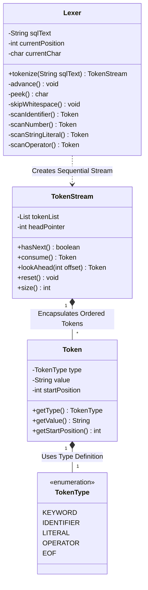

```mermaid
classDiagram
    direction TD

    %% =====================================================
    %% LEXICAL ANALYZER BREAKDOWN
    %% Pattern: "Scanner & Token Stream Composition Breakdown"
    %% =====================================================

    class Lexer {
        -String sqlText
        -int currentPosition
        -char currentChar
        +tokenize(String sqlText) TokenStream
        -advance() void
        -peek() char
        -skipWhitespace() void
        -scanIdentifier() Token
        -scanNumber() Token
        -scanStringLiteral() Token
        -scanOperator() Token
    }

    class TokenStream {
        -List<Token> tokenList
        -int headPointer
        +hasNext() boolean
        +consume() Token
        +lookAhead(int offset) Token
        +reset() void
        +size() int
    }

    class Token {
        -TokenType type
        -String value
        -int startPosition
        +getType() TokenType
        +getValue() String
        +getStartPosition() int
    }

    class TokenType {
        <<enumeration>>
        KEYWORD
        IDENTIFIER
        LITERAL
        OPERATOR
        EOF
    }

    %% Relationships
    Lexer ..> TokenStream : Creates Sequential Stream
    TokenStream "1" *-- "*" Token : Encapsulates Ordered Tokens
    Token "1" *-- "1" TokenType : Uses Type Definition
```
