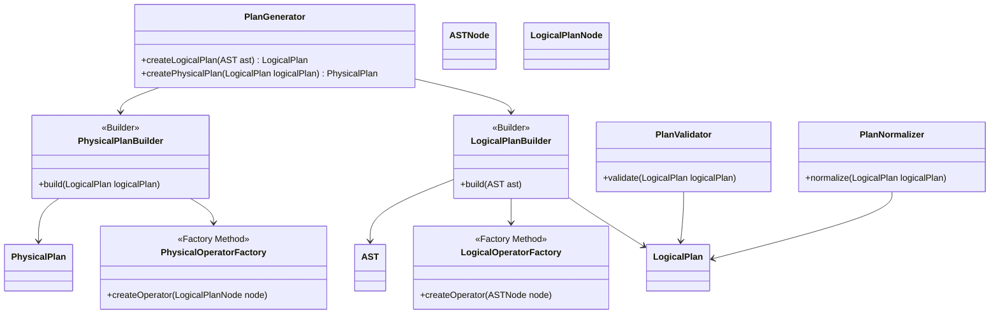

```mermaid
classDiagram
    direction TD

%% =====================================================
%% PLAN GENERATION
%% =====================================================

    class PlanGenerator{
+createLogicalPlan(AST ast) LogicalPlan
+createPhysicalPlan(LogicalPlan logicalPlan) PhysicalPlan
}

%% =====================================================
%% LOGICAL PLAN
%% =====================================================

class LogicalPlanBuilder{
<<Builder>>
+build(AST ast)
}

class LogicalOperatorFactory{
<<Factory Method>>
+createOperator(ASTNode node)
}

class LogicalPlan

%% =====================================================
%% PHYSICAL PLAN
%% =====================================================

class PhysicalPlanBuilder{
<<Builder>>
+build(LogicalPlan logicalPlan)
}

class PhysicalOperatorFactory{
<<Factory Method>>
+createOperator(LogicalPlanNode node)
}

class PhysicalPlan

%% =====================================================
%% PLAN VALIDATION
%% =====================================================

class PlanValidator{
+validate(LogicalPlan logicalPlan)
}

class PlanNormalizer{
+normalize(LogicalPlan logicalPlan)
}

%% =====================================================
%% SHARED OBJECTS
%% =====================================================

class AST

class ASTNode

class LogicalPlanNode

%% =====================================================
%% RELATIONSHIPS
%% =====================================================

PlanGenerator --> LogicalPlanBuilder
PlanGenerator --> PhysicalPlanBuilder

LogicalPlanBuilder --> LogicalOperatorFactory
LogicalPlanBuilder --> LogicalPlan

PhysicalPlanBuilder --> PhysicalOperatorFactory
PhysicalPlanBuilder --> PhysicalPlan

LogicalPlanBuilder --> AST

PlanValidator --> LogicalPlan

PlanNormalizer --> LogicalPlan
```