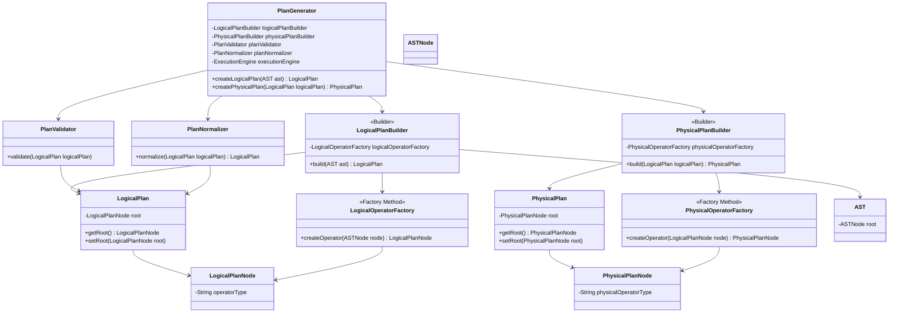

```mermaid
classDiagram
    direction TD

%% =====================================================
%% PLAN GENERATION
%% =====================================================

    class PlanGenerator{
    -LogicalPlanBuilder logicalPlanBuilder
    -PhysicalPlanBuilder physicalPlanBuilder
    -PlanValidator planValidator
    -PlanNormalizer planNormalizer
    -ExecutionEngine executionEngine
    +createLogicalPlan(AST ast) LogicalPlan
    +createPhysicalPlan(LogicalPlan logicalPlan) PhysicalPlan
}

%% =====================================================
%% LOGICAL PLAN
%% =====================================================

class LogicalPlanBuilder{
    <<Builder>>
    -LogicalOperatorFactory logicalOperatorFactory
    +build(AST ast) LogicalPlan
}

class LogicalOperatorFactory{
    <<Factory Method>>
    +createOperator(ASTNode node) LogicalPlanNode
}

class LogicalPlan{
    -LogicalPlanNode root
    +getRoot() LogicalPlanNode
    +setRoot(LogicalPlanNode root)
}

%% =====================================================
%% PHYSICAL PLAN
%% =====================================================

class PhysicalPlanBuilder{
    <<Builder>>
    -PhysicalOperatorFactory physicalOperatorFactory
    +build(LogicalPlan logicalPlan) PhysicalPlan
}

class PhysicalOperatorFactory{
    <<Factory Method>>
    +createOperator(LogicalPlanNode node) PhysicalPlanNode
}

class PhysicalPlan{
    -PhysicalPlanNode root
    +getRoot() PhysicalPlanNode
    +setRoot(PhysicalPlanNode root)
}

%% =====================================================
%% PLAN VALIDATION
%% =====================================================

class PlanValidator{
    +validate(LogicalPlan logicalPlan)
}

class PlanNormalizer{
    +normalize(LogicalPlan logicalPlan) LogicalPlan
}

%% =====================================================
%% SHARED OBJECTS
%% =====================================================

class AST{
    -ASTNode root
}

class ASTNode

class LogicalPlanNode{
    -String operatorType
}

class PhysicalPlanNode{
    -String physicalOperatorType
}

%% =====================================================
%% RELATIONSHIPS
%% =====================================================

PlanGenerator --> LogicalPlanBuilder
PlanGenerator --> PhysicalPlanBuilder
PlanGenerator --> PlanValidator
PlanGenerator --> PlanNormalizer

LogicalPlanBuilder --> LogicalOperatorFactory
LogicalPlanBuilder --> LogicalPlan

PhysicalPlanBuilder --> PhysicalOperatorFactory
PhysicalPlanBuilder --> PhysicalPlan

LogicalPlanBuilder --> AST
LogicalPlan --> LogicalPlanNode
PhysicalPlan --> PhysicalPlanNode

LogicalOperatorFactory --> LogicalPlanNode
PhysicalOperatorFactory --> PhysicalPlanNode

PlanValidator --> LogicalPlan

PlanNormalizer --> LogicalPlan
```