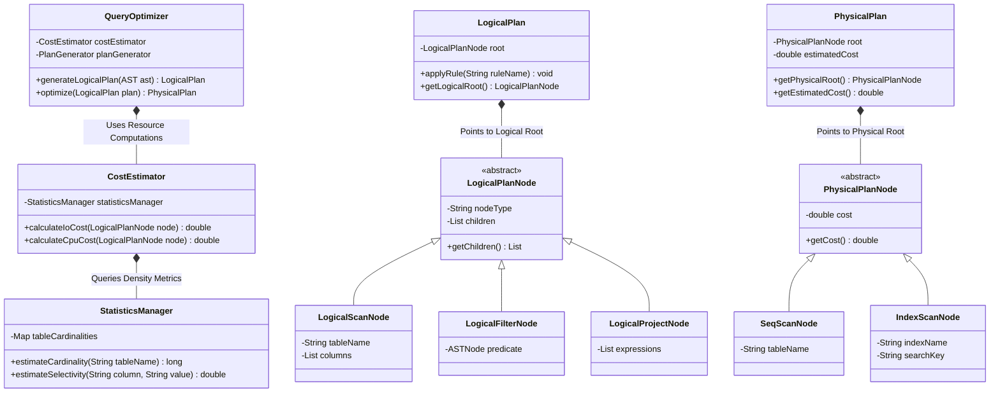

```mermaid
classDiagram
    direction TD

    %% =====================================================
    %% QUERY OPTIMIZER & CBO ENGINE BREAKDOWN
    %% Pattern: "Plan Node Hierarchy & Cost Estimation Breakdown"
    %% =====================================================

    class QueryOptimizer {
        -CostEstimator costEstimator
        -PlanGenerator planGenerator
        +generateLogicalPlan(AST ast) LogicalPlan
        +optimize(LogicalPlan plan) PhysicalPlan
    }

    class LogicalPlan {
        -LogicalPlanNode root
        +applyRule(String ruleName) void
        +getLogicalRoot() LogicalPlanNode
    }

    class LogicalPlanNode {
        <<abstract>>
        -String nodeType
        -List<LogicalPlanNode> children
        +getChildren() List<LogicalPlanNode>
    }

    class LogicalScanNode {
        -String tableName
        -List<String> columns
    }

    class LogicalFilterNode {
        -ASTNode predicate
    }

    class LogicalProjectNode {
        -List<String> expressions
    }

    class PhysicalPlan {
        -PhysicalPlanNode root
        -double estimatedCost
        +getPhysicalRoot() PhysicalPlanNode
        +getEstimatedCost() double
    }

    class PhysicalPlanNode {
        <<abstract>>
        -double cost
        +getCost() double
    }

    class SeqScanNode {
        -String tableName
    }

    class IndexScanNode {
        -String indexName
        -String searchKey
    }

    class CostEstimator {
        -StatisticsManager statisticsManager
        +calculateIoCost(LogicalPlanNode node) double
        +calculateCpuCost(LogicalPlanNode node) double
    }

    class StatisticsManager {
        -Map<String, Long> tableCardinalities
        +estimateCardinality(String tableName) long
        +estimateSelectivity(String column, String value) double
    }

    %% Relationships
    LogicalPlan *-- LogicalPlanNode : Points to Logical Root
    LogicalPlanNode <|-- LogicalScanNode
    LogicalPlanNode <|-- LogicalFilterNode
    LogicalPlanNode <|-- LogicalProjectNode

    PhysicalPlan *-- PhysicalPlanNode : Points to Physical Root
    PhysicalPlanNode <|-- SeqScanNode
    PhysicalPlanNode <|-- IndexScanNode

    QueryOptimizer *-- CostEstimator : Uses Resource Computations
    CostEstimator *-- StatisticsManager : Queries Density Metrics
```
