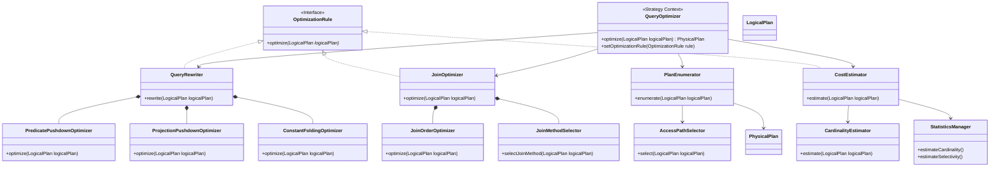

```mermaid
classDiagram
    direction TD

%% =====================================================
%% QUERY OPTIMIZER
%% =====================================================

class QueryOptimizer{
    <<Strategy Context>>
    +optimize(LogicalPlan logicalPlan) PhysicalPlan
    +setOptimizationRule(OptimizationRule rule)
}

class OptimizationRule{
    <<Interface>>
    +optimize(LogicalPlan logicalPlan)*
}

%% =====================================================
%% QUERY REWRITE
%% =====================================================

class QueryRewriter{
    +rewrite(LogicalPlan logicalPlan)
}

class PredicatePushdownOptimizer{
    +optimize(LogicalPlan logicalPlan)
}

class ProjectionPushdownOptimizer{
    +optimize(LogicalPlan logicalPlan)
}

class ConstantFoldingOptimizer{
    +optimize(LogicalPlan logicalPlan)
}

%% =====================================================
%% JOIN OPTIMIZATION
%% =====================================================

class JoinOptimizer{
    +optimize(LogicalPlan logicalPlan)
}

class JoinOrderOptimizer{
    +optimize(LogicalPlan logicalPlan)
}

class JoinMethodSelector{
    +selectJoinMethod(LogicalPlan logicalPlan)
}

%% =====================================================
%% COST OPTIMIZATION
%% =====================================================

class CostEstimator{
    +estimate(LogicalPlan logicalPlan)
}

class CardinalityEstimator{
    +estimate(LogicalPlan logicalPlan)
}

class StatisticsManager{
    +estimateCardinality()
    +estimateSelectivity()
}

%% =====================================================
%% PLAN SEARCH
%% =====================================================

class PlanEnumerator{
    +enumerate(LogicalPlan logicalPlan)
}

class AccessPathSelector{
    +select(LogicalPlan logicalPlan)
}

%% =====================================================
%% SHARED OBJECTS
%% =====================================================

class LogicalPlan

class PhysicalPlan

%% =====================================================
%% RELATIONSHIPS
%% =====================================================

QueryOptimizer --> QueryRewriter
QueryOptimizer --> JoinOptimizer
QueryOptimizer --> CostEstimator
QueryOptimizer --> PlanEnumerator

OptimizationRule <|.. QueryRewriter
OptimizationRule <|.. JoinOptimizer
OptimizationRule <|.. CostEstimator

QueryRewriter *-- PredicatePushdownOptimizer
QueryRewriter *-- ProjectionPushdownOptimizer
QueryRewriter *-- ConstantFoldingOptimizer

JoinOptimizer *-- JoinOrderOptimizer
JoinOptimizer *-- JoinMethodSelector

CostEstimator --> CardinalityEstimator
CostEstimator --> StatisticsManager

PlanEnumerator --> AccessPathSelector

PlanEnumerator --> PhysicalPlan
```