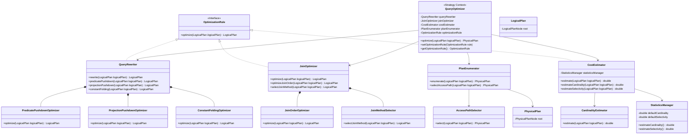

```mermaid
classDiagram
    direction TD

%% =====================================================
%% QUERY OPTIMIZER
%% =====================================================

class QueryOptimizer{
    <<Strategy Context>>
    -QueryRewriter queryRewriter
    -JoinOptimizer joinOptimizer
    -CostEstimator costEstimator
    -PlanEnumerator planEnumerator
    -OptimizationRule optimizationRule
    +optimize(LogicalPlan logicalPlan) PhysicalPlan
    +setOptimizationRule(OptimizationRule rule)
    +getOptimizationRule() OptimizationRule
}

class OptimizationRule{
    <<Interface>>
    +optimize(LogicalPlan logicalPlan)* LogicalPlan
}

%% =====================================================
%% QUERY REWRITE
%% =====================================================

class QueryRewriter{
    +rewrite(LogicalPlan logicalPlan) LogicalPlan
    +predicatePushdown(LogicalPlan logicalPlan) LogicalPlan
    +projectionPushdown(LogicalPlan logicalPlan) LogicalPlan
    +constantFolding(LogicalPlan logicalPlan) LogicalPlan
}

class PredicatePushdownOptimizer{
    +optimize(LogicalPlan logicalPlan) LogicalPlan
}

class ProjectionPushdownOptimizer{
    +optimize(LogicalPlan logicalPlan) LogicalPlan
}

class ConstantFoldingOptimizer{
    +optimize(LogicalPlan logicalPlan) LogicalPlan
}

%% =====================================================
%% JOIN OPTIMIZATION
%% =====================================================

class JoinOptimizer{
    +optimize(LogicalPlan logicalPlan) LogicalPlan
    +optimizeJoinOrder(LogicalPlan logicalPlan) LogicalPlan
    +selectJoinMethod(LogicalPlan logicalPlan) LogicalPlan
}

class JoinOrderOptimizer{
    +optimize(LogicalPlan logicalPlan) LogicalPlan
}

class JoinMethodSelector{
    +selectJoinMethod(LogicalPlan logicalPlan) LogicalPlan
}

%% =====================================================
%% COST OPTIMIZATION
%% =====================================================

class CostEstimator{
    -StatisticsManager statisticsManager
    +estimate(LogicalPlan logicalPlan) double
    +estimateCardinality(LogicalPlan logicalPlan) double
    +estimateSelectivity(LogicalPlan logicalPlan) double
}

class CardinalityEstimator{
    +estimate(LogicalPlan logicalPlan) double
}

class StatisticsManager{
    -double defaultCardinality
    -double defaultSelectivity
    +estimateCardinality() double
    +estimateSelectivity() double
}

%% =====================================================
%% PLAN SEARCH
%% =====================================================

class PlanEnumerator{
    +enumerate(LogicalPlan logicalPlan) PhysicalPlan
    +selectAccessPath(LogicalPlan logicalPlan) PhysicalPlan
}

class AccessPathSelector{
    +select(LogicalPlan logicalPlan) PhysicalPlan
}

%% =====================================================
%% SHARED OBJECTS
%% =====================================================

class LogicalPlan{
    -LogicalPlanNode root
}

class PhysicalPlan{
    -PhysicalPlanNode root
}

%% =====================================================
%% RELATIONSHIPS
%% =====================================================

QueryOptimizer --> QueryRewriter
QueryOptimizer --> JoinOptimizer
QueryOptimizer --> CostEstimator
QueryOptimizer --> PlanEnumerator

OptimizationRule <|.. QueryRewriter
OptimizationRule <|.. JoinOptimizer
OptimizationRule <|.. CostEstimator

QueryRewriter *-- PredicatePushdownOptimizer
QueryRewriter *-- ProjectionPushdownOptimizer
QueryRewriter *-- ConstantFoldingOptimizer

JoinOptimizer *-- JoinOrderOptimizer
JoinOptimizer *-- JoinMethodSelector

CostEstimator --> CardinalityEstimator
CostEstimator --> StatisticsManager

PlanEnumerator --> AccessPathSelector

PlanEnumerator --> PhysicalPlan
```